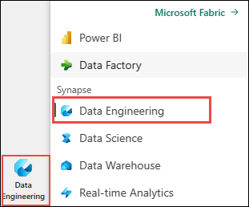
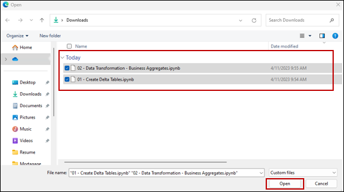
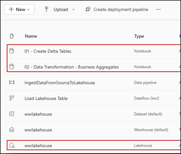
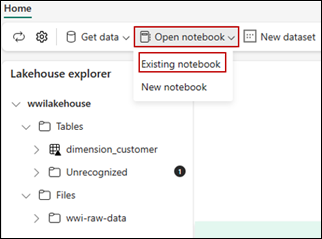
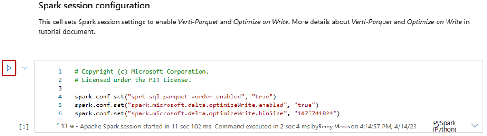
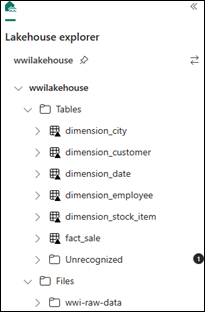
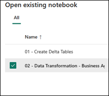
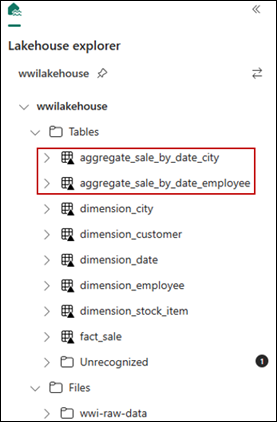

# Prepare and transform data in the lakehouse

In this task, you will use notebooks with Spark runtime to transform and prepare the data

## Prepare data
From the previous tasks, we have raw data ingested from the source to the Files section of the lakehouse. Now you can transform that data and prepare it for creating delta tables.

1. Download the **notebooks** from the **[Lakehouse Tutorial Source Code](https://github.com/microsoft/fabric-samples/tree/main/docs-samples/data-engineering/Lakehouse%20Tutorial%20Source%20Code)**  folder 
   
2. From the experience switcher located at the bottom left of the screen, select **Data engineering**.

   

3. Select **Import notebook** from the **New** section at the top of the landing page.

4. Select **Upload** from the **Import status** pane that opens on the right side of the screen.

5. Select all the notebooks that were downloaded in step 1 of this section.

6. Select **Open**. A notification indicating the status of the import appears in the top right corner of the browser window.

   

7. After the import is successful, you can go to items view of the workspace and see the newly imported notebooks. Select **wwilakehouse** lakehouse to open it.

     

8. Once the **wwilakehouse** lakehouse is opened, select **Open notebook** > **Existing notebook** from the top navigation menu.

    

9. From the list of existing notebooks, select the **01 - Create Delta Tables** notebook and select **Open**.

10. In the open notebook in **Lakehouse explorer**, you see the notebook is already linked to your opened lakehouse.

11. Before you write data as delta lake tables in the **Tables** section of the lakehouse, you use two Fabric features (**V-order and Optimize Write**) for optimized data writing and for improved reading performance. To enable these features in your session, set these configurations in the first cell of your notebook.

    To start the notebook and execute all the cells in sequence, select **Run All** on the top ribbon (under **Home**). Or, to only execute code from a specific cell, select the **Run** icon that appears to the left of the cell upon hover, or press **SHIFT + ENTER** on your keyboard while control is in the cell.

    

   >Note: When running a cell, you didn't have to specify the underlying Spark pool or cluster details because Fabric provides them through Live Pool. Every Fabric workspace comes with a default Spark pool, called Live Pool. This means when you create notebooks, you don't have to worry about specifying any Spark configurations or cluster details. When you execute the first notebook command, the live pool is up and running in a few seconds. And the Spark session is established and it starts executing the code. Subsequent code execution is almost instantaneous in this notebook while the Spark session is active.

12. Next, you read raw data from the **Files** section of the lakehouse, and add more columns for different date parts as part of the transformation. Finally, you use partitionBy Spark API to partition the data before writing it as delta table based on the newly created data part columns (Year and Quarter).

    ```
    from pyspark.sql.functions import col, year, month, quarter
    table_name = 'fact_sale'
    df = spark.read.format("parquet").load('Files/wwi-raw-data/full/fact_sale_1y_full')
    df = df.withColumn('Year', year(col("InvoiceDateKey")))
    df = df.withColumn('Quarter', quarter(col("InvoiceDateKey")))
    df = df.withColumn('Month', month(col("InvoiceDateKey")))
    df.write.mode("overwrite").format("delta").partitionBy("Year","Quarter").save("Tables/" + table_name)
    ```
13. After the fact tables load, you can move on to loading data for the rest of the dimensions. The following cell creates a function to read raw data from the **Files** section of the lakehouse for each of the table names passed as a parameter. Next, it creates a list of dimension tables. Finally, it loops through the list of tables and creates a delta table for each table name that's read from the input parameter.

    ```
    from pyspark.sql.types import *
    def loadFullDataFromSource(table_name):
    df = spark.read.format("parquet").load('Files/wwi-raw-data/full/' + table_name)
    df.write.mode("overwrite").format("delta").save("Tables/" + table_name)
    full_tables = [
    'dimension_city',
    'dimension_date',
    'dimension_employee',
    'dimension_stock_item'
    ]
    for table in full_tables:
    loadFullDataFromSource(table)
    ```
14. To validate the created tables, right click and select refresh on the **wwilakehouse** lakehouse. The tables appear.

     

15. Go the items view of the workspace again and select the **wwilakehouse** lakehouse to open it.

16. Now, open the second notebook. In the lakehouse view, select **Open notebook > Existing notebook** from the ribbon.

17. From the list of existing notebooks, select the **02 - Data Transformation - Business** notebook to open it.

    

18. In the open notebook in **Lakehouse explorer**, you see the notebook is already linked to your opened lakehouse.

19. An organization might have data engineers working with Scala/Python and other data engineers working with SQL (Spark SQL or T-SQL), all working on the same copy of the data. Fabric makes it possible for these different groups, with varied experience and preference, to work and collaborate. The two different approaches transform and generate business aggregates. You can pick the one suitable for you or mix and match these approaches based on your preference without compromising on the performance:

- **Approach #1** - Use PySpark to join and aggregates data for generating business aggregates. This approach is preferable to someone with a programming (Python or PySpark) background.

- **Approach #2** - Use Spark SQL to join and aggregates data for generating business aggregates. This approach is preferable to someone with SQL background, transitioning to Spark.

20. **Approach #1 (sale_by_date_city)** - Use PySpark to join and aggregate data for generating business aggregates. With the following code, you create three different Spark dataframes, each referencing an existing delta table. Then you join these tables using the dataframes, do group by to generate aggregation, rename a few of the columns, and finally write it as a delta table in the **Tables** section of the lakehouse to persist with the data.

    In this cell, you create three different Spark dataframes, each referencing an existing delta table.
    ```
    df_fact_sale = spark.read.table("wwilakehouse.fact_sale") 
    df_dimension_date = spark.read.table("wwilakehouse.dimension_date")
    df_dimension_city = spark.read.table("wwilakehouse.dimension_city")
    ```

    In this cell, you join these tables using the dataframes created earlier, do group by to generate aggregation, rename a few of the columns, and finally write it as a delta table in the **Tables** section of the lakehouse.

22.To validate the created tables, right click and select refresh on the **wwilakehouse** lakehouse. The aggregate tables appear. 

   
    
   Both the approaches produce a similar outcome. You can choose based on your background and preference, to minimize the need for you to learn a new technology or compromise on the performance.

   Also you may notice that you're writing data as delta lake files. The automatic table discovery and registration feature of Fabric picks up and registers them in the metastore. You don't need to explicitly call CREATE TABLE statements to create tables to use with SQL.

