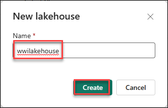
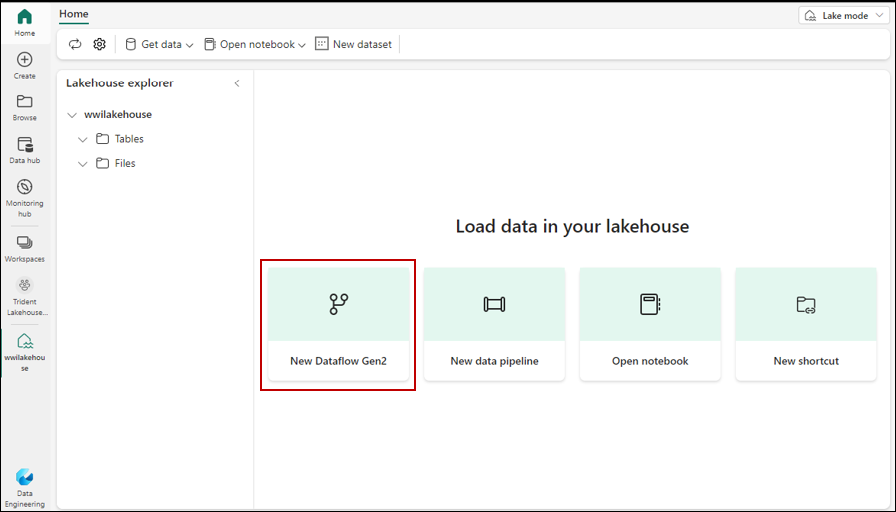
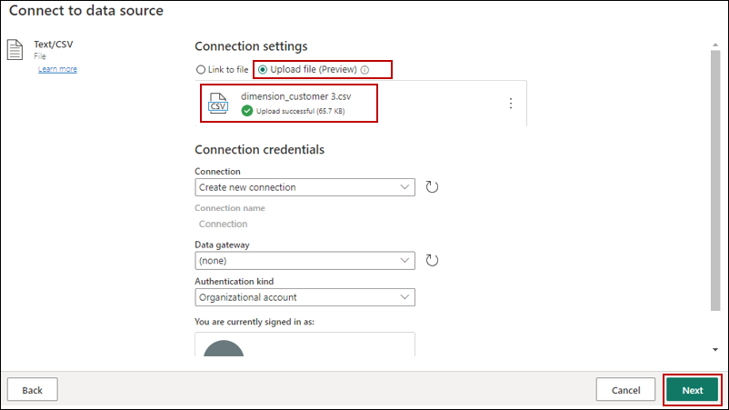
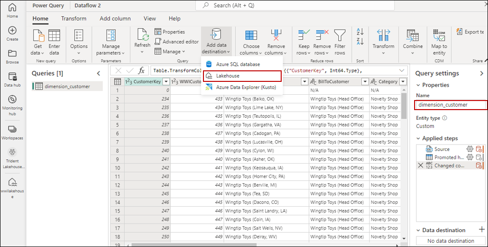
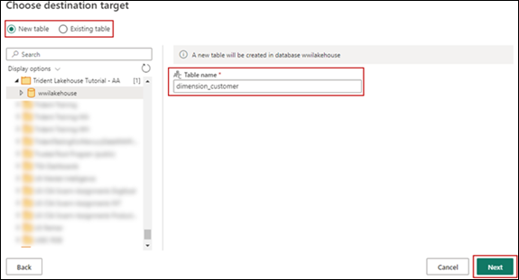
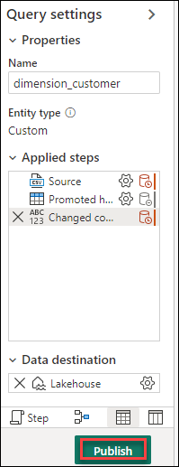
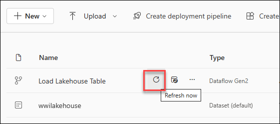
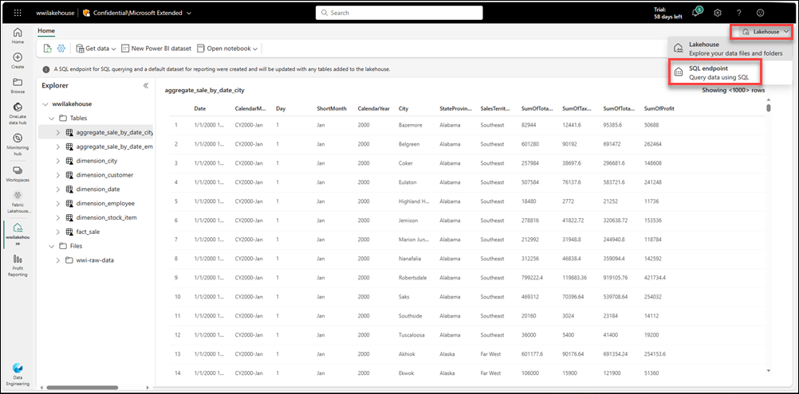
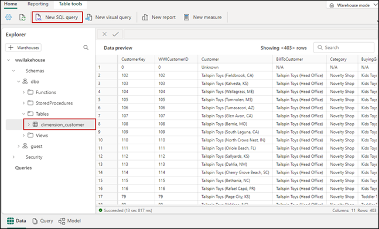

# Create a lakehouse, ingest sample data, and build a report
In this task, you will build a **lakehouse**, ingest sample data into the delta table, apply transformation where required, and then create reports.

## Create a lakehouse

1. In the **[Power BI Service](https://app.powerbi.com/)**, select **Workspaces** from the left-hand menu.

2. Open the **Fabric workspace** that you created in the previous task.

3. From the experience switcher located at the bottom left, select **Data Engineering**.
   

4. In the **Data Engineering** tab, select **Lakehouse** to create a lakehouse.

5. In the **New lakehouse** dialog box, enter **wwilakehouse** in the **Name** field.
    

6. Select **Create** to create and open the new lakehouse.

## Ingest sample data

1. Download the **dimension_customer.csv** file from the **[Fabric samples repo.](https://github.com/microsoft/fabric-samples/blob/689e78676174d4627fc3855165bde9100cb4d19e/docs-samples/data-engineering/dimension_customer.csv/)**
   
2. In the **Lakehouse Explorer**, you see options to load data into lakehouse. Select **New Dataflow Gen2**

   

3. On the new dataflow pane, select **Import from a Text/CSV file**

4. On the **Connect to data source** pane, select the **Upload file** radio button. Drag and drop the *dimension_customer.csv* file that you downloaded in Step 1.
   After the file is uploaded, select **Next**.

  

5. From the **Preview** file data page, preview the data and select **Create** to proceed and return back to the dataflow canvas.

6. In the **Query settings** pane, enter **dimension_customer** for the **Name** field. From the menu items, select **Add data destination** and select **Lakehouse**.
   

7. If needed, from the **Connect to data destination** screen, sign into your account. Select **Next**.

8. Navigate to the **wwilakehouse** in your workspace

9. If the **dimension_customer** table doesn't exist, select the **New table** setting and enter the table name **dimension_customer**.
   If the table already exists, select the **Existing table** setting and choose **dimension_customer** from the list of tables in the object explorer. Select **Next**.
   

10. On the **Choose destination settings** pane, select **Replace** as **Update** method. Select **Save Settings** to return to the dataflow canvas.

11. From the dataflow canvas, you can easily transform the data based on your business requirements.
    For simplicity, we aren't making any changes in this tutorial. To proceed, select **Publish** at the bottom right of the screen.
    

12. A spinning circle next to the dataflow's name indicates publishing is in progress in the item view. When publishing is complete, select the ... and select **Properties**.
    Rename the dataflow to **Load Lakehouse Table** and select **Save**.

13. Select the **Refresh now** option next to data flow name to refresh the dataflow. It runs the dataflow and moves data from the source file to lakehouse table.
    While it's in progress, you see a spinning circle under **Refreshed** column in the item view.
     

14. Once the dataflow is refreshed, select your new lakehouse in the left navigation panel to view the **dimension_customer** delta table. Select the table to preview its data. You can also use the SQL endpoint of the lakehouse to query the data with SQL statements.
    Select **SQL endpoint** from the **Lakehouse** drop-down menu at the top right of the screen.
     
    
16. Select the **dimension_customer** table to preview its data or select **New SQL query** to write your SQL statements.
     
    
17. The following sample query aggregates the row count based on the *BuyingGroup* column of the *dimension_customer* table. SQL query files are saved automatically for future reference, and you can rename or delete these files based on your need.

To run the script, select the **Run** icon at the top of the script file.

## Build a report

```
SELECT BuyingGroup, Count(*) AS Total
FROM dimension_customer
GROUP BY BuyingGroup
```
