# Enable and use Microsoft Fabric

Before you can explore the end-to-end capabilities of Microsoft Fabric, you must enable the Microsoft Fabric:

1. Sign in to your **[Power BI](https://app.powerbi.com/)** account at `https://app.powerbi.com`, enter the following email/username, and then click on **Submit**.  

   * **Username/Email**:  <inject key="AzureAdUserEmail"></inject>
   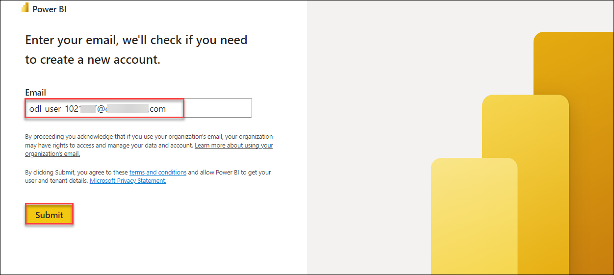

2. Now, enter the following password and click on **Sign in**

   * **Password**:  <inject key="AzureAdUserPassword"></inject>
   
   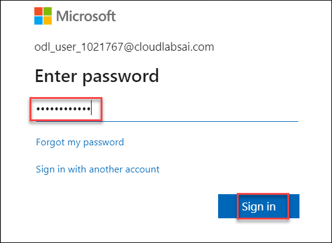

   **Note**: Refer to the **Environment** tab for any other lab credentials/details.

3. If you get a **Stay signed in?** prompt, click on **yes**

   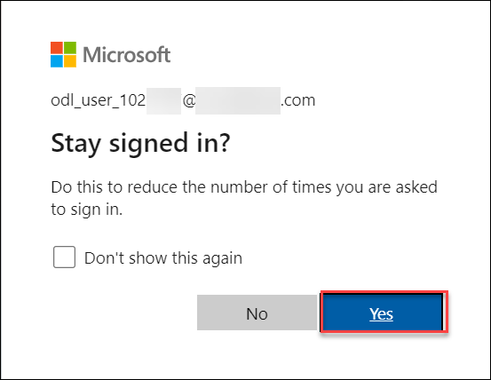

4. Next, click on **Continue**

   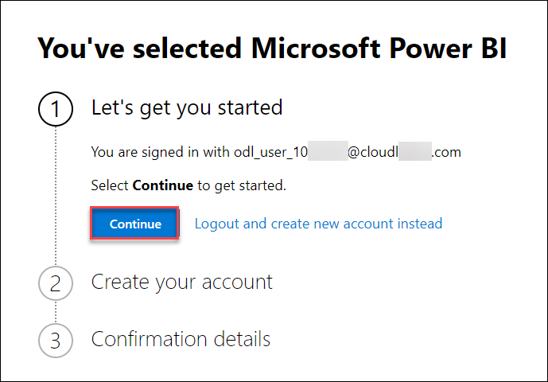

5. Enter the details required and click on **Get started**

   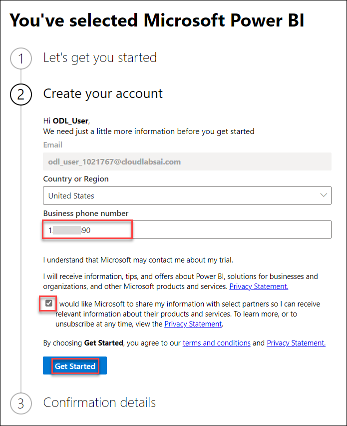

6. Wait for a couple of minutes till your PowerBI environment gets ready.

    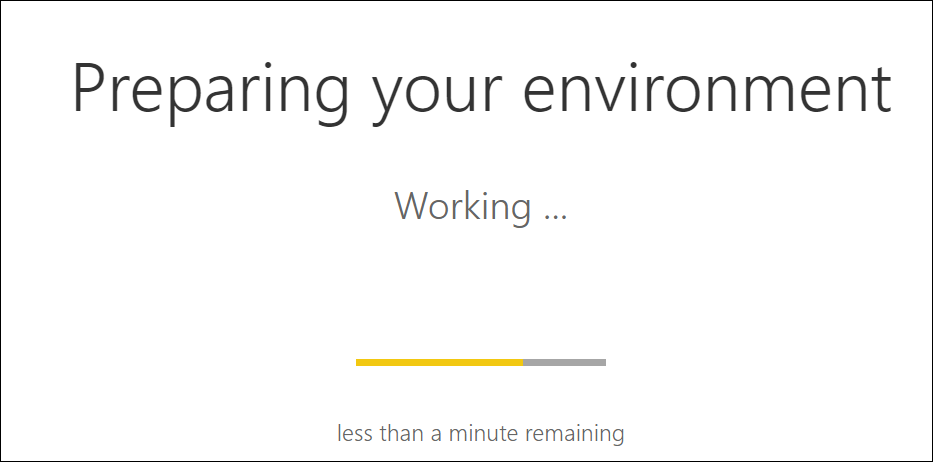

7. From the PowerBI home page, select **Account Manager** from the top-right corner to start the free **Microsoft Fabric trial**.
    
    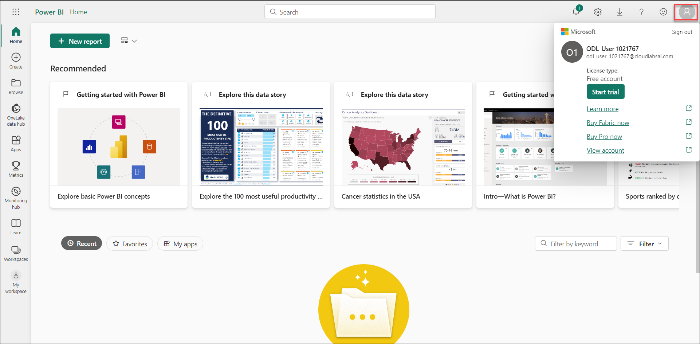
  
    >**Note:** Microsoft Fabric has launched as a public preview and is temporarily provided free of charge when you sign up for the Microsoft Fabric (Preview) trial. Your use of the Microsoft Fabric (Preview) trial includes access to the Fabric product experiences and the resources to create and host Fabric items. The Fabric (Preview) trial lasts for a period of 60 days but may be extended by Microsoft, at our discretion.
   
8. In the Account Manager, select **Start Trial**.

   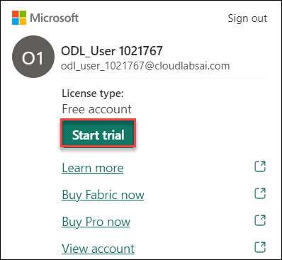
   
9. If prompted, agree to the terms and then select **Start trial**. 

   
   
10. Once your trial capacity is ready, you receive a confirmation message. Select **Got it** to begin working in Fabric.

    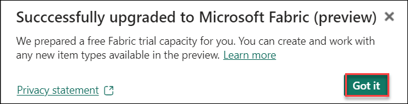
   
11. Open your **Account manager** again. Notice that you now have a heading for **Trial status**. Your Account manager keeps track of the number of days remaining in your trial.

   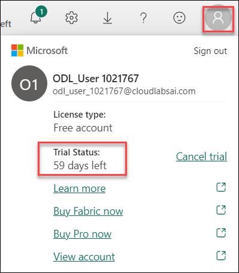

   You now have a **Fabric (Preview) trial** that includes a **Power BI trial** and a **Fabric (Preview) trial capacity**.

## Create resources in Fabric
After you've created your Fabric-enabled workspace, you can start creating resources in Fabric. You can create resources in Fabric using the **Create** menu in the upper left corner of the Power BI service.

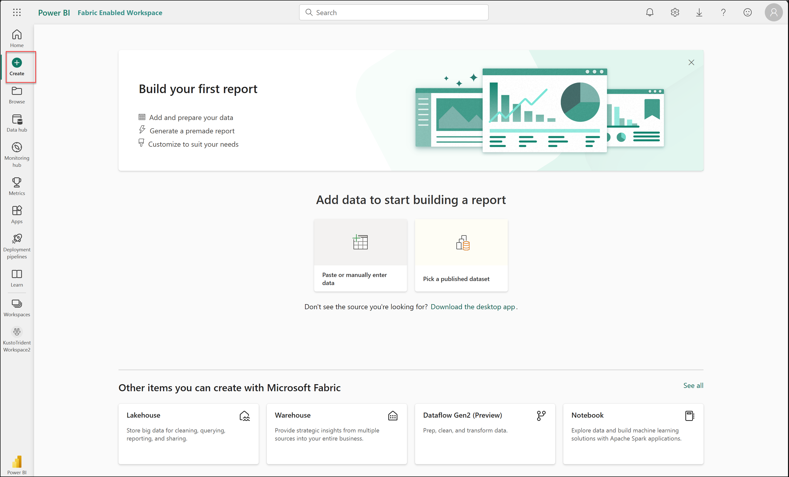

## Explore Fabric experiences

Fabric experiences refer to the different capabilities included in Fabric. You can switch between experiences using the experience switcher in the bottom left corner of the navigation pane.

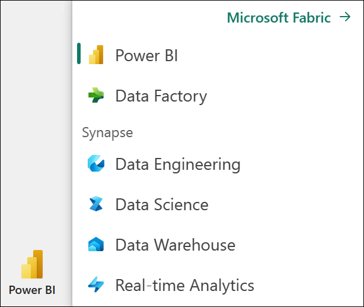

You may notice that Fabric experiences look similar to other Microsoft data offerings. Fabric is built on Power BI and Azure Data Lake Storage, and includes capabilities from Azure Synapse Analytics, Azure Data Factory, Azure Databricks, and Azure Machine Learning. What makes Fabric unique is that it brings these capabilities together in a single, SaaS, integrated experience without the need for access to Azure resources.
