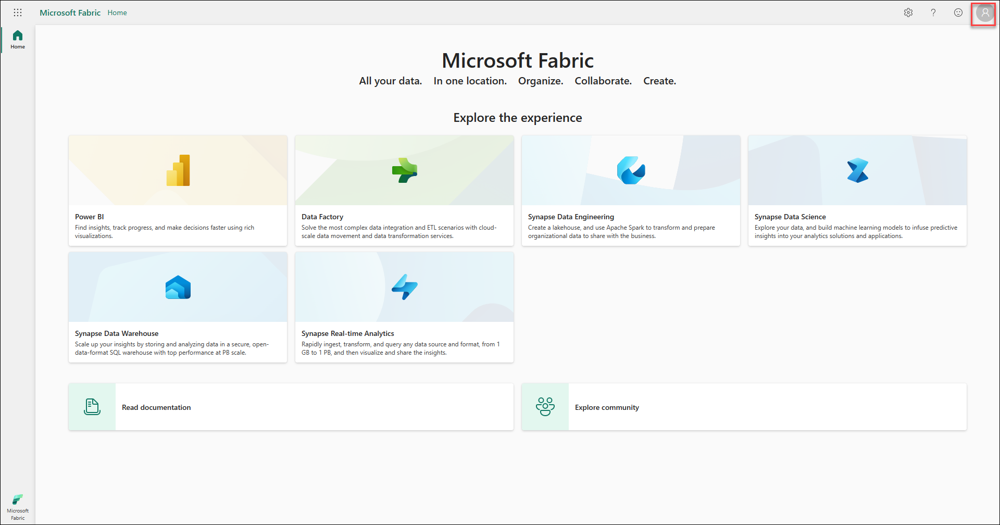
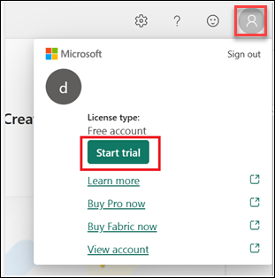
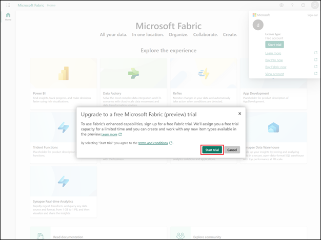
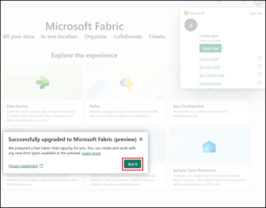
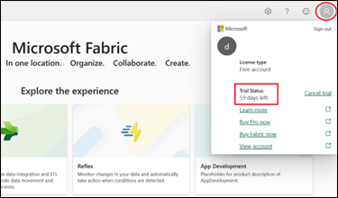

# Getting-started

1. Sign in to your **[Power BI](https://app.powerbi.com/)** account at `https://app.powerbi.com`, enter the following email/username, and then click on **Next**.  

   * **Username/Email**:  <inject key="AzureAdUserEmail"></inject> 
   * **Password**:  <inject key="AzureAdUserPassword"></inject>

   **Note**: Refer to the **Environment Details** tab for any other lab credentials/details.

2. Next, Navigate to **[Microsoft Fabric](https://app.fabric.microsoft.com)** at `https://app.fabric.microsoft.com` to sign up for the free **Microsoft Fabric trial**.

   Provide the Email id if prompted **Username/Email**:  <inject key="AzureAdUserEmail"></inject> 

   >**Note:** Microsoft Fabric has launched as a public preview and is temporarily provided free of charge when you sign up for the Microsoft Fabric (Preview) trial. Your use of the Microsoft Fabric (Preview) trial includes access to the Fabric product experiences and the resources to create and host Fabric items. The Fabric (Preview) trial lasts for a period of 60 days but may be extended by Microsoft, at our discretion.

3. From the Fabric homepage and select **Account Manager** from the top-right corner.

   
   
4. In the Account Manager, select **Start Trial**.

   
   
5. If prompted, agree to the terms and then select **Start trial**. 

   
   
6. Once your trial capacity is ready, you receive a confirmation message. Select **Got it** to begin working in Fabric.
   
   
7. Open your **Account manager** again. Notice that you now have a heading for **Trial status**. Your Account manager keeps track of the number of days remaining in your trial.

   

   You now have a Fabric (Preview) trial that includes a Power BI individual trial and a Fabric (Preview) trial capacity.
