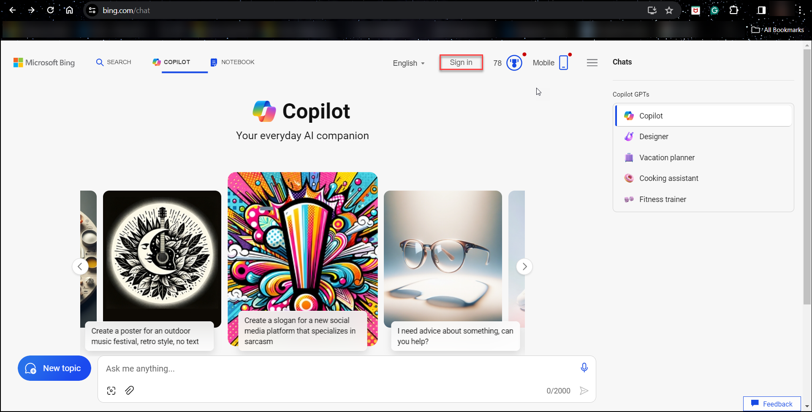
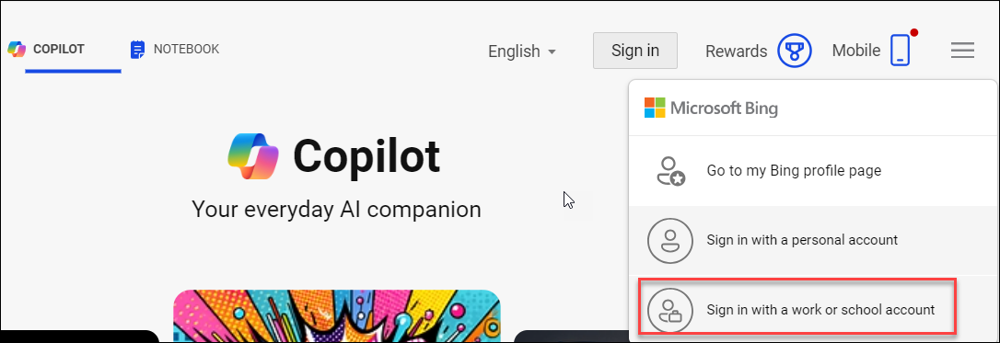
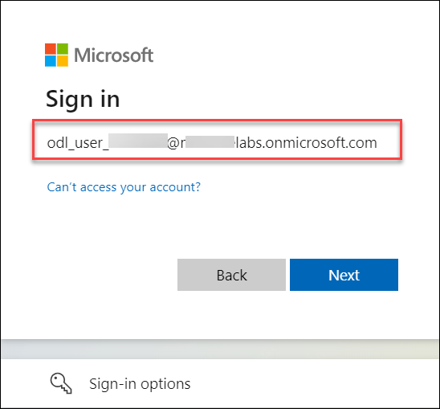
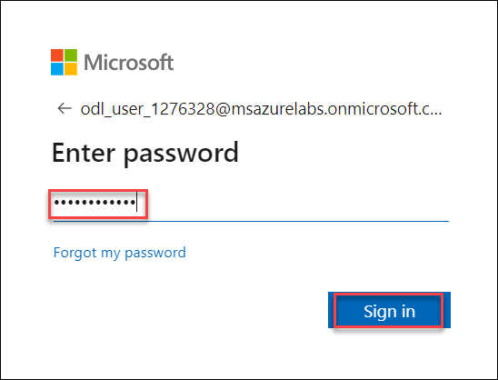
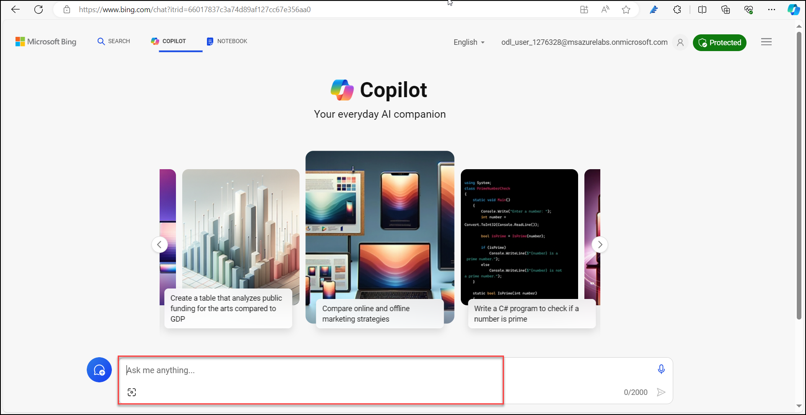

#  Artificial Intelligence in Marketing	

## Overview
This lab environment has a license Microsoft 365 Business standard assigned to the Azure Account.

## Getting started

## Instructions

1. In the browser open a new tab, and navigate to **Bing chat** (<https://www.bing.com/chat>) and click on **Sign in**.

   

1. Click on **Sign in with a work or School account**.

   
   
1. Now, you will see a login screen, in which enter the following email/username and then click on **Sign in**.  

   * **Username/Email**:  <inject key="AzureAdUserEmail"></inject> 
   * **Password**:  <inject key="AzureAdUserPassword"></inject>

   **Note**: Refer to the **Environment** tab for any other lab credentials/details.
        
   

   

1.  If you see the pop-up **Stay Signed in?** click **Yes**.

    

1. You can now use Bing chat as required
     
   

