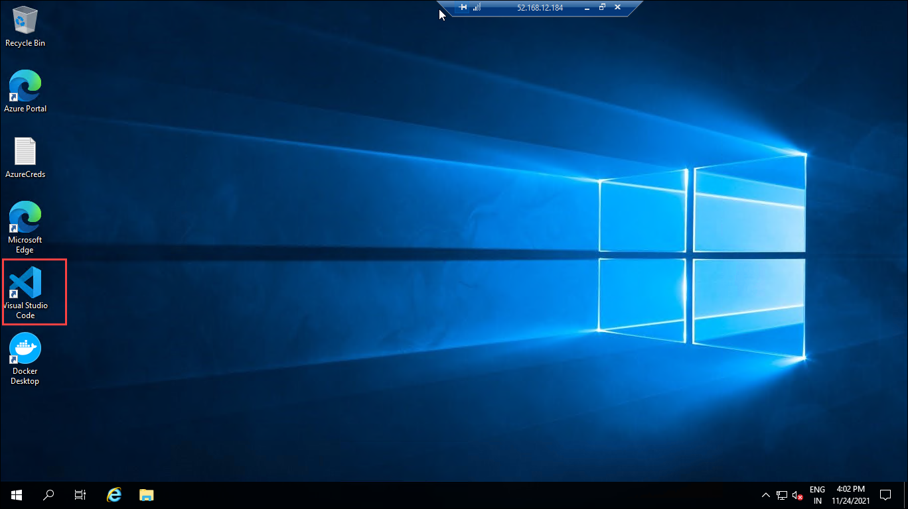
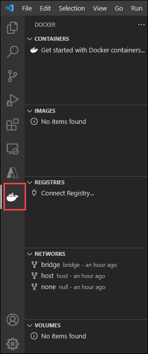
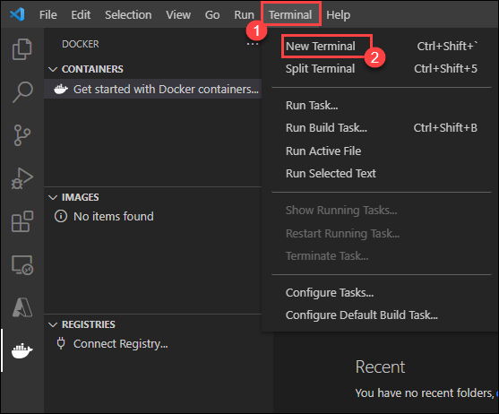
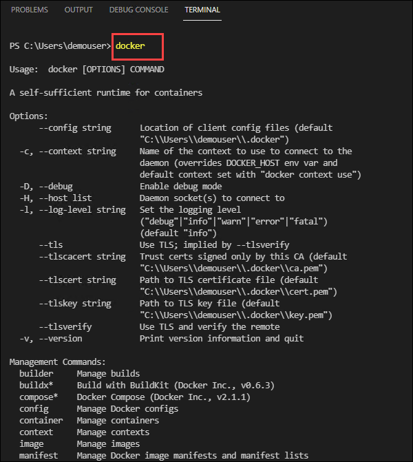
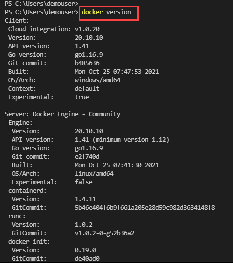
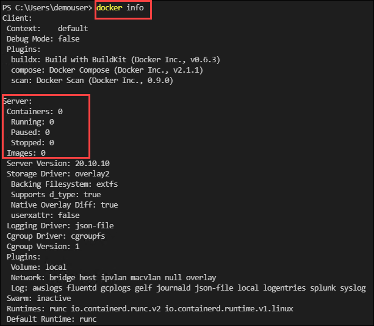

### Exercise 1: Getting started with Docker

In this exercise, you ill verify the docker installation by running the basic commands.

1. On the LabVM provided to you, from the left click on **Visual Studio code**  and open it.

   


2. In the **Visual Studio code** notice docker has been already installed.

   

3. Now to run docker commands open Terminal by clicking on **Terminal (1)** and **New Terminal (2)**.

   

4. In the terminal type  ```docker``` and hit enter. This will list the available commands.

   

5. Now run the below command to get the docker version information.  This command will render all the version information of the docker installed in an easy to read layout.

   ```
     docker version
   ```
   

6. Type the following command to get system-wide information regarding the Docker installation.  The information displayed includes the kernel version, number of containers, and images. As we have not yet created any containers or images you will receive the container and images count as zero.

   ```
     docker info
   ```
   
   
