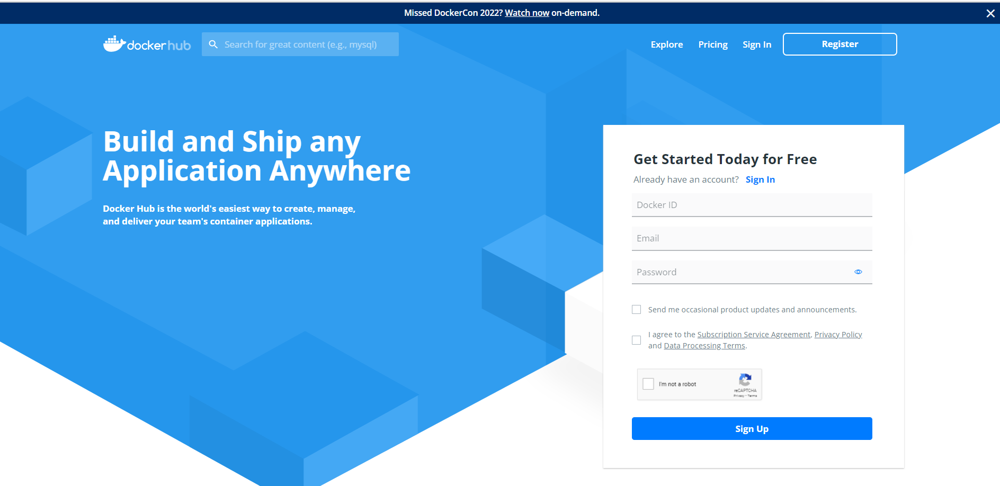

### Exercise 3: Working with Docker Images:

A Docker image is a file used to execute code in a Docker container. Docker images act as a set of instructions to build a Docker container, like a template. Docker images also act as the starting point when using Docker. An image is comparable to a snapshot in virtual machine (VM) environments.

A Docker image contains application code, libraries, tools, dependencies and other files needed to make an application run. When a user runs an image, it can become one or many instances of a container.

In this exercise, you will work on building Docker images from the docker file and create a container from the image with the Nginx website hosted on it. You will also pull and push images to the Docker hub.

1. In your terminal run the below command to list all the images that are present in your system. Notice your ubuntu image is listed.

   ```
   docker image ls
   ```
   
      
2. Now pull an **Ubuntu:latest** image from the docker hub by running the below command:

   - docker pull <image_name:version>

     ```
     docker pull ubuntu:latest
     ```
     
   
3. In Visual studio code click on **File** and select **New file**.

   

4. In the file add the folowing content and save the file in **`c:/dockerfiles`** folder. Provide the file name as **Dockerfile** and select type as **No extension** then click on **Save**.

   ```
   # Each instruction in this file generates a new layer that gets pushed to your local image cache
   #
 
   #
   # Lines preceeded by # are regarded as comments and ignored
   #
 
   #
   # The line below states we will base our new image on the Latest Official Ubuntu 
   FROM ubuntu:latest

   #
   # Update the image to the latest packages
   RUN apt-get update && apt-get upgrade -y
 
   #
   # Install NGINX to test.
   RUN apt-get install nginx -y
 
   #
   # Expose port 80
   EXPOSE 80
 
   #
   # Last is the actual command to start up NGINX within our Container
   CMD ["nginx", "-g", "daemon off;"]
   ```
   
   
   
   **Note**: Please check that the file Dockerfile has no file extension like .txt
   
5. In the terminal navigate to **c:\dockerfiles** and build the container image using the docker build command.

   ```
   cd c:/dockerfiles
   ```

   - docker build -t <your_image_name> .
   
     ```
     docker build -t nginx-site .
     ```
   
     
   
6. Run ```docker images``` command and verify your image is created.

    ```
    docker images
    ```
   
    
    
7. Now that you have an image ready, create and run a container from the image using the below command. 

   - docker run -d -p <port_number> --name <your_container_name> <your_image_name>
  
     ```
     docker run -d -p 8000:80 --name my-running-site nginx-site
     ```
   
     
  
   
8. Open edge browser in your LabVm and browse to http://localhost:8000.

   ```
   http://localhost:8000
   ```

9. Verify that you are able to see the nginx web page.

   


10. You have successfully built an image from dockerfile and created a container from the image with the nginx website hosted on it. 

#### Push image to Docker Hub

> **Note**: You need to have a Docker account to push images to docker hub. If you don't have please create one account https://hub.docker.com/


11. Now login to the Docker Hub using the below command. When prompted enter your personal docker username and password. If you don't register Docker Hub before, please follow step 12.

    ```
    docker login
    ```
    
    

12. In edge browser go to docker hub **https://hub.docker.com/**, navigate to **Register** section, and Register with your personal email account.
 
    

    
13. In edge browser login to docker hub **https://hub.docker.com/**, navigate to **Repositories** section and create an repository with the name **`mydemo-images`**.

    
    
    

14. Use the docker tag command to give your image a new name. Be sure to replace YOUR-USER-NAME with your Docker ID.

    ```
    docker tag  nginx-site YOUR-USER-NAME/Repository-Name:V1
    ```
    
    
    
15.  Push your image to the repository you created.

     ```
     docker push YOUR-USER-NAME/Repository-Name:V1
     ```
     
    
16. After pushing the image navigate back to your repository in docker hub and verify your able to see the image that you pushed in the previous step.

    


Click on **Next** at the bottom of lab guide to move to the next exercise.
