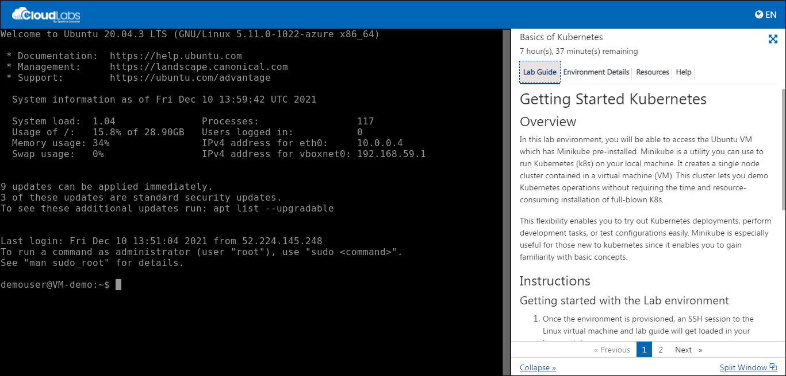
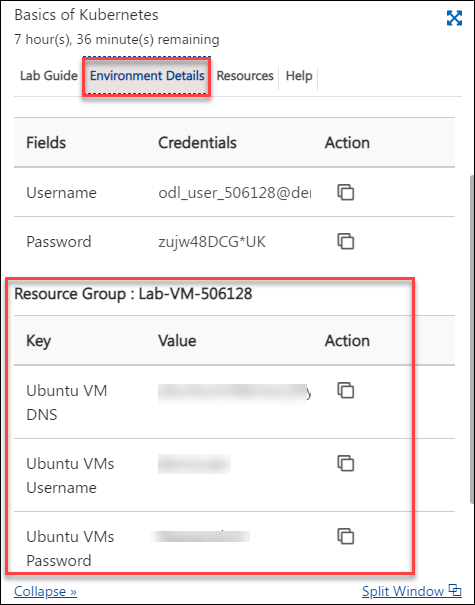
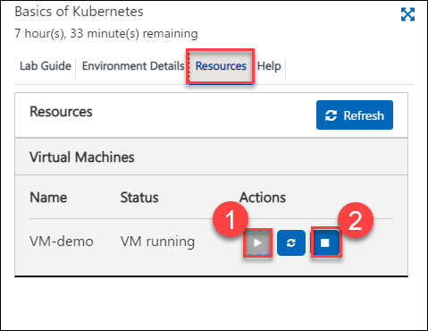
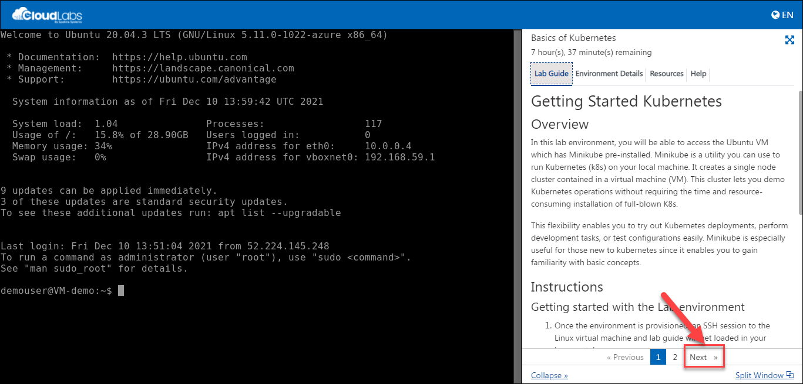

# Getting Started with Kubernetes

## Overview

In this lab environment, you'll be able to use the Ubuntu VM which comes with preloaded images of Minikube. This flexibility enables you to try out Kubernetes deployments, perform development tasks, or test configurations easily. Minikube is especially useful for those new to kubernetes since it enables you to gain familiarity with basic concepts.

## Instructions

### Getting started with the Lab environment

1. Once the environment is provisioned, an SSH session to the Linux virtual machine and lab guide will get loaded in your browser tab. 
   
   

1. To get the lab environment details, you can select the **Environment Details** tab. Additionally, the credentials will also be sent to your email address provided during registration.

   
   
1. You can also open the Lab Guide on a separate full window by selecting the **Split Window** button on the bottom right corner.

   

1. You can **start (1)** or **stop (2)** the Virtual Machine from the **Resources** tab.

   
   
1. Now, click on **Next** from the lower right corner to move to the next page.
   
    

