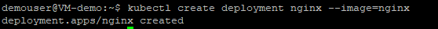
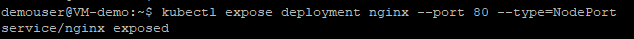
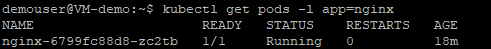

# Exercise 2: Creating a Sample Nginx App Using Kubectl

In this exercise, we are going to explore on the **nodes** and **pods** inside kubernetes cluster. We will create a sample application named **nginx**, expose the deployments in the cluster and observe the pod details using different kubectl commands. 

1. Run the below command to get the list of nodes inside the kubernetes cluster using **kubectl get nodes** commands.

   ```
   kubectl get nodes
   ```
   
   
1. Execute the below query to to get the details about the node inside the cluster **minikube** and observe the node details from the output section.

   ```
   kubectl describe node minikube
   ```
   
   
1. Run the below command to check the pods inside the cluster. **kubectl get pods** command is used to get all the pods inside the kubernetes.

   ```
   kubectl get pods
   ```
   After running the above command you will recieve an output message **No resources found in default namespace** as there are no pods created.

1. Execute the below command to create a deployment of nginx using the nginx image. Once the command ran successfully, you will prompted with an output message saying **deployment.apps/nginx created**
  
   ```
   kubectl create deployment nginx --image=nginx
   ```
   
   
1. Run the below query to expose the deployments inside the kubernetes. You will be prompted with an output message **service/nginx exposed** after running the command successfully.

   ```
   kubectl expose deployment nginx --port 80 --type=NodePort
   ```
   
   
1. By executing the following query you can now see the state of your deployment. Make sure that the deployment is in running state before proceeding to further steps.
   
   ```
   kubectl get deployments
   ```
   
   
1. Execute the below command to get display information about the deployment and observe the output.

   ```
   kubectl describe deployment nginx
   ```
   
   
1. Run the below command to check the pods inside the cluster. You can see that a new pod has been created and is currently in **running** state.

    ```
   kubectl get pods
   ```
   
   
1. Execute the below command to list the pods created by the **nginx** deployment.

   ```
   kubectl get pods -l app=nginx
   ```
   
   
1. Run the folloiwng command and observe the pod details from output. **kubectl describe pod** displays information about a pod.

   ```
   kubectl describe pod
   ```
   
   
1. Run the **get svc** command to see a summary of the service and the ports exposed.

   ```
   kubectl get svc
   ```
   
   
### Summary

In this exercise, we created a sample deployment and explored on checking the status of the nodes and pods inside kubernetes cluster.
