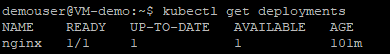
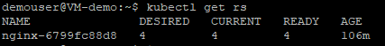
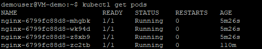

# Exercise 4: Scaling the App

When traffic increases, we will need to scale the application to keep up with user demand. We have learned about deployments and services, now lets learn about scaling.

We will use the **scale** command to scale the deployments and we can check the status of scaling by using **get pods** command.

1. Run the below command and observe the list of your deployments using the **get deployments** command.

   ```
   kubectl get deployments
   ```
   
   
1. Execute the following command to see the **ReplicaSet** created by the deployment. A **ReplicaSet** ensures that a specified number of pod replicas are running at any given time.

   ```
   kubectl get rs
   ```
   
   
1. Run the below command to scale the deployments. Let’s scale the deployment to 4 replicas. We’ll use the **kubectl scale** command, followed by the deployment type, name and desired number of instances.

   ```
   kubectl scale deployments/nginx --replicas=4
   ```
   After running the above command, you will recieve an output message saying **deployment.apps/nginx scaled** as shown in the below screenshot.
   
   
   
1. Execute the following command to see the updated **ReplicaSet** inside the deployment.

   ```
   kubectl get rs
   ```
   
   
1. Execute the below command. We can see the status of scaling operation by using **describe** command.

   ```
   kubectl describe deployments/nginx
   ```
   
  
1. Run the following command and observe that the changes were applied, and we have 4 pods of the application available in **Running** state.

   ```
   kubectl get pods
   ```
   
   
1. To scale down the service to 2 replicas, run the following **kubectl scale** command again. We can use the same **scale** command to scale down the pods.

   ```
   kubectl scale deployments/nginx --replicas=2
   ```
   After running the above command, you will recieve an output message saying **deployment.apps/nginx scaled** as shown in the below screenshot.
   
   
   
1. Execute the below command to check if the changes are applied using the **get deployments** command.

   ```
   kubectl get deployments
   ```
   
   
1. Run the following command and observe that the number of replicas decreased to 2. We can list the number of pods using the **get pods** command.

   ```
   kubectl get pods
   ```
   
   
### Summary

In this exercise, we learned about how to use **scale** command to scale the deployments up and down.

