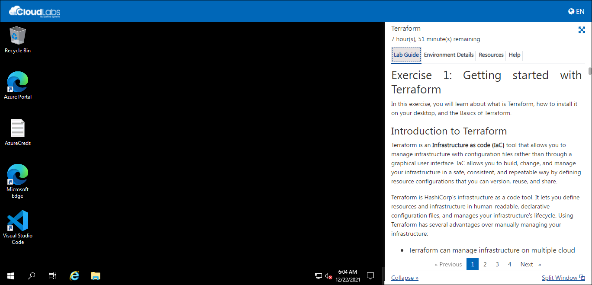
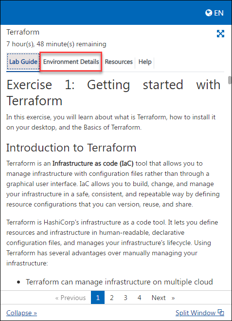
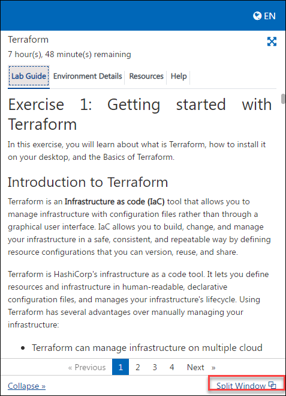

# Getting Started with Lab

1. Once the environment is provisioned, a virtual machine and lab guide will get loaded in your browser. Use this virtual machine throughout the workshop to perform the lab.

    
   
1. To get the lab environment details, you can select the Environment Details tab. Additionally, the credentials will also be emailed to your email address provided at registration.

    

1. You can also open the Lab Guide in a separate full window by selecting the Split Window icon at the bottom right corner.

    
    

# Log in to Microsoft Edge

1. In the virtual machine (VM) on the left, click on the Microsoft edge icon as shown below.

     
     
1. When you click on Azure portal, the edge browser welcome screen will come up, select **Get started**.

    
   
1. On the next window, click on **Confirm**.

    
    
1. You can close the popup that appears.

    
    
1. Now, you have successfully logged in 
   
