# Exercise 1: Getting started with Terraform

In this exercise, you will learn about what is Terraform, how to install it on your desktop, and the Basics of Terraform.


## Introduction to Terraform

Terraform is HashiCorp's **Infrastructure as code (IaC)** tool that allows you to manage infrastructure with configuration files rather than through a graphical user interface. IaC allows you to build, change, and manage your infrastructure in a safe, consistent, and repeatable way by defining resource configurations that you can version, reuse, and share.

Terraform also lets you define resources and infrastructure in human-readable, declarative configuration files, and manages your infrastructure's lifecycle. Using Terraform has several advantages over manually managing your infrastructure:

   - Terraform can manage infrastructure on multiple cloud platforms.
   - The human-readable configuration language helps you write infrastructure code quickly.
   - Terraform's state allows you to track resource changes throughout your deployments.
   - You can commit your configurations to version control to safely collaborate on infrastructure.

 ### Manage any infrastructure

Terraform plugins called `providers` let Terraform interact with cloud platforms and other services via their application programming interfaces (APIs). HashiCorp and the Terraform community have written over 1,000 providers to manage resources on Amazon Web Services (AWS), Azure, Google Cloud Platform (GCP), Kubernetes, Helm, GitHub, Splunk, and DataDog, just to name a few.

To know more about Terraform, you can refer to the given link ``https://www.terraform.io/intro/index.html``.


## Task 1: Install Terraform in Windows Machine

In this task, you will download and install the Terraform manually on a Windows machine.

1. Within the Virtual Machine, open up a new tab on the web browser and navigate to the below URL to download the **Terraform** zip file.

```
   https://www.terraform.io/downloads.html
```

2. On the **Download Terraform** page, under the **Windows** tab, click on **64-bit** to download the file.

    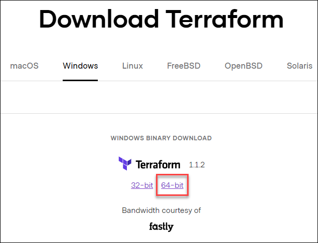
    
1. After downloading the **Terraform** zip-file, minimize the browser window and open the **File Explorer**
    
3. Navigate to the C drive and create a folder named **terraform**, and extract the zip file to the folder.

     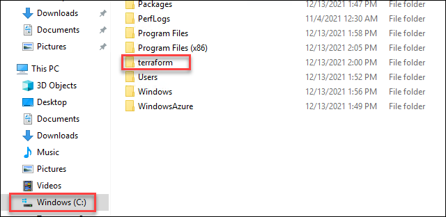
     
4. Now you need to make sure that Terraform binary is available on your path.

5. To do that search for **Environment variables** from the windows search bar and select it.

    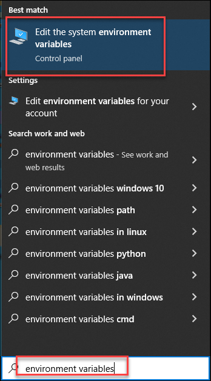
    
6. On **System properties**, click on **Environment Variables**.

    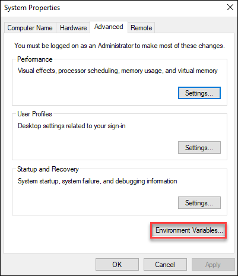
    
7. Now under system variables, select **Path (1)** and click on **Edit (2)**.

    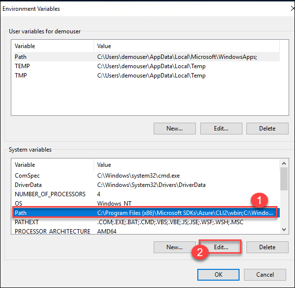
    
8. Selct **New(1)** then add the path **C:\terraform** **(2)** and click on **Ok (3)** to save it.

    

9. Once you have done that, you can close the System Properties tab.

## Task 2: Basics of Terraform

In this task, you will learn about the basics of Terraform by reviewing it and initialize the Terraform configuration using Windows PowerShell.

### Overview

The syntax of Terraform configurations is called **HashiCorp Configuration Language (HCL)**. It is meant to strike a balance between human-readable and editable as well as being machine-friendly. For machine-friendliness, Terraform can also read JSON configurations. For the Terraform configuration, you will be using the **.tf** extension.

The Terraform language syntax is built around two key syntax constructs: Arguments and blocks.

- **Arguments** : An argument assigns a value to a particular name

    `string_id = "abc123"`
    The identifier before the equals sign is the argument name, and the expression after the equals sign is the argument's value.
    
- **Blocks**: A block is a container for other content

   ```
   resource "azure_instance" "example" {
        ami = "abc123"
        network_interface {
         ...
      }
   }
   ```
   
   A block has a type (resource in this example). Each block type defines how many labels must follow the type keyword. The resource block type expects two labels, which are azure_instance and example in the example above. A particular block type may have any number of required labels, or it may require none as with the nested network_interface block type.

  After the block type keyword and any labels, the block body is delimited by the { and } characters. Within the block body, further arguments and blocks may be nested, creating a hierarchy of blocks and their associated arguments.

 

### Identifiers

Argument names, block type names, and the names of most Terraform-specific constructs like resources, input variables, etc. are all identifiers.

Identifiers can contain letters, digits, underscores (_), and hyphens (-). The first character of an identifier must not be a digit, to avoid ambiguity with literal numbers.

For complete identifier rules, Terraform implements the Unicode identifier syntax, extended to include the ASCII hyphen character -.

### Comments

The Terraform language supports three different syntaxes for comments:

  - **#** begins a single-line comment, ending at the end of the line.

  - **//** also begins a single-line comment, as an alternative to **#**.

  - `/* and */ `are the start and end delimiters for a comment that might span over multiple lines.

  - The **#** single-line comment style is the default comment style and should be used in most cases. Automatic configuration formatting tools may automatically transform **//** comments into **#** comments since the double-slash style is not idiomatic.


### Write configuration

You can have a look at the sample configuration of Terraform file `main.tf` below:

```
   # Configure the Azure provider
terraform {
  required_providers {
    azurerm = {
      source  = "hashicorp/azurerm"
      version = "~> 2.65"
    }
  }

  required_version = ">= 1.1.0"
}

provider "azurerm" {
  features {}
}

resource "azurerm_resource_group" "rg" {
  name     = "myTFResourceGroup"
  location = "westus2"
}
```

In the following sections, you will review each block of the configuration in more detail.

  - **Terraform Block:**

The `terraform {}` block contains Terraform settings, including the required providers Terraform will use to provision your infrastructure. For each provider, the `source` attribute defines an optional hostname, a namespace, and the provider type. Terraform installs providers from the Terraform Registry by default. In this example configuration, the `azurerm` provider's source is defined as `hashicorp/azurerm`, which is shorthand for `registry.terraform.io/hashicorp/azurerm`.

You can also define a version constraint for each provider in the `required_providers` block. The `version` attribute is optional, but we recommend using it to enforce the provider version. Without it, Terraform will always use the latest version of the provider, which may introduce breaking changes.

   - **Providers:**

The `provider` block configures the specified provider, in this case, `azurerm`. A provider is a plugin that Terraform uses to create and manage your resources. You can define multiple provider blocks in a Terraform configuration to manage resources from different providers.


   - **Resource:**

You will be using `resource` blocks to define components of your infrastructure. A resource might be a physical component such as a server, or it can be a logical resource such as a Heroku application.

Resource blocks have two strings before the block: the resource type and the resource name. In this example, the resource type is `azurerm_resource_group` and the name is `rg`. The prefix of the type maps to the name of the provider. In the example configuration, Terraform manages the `azurerm_resource_group` resource with the `azurerm` provider. Together, the resource type and resource name form a unique ID for the resource. For example, the ID for your network is `azurerm_resource_group.rg`.


### Task 2.1: Initialize your Terraform configuration

In this task, you will learn about how to write and initialize the Terraform configuration using Windows PowerShell.

1. In your LabVm, right-click on the **Windows icon (1)** from the bottom left corner and select **Windows Powershell (Admin) (2)**.

    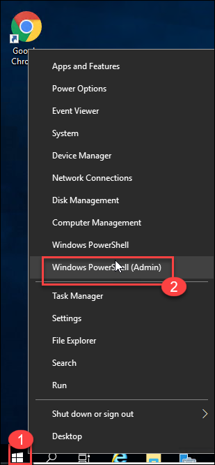
    
1. In the PowerShell terminal, run the following command to install Azure CLI.

   ```
   Invoke-WebRequest -Uri https://aka.ms/installazurecliwindows -OutFile .\AzureCLI.msi; Start-Process msiexec.exe -Wait -ArgumentList '/I AzureCLI.msi /quiet'; rm .\AzureCLI.msi
   ```
     
     
1. After installing Azure CLI, close the existing Windows Powershell session and open it again.
     
1. Run the following command in your terminal to set up your Azure account permissions locally.

    ``` 
       az login
    ```
    > **Info**: Terraform must authenticate to Azure to create an infrastructure.
    
1. Your browser window will open and you will be prompted to authenticate to your Azure. 

1. Enter the following credentials to login into your Azure account.

    * Email/Username: **<inject key="AzureAdUserEmail"></inject>**

    
   
   * Password: **<inject key="AzureAdUserPassword"></inject>**
   
   
      
 
3. Once you are authenticated to Azure, you will be presented with subscription information as result.

   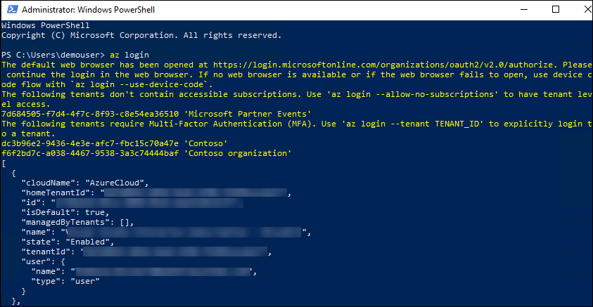
  
1. Now Copy and paste the below command in the PowerShell terminal to create a new folder called `learn-terraform-azure` and minimize the terminal.

     ```
        New-Item -Path "c:\" -Name "learn-terraform-azure" -ItemType "directory"
     ```
7. Copy and paste the below configuration in a new file called `main.tf`, make sure you replace **{DID}** value under resource group name with **<inject key="DeploymentID" />** and save it under **C:\learn-terraform-azure**

    ```
       # Configure the Azure provider
        terraform {
         required_providers {
          azurerm = {
            source  = "hashicorp/azurerm"
            version = "~> 2.65"
           }
         }

        required_version = ">= 1.1.0"
      }

     provider "azurerm" {
        features {}
     }

    resource "azurerm_resource_group" "rg" {
       name     = "lab-rg-{DID}"
       location = "westus2"
    }
    ```
    >**Note:** Make sure you select **Save as type** as **All files**, while saving the **main.tf** file
   
1. Now, navigate to the newly created directory by running the following command.

    ```
       cd C:\learn-terraform-azure
    ```

1. Run the below command to initialize your `learn-terraform-azure` directory in your terminal. 

     ```
        terraform init
     ```
  
      > Note: The terraform commands will work with any operating system

1. Once you have initiated the Terraform, you will be presented with the below message.

    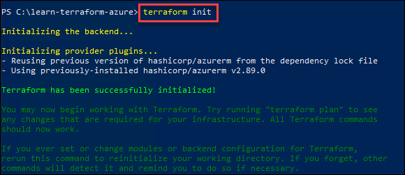
    
1. Run the below command to automatically update configurations in the current directory for readability and consistency.

     ```
       terraform fmt
     ```
 1. Terraform will print out the names of the files it modified if any. In this case, your configuration file was already formatted correctly, so Terraform will display the name of the newly created file.

     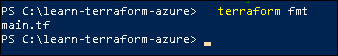
   
1. You can also make sure your configuration is syntactically valid and internally consistent by running the below command.

     ```
       terraform validate
     ```

    
    
1. Run the below command to see how Terraform will apply this change to your infrastructure. Enter **yes** to the prompt to confirm the changes.

     ```
       terraform apply
     ```

    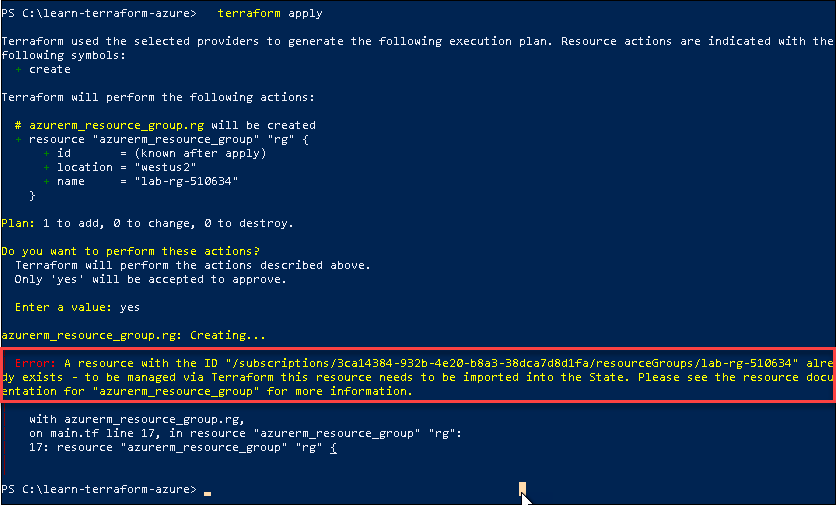
    
     > **Note**: As it is a pre-created resource group, you will get an error as the resource group already exists. You can ignore the error and continue with the next step.

1. Now, you need to import the created Resource group by running the below command in **Windows PowerShell (Admin)**.

      > **Note:** Make sure you replace the **{subscription-id}** and **{DID}** before running the command. You can find the values on the **Environment details** page.

     ```
      terraform import azurerm_resource_group.rg /subscriptions/{subscription-id}/resourceGroups/lab-rg-{DID}
     ```
  
     > When you apply your configuration, Terraform writes data into a file called **terraform.tfstate**. This file contains the IDs and properties of the resources Terraform created so that it can manage or destroy those resources going forward. 

19. You can inspect the current state of the resource group by running the following command.
 
     ```
      terraform show
     ```
   
     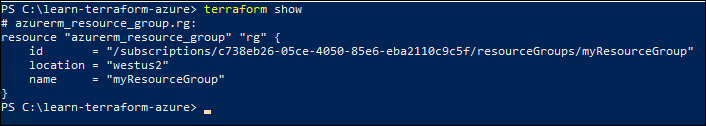
     
20. To review the information in your state file, use the **state** command. If you have a long state file, you can see a list of the resources you created with Terraform by using the **list** subcommand.

     ```
        terraform state list
     ```
       
      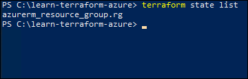
      
21. Use the following command, to see a full list of available commands to view and manipulate the configuration's state.

     ```
      terraform state
     ```
    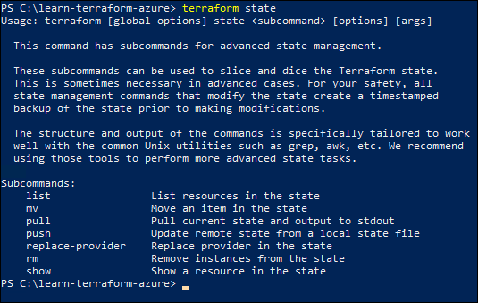

22. Now you have successfully imported the resource group **lab-rg-<inject key="DeploymentID" enableCopy="false"/>** using Terraform configuration.

## Summary

In this exercise, you have covered the following:

 - Installed Terraform
 - Initialized the Terraform configuration
 - Imported the Resource group using Terraform
