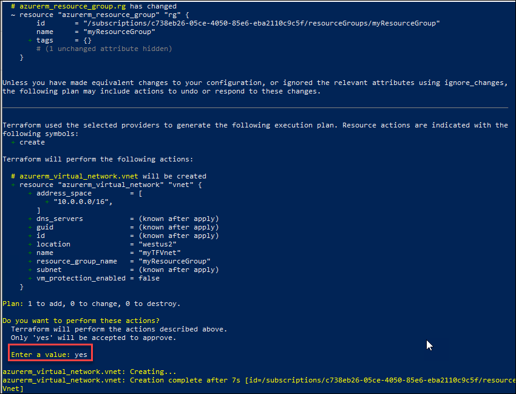
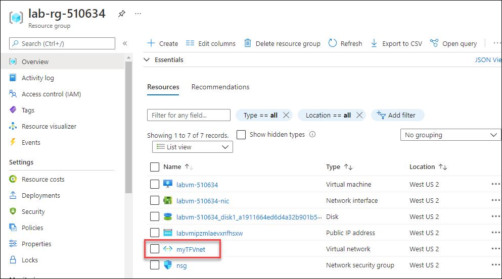

# Exercise 2: Create Virtual Network using Terraform

In this exercise, you will create Virtual Network using Terraform and modify your configuration by defining an additional resource that references your resource group and adding tags to your resource group.


## Task 1: Create Virtual Network using Terraform

In this task, you will create a virtual network using Terraform.
   
1. Now, minimize the Powershell window and navigate to the path **C:\learn-terraform-azure** in the file explorer.

1. In your **main.tf** file, copy and paste the resource block given below to create a virtual network (VNet) and save the file.

   ```
     # Create a virtual network
     resource "azurerm_virtual_network" "vnet" {
       name                = "vnet-terraform-prod-westus2-001"
       address_space       = ["10.0.0.0/16"]
       location            = "westus2"
       resource_group_name = azurerm_resource_group.rg.name
     }
    ```
    > **Info**: To create a new Azure VNet, you have to specify the name of the resource group to contain the VNet. By referencing the resource group, you establish a dependency between the resources. Terraform ensures that resources are created in proper order by constructing a dependency graph for your configuration.

1. After updating the configuration, run the below command to see how Terraform will apply this change to your infrastructure. Enter **yes** to the prompt to confirm the changes.

    ```
      terraform apply
    ```
    
  
    > **Info**: Terraform builds an execution plan by comparing your desired state as described in the configuration to the current state, which is saved in either the local terraform.tfstate file or in a remote state backend depending on your configuration.

1. You have successfully created a Virtual network using Terraform.

1. To validate the Virtual network, navigate back to the **Azure Portal** and click on **Resource groups** from Navigate panel.

    

1. On the **Resource groups** tab, click on **lab-rg-<inject key="DeploymentID" enableCopy="false"/>**.

1. Now, under **Resources**, you should be able to see the newly created virtual network **myTFVnet**.

    
    
1. You can minimize the windows browser before moving to the next task.


## Task 2: Modify an existing resource

In addition to creating new resources, Terraform can also modify the properties of existing resources. In this task, you will be adding the tags to the existing resource group.

1. Now, again navigate to your **main.tf** file, and update the **azurerm_resource_group** resource in your configuration by adding the tags block as shown below:

   >**Note :** make sure you replace **DID** value under resource group name with **<inject key="DeploymentID" />** and save the file.

   ```
     resource "azurerm_resource_group" "rg" {
       name     = "lab-rg-{DID}"
       location = "westus2"

       tags = {
         Environment = "Terraform Getting Started"
         Team = "DevOps"
       }
     }
    ```
1. Run the below command to modify your infrastructure and enter **yes** to the prompt to confirm the operation.

   ```
    terraform apply
   ```
   
   
   > **Info :** The prefix ~ means that Terraform will update the resource in place.

1. Run the below command to see the new values associated with this resource group.

    ```
      terraform show
    ```
     
     
1. Run the below command to get the updated list of resources managed in your workspace.

   ```
     terraform state list
   ```
   
   

## Summary

- Created Virtual Network using Terraform
- Modified the existing resource
