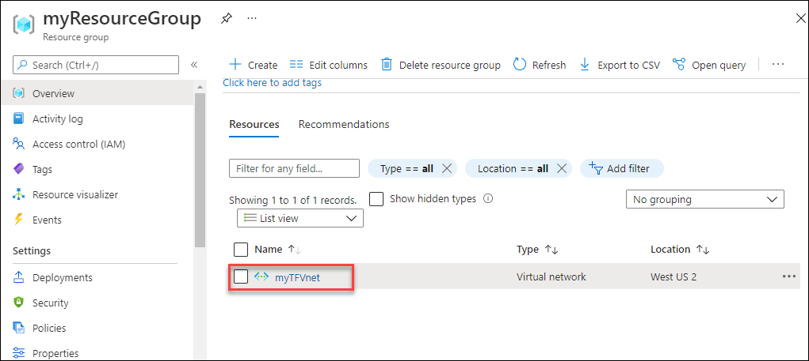

# Exercise 2: Create Virtual Network using Terraform

In this exercise, you will validate the created Resource group in Azure Portal and you will modify your configuration by defining an additional resource that references your resource group and adding tags to your resource group.


## Task 1: Validate the resource group

In this task, you will validate the created Resource Group in Azure Portal.

1. In the virtual machine (VM) on the left, click on the Azure portal desktop icon as shown below.

   
   
1. When you click on Azure portal, the edge browser welcome screen will come up, select **Get started**.

   
   
1. On the next window, click on **Confirm**.

   
   
1. You can close the popup that appears.

   
   
1. Now, you will see two tabs in the edge browser, close the first tab named with **Microsoft Edge**.

1. On the **Sign in to Microsoft Azure** window, you will see the login screen, enter the following username and click on **Next**.

   * Email/Username: <inject key="AzureAdUserEmail"></inject>

   

1. Now enter the following password and click on **Sign in**. 

   * Password: <inject key="AzureAdUserPassword"></inject>
   
   

1. First-time users are often prompted to **Stay Signed In**, if you see any such pop-up, click on **No**

   

1. If you see the pop-up **You have free Azure Advisor recommendations!**, close the window to continue the lab.

1. If a **Welcome to Microsoft Azure** popup window appears, click **Maybe Later** to skip the tour.

1. Now you can see Azure Portal Dashboard, click on **Resource groups** from the Navigate panel to see the resource groups.

    
    
    
## Task 2: Create Virtual Network using Terraform

In this task, you will create a virtual network using Terraform.


1. Return to the **Windows Powershell (Admin)** in the LabVm. If you have closed the tab, right-click on the **Windows icon (1)** from the bottom left corner and select **Windows Powershell (Admin) (2)**.

     
     
1. Navigate to the created directory by running the following command.

    ```
      cd C:\learn-terraform-azure
    ```
    
1. Now, minimize the Powershell window and navigate to the path **C:\learn-terraform-azure** in the file explorer.

1. In your **main.tf** file, add the resource block below to create a virtual network (VNet) and save the file

   ```
     # Create a virtual network
     resource "azurerm_virtual_network" "vnet" {
       name                = "myTFVnet"
       address_space       = ["10.0.0.0/16"]
       location            = "westus2"
       resource_group_name = azurerm_resource_group.rg.name
     }
    ```
    > **Info**: To create a new Azure VNet, you have to specify the name of the resource group to contain the VNet. By referencing the resource group, you establish a dependency between the resources. Terraform ensures that resources are created in proper order by constructing a dependency graph for your configuration.

1. After changing the configuration, run the below command to see how Terraform will apply this change to your infrastructure. Respond yes to the prompt to confirm the changes.

    ```
      terraform apply
    ```
    
  
    > **Info**: Terraform builds an execution plan by comparing your desired state as described in the configuration to the current state, which is saved in either the local terraform.tfstate file or in a remote state backend depending on your configuration.

1. You have successfully created a Virtual network using Terraform.

1. To validate the Virtual network, navigate back to the **Azure Portal** and click on **Resource groups** from Navigate panel.

1. On the **Resource groups** tab, click on **myResourceGroup**.

1. Now, under **Resources**, you should be able to see the newly created virtual network **myTFVnet**.

    
    

## Task 3: Modify an existing resource

In addition to creating new resources, Terraform can also modify the existing resources.

1. Now, again navigate to your **main.tf** file, and update the **azurerm_resource_group** resource in your configuration by adding the tags block as shown below:

   ```
     resource "azurerm_resource_group" "rg" {
       name     = "myTFResourceGroup"
       location = "westus2"

       tags = {
         Environment = "Terraform Getting Started"
         Team = "DevOps"
       }
     }
    ```
1. Run the below command to modify your infrastructure and respond **yes** to the prompt to confirm the operation.

   ```
    terraform apply
   ```
   
   
   > **Info :** The prefix ~ means that Terraform will update the resource in place.

1. Run the below command to see the new values associated with this resource group.

    ```
      terraform show
    ```
     
     
1. Run the below command to get the updated list of resources managed in your workspace.

   ```
     terraform state list
   ```
   
   

## Summary

- Validated the created resource group
- Created Virtual Network using Terraform
- Modified the existing resource
