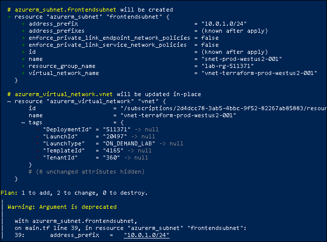
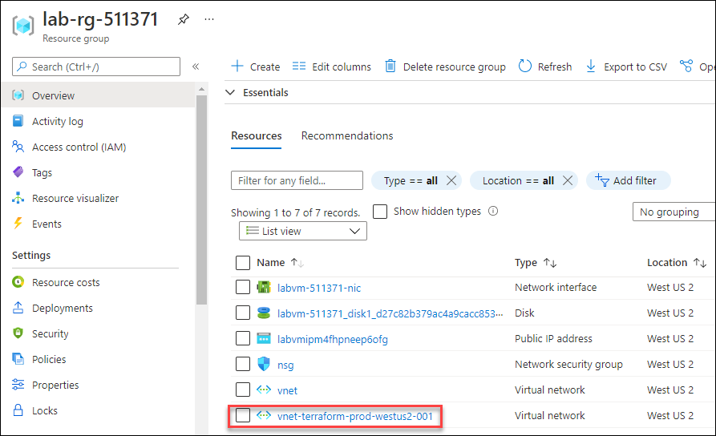
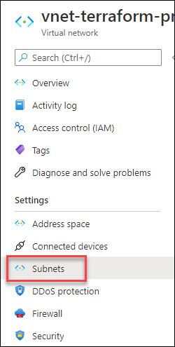
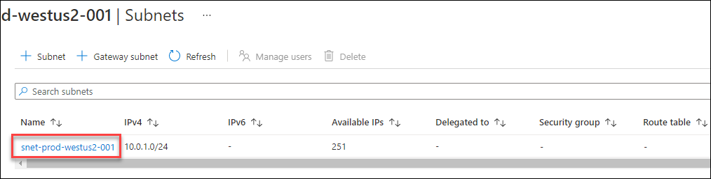
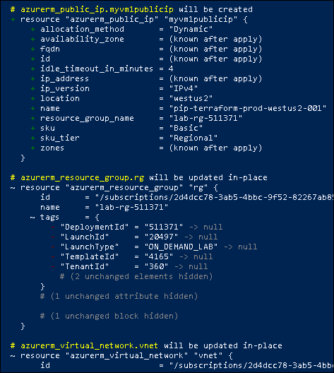
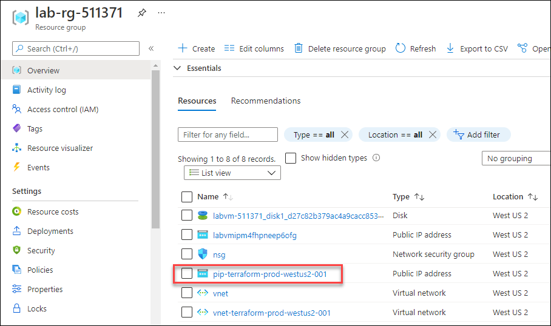

# Exercise 3: Create a Subnet and Public IP Address using terraform

In this exercise, you will create the resources Subnet and Public IP address using Terraform those will be used while creating the Virtual Machine in the upcoming exercises.


## Task 1: Create Subnet using Terraform

In this task, you will create a subnet using Terraform within the VNet which you have created in the previous exercise.


1. Minimize the Powershell window and navigate to the path **C:\learn-terraform-azure** in the file explorer.

1. In your **main.tf** file, copy and paste the resource block given below to create a subnet and save the file.

   ```
     resource   "azurerm_subnet"   "frontendsubnet"   { 
         name   =   "snet-prod-westus2-001" 
         resource_group_name   =    azurerm_resource_group.rg.name 
         virtual_network_name   =   azurerm_virtual_network.vnet.name 
         address_prefix   =   "10.0.1.0/24" 
     } 
   ```
   > **Info** : To create a new Azure Subnet, you have to specify the name of the resource group and Vnet to contain the Subnet. By referencing the resource group and Vnet, you establish a dependency between the resources. Terraform ensures that resources are created in proper order by constructing a dependency graph for your configuration.

1. Run the below command to create an execution plan, which lets you to preview the changes that Terraform plans to make to your infrastructure. 

    ```
      terraform plan -out=FILE
    ```
    
    > **Info :**  In the above command you are using **-out=FILE** option to save the generated plan to a file on disk, which you can later execute by passing the file to terraform apply as an extra argument. 

1. After changing the configuration, run the below command to see how Terraform will apply this change to your infrastructure. Enter **yes** to the prompt to confirm the changes.

    ```
      terraform apply
    ```
 
   
   
1. To validate the Virtual network, navigate back to the **Azure Portal** and click on **Resource groups** from Navigate panel.

1. On the **Resource groups** tab, click on **lab-rg-<inject key="DeploymentID" enableCopy="false"/>**.

1. Now, under **Resources**, you should be able to see the newly created Virtual Network **vnet-terraform-prod-westus2-001**.

    
    
1. Select **Subnets** from the left navigation menu of the page.

    
    
1. On the **Subnets** page, you will be able to see the newly created subnet **snet-prod-westus2-001**.

    
    
1. Now, you have successfully created a subnet using Terraform.


# Task 2: Create Public IP Address using Terraform.

In this task, you will create a new Public IP Address using Terraform to attach to the Virtual Machine where you are going to create it in the next exercise.

     
1. Now, minimize the windows browser and navigate to the path **C:\learn-terraform-azure** in the file explorer.

1. In your **main.tf** file, copy and paste the resource block given below to create a Public IP Address and save the file.

     ```
        # create public IP Address
        resource   "azurerm_public_ip"   "myvm1publicip"   { 
          name   =   "pip-terraform-prod-westus2-001" 
          location   =   "westus2" 
          resource_group_name   =   azurerm_resource_group.rg.name 
          allocation_method   =   "Dynamic" 
          sku   =   "Basic" 
        }
      ```
      
1. After changing the configuration, navigate back to the **Windows PowerShell** and run the below command to see how Terraform will apply this change to your infrastructure. Enter **yes** to the prompt to confirm the changes.

    ```
       terraform apply
    ```
    
      
      
1. Now, you have successfully created a **Public IP Address** named as **pip-terraform-prod-westus2-001** using Terraform.

1. To validate the **Public IP Address**, navigate back to the **Azure Portal** and click on **Resource groups** from Navigate panel.

1. On the **Resource groups** tab, click on **lab-rg-<inject key="DeploymentID" enableCopy="false"/>**.

1. Now, under **Resources**, scroll down to see the Public IP Address **pip-terraform-prod-westus2-001**.

     
     
     >**Note:** You may have to refresh the page to see the newly created Public IP Address.


## Summary

In this exercise, you have covered the following:

  - Created a Subnet using Terraform and validated the resource from Azure Portal.
  - Created Public IP Address using Terraform and validated the resource from Azure Portal.
