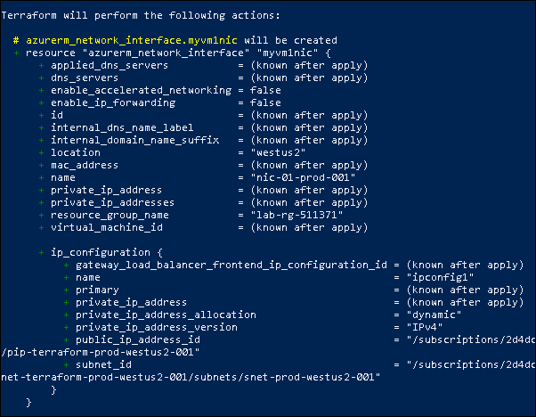
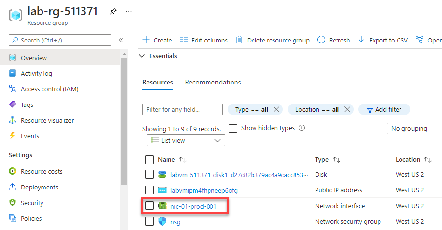
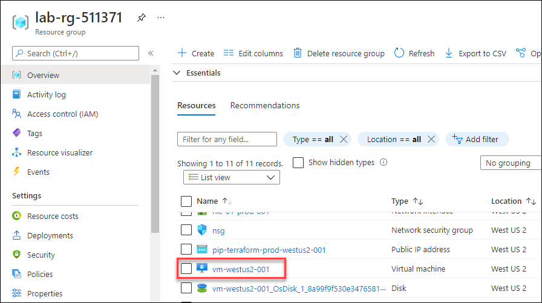

# Exercise 4: Create Network Interface and Virtual Machine using Terraform

In this exercise, you will create Network Interface and Virtual machine using Terraform configuration.


## Task 1: Create Network Interface using Terraform

In this task, you will create a Network interface using Terraform to attach to the Virtual Machine where you are going to create it in the next task.

1. Minimize the windows browser and navigate to the path **C:\learn-terraform-azure** in the file explorer.

1. In your **main.tf** file, copy and paste the resource block given below to create a Network Interface and save the file.

    ```
      # Create Network Interface
      resource   "azurerm_network_interface"   "myvm1nic"   { 
         name   =   "nic-01-prod-001" 
         location   =   "westus2" 
         resource_group_name   =   azurerm_resource_group.rg.name 

         ip_configuration   { 
             name   =   "ipconfig1" 
             subnet_id   =   azurerm_subnet.frontendsubnet.id 
             private_ip_address_allocation   =   "Dynamic" 
             public_ip_address_id   =   azurerm_public_ip.myvm1publicip.id 
          } 
      }
    ```
      >**Info :** To create a new Network Interface, you have to specify the name of the resource group, subnet, and public IP address. By referencing the resource group, subnet, and public IP address you establish a dependency between the resources. Terraform ensures that resources are created in proper order by constructing a dependency graph for your configuration.

1. Run the below command to create an execution plan, which lets you to preview the changes that Terraform plans to make to your infrastructure. 

    ```
      terraform plan -out=FILE
    ```
    
    > **Info :**  In the above command you are using **-out=FILE** option to save the generated plan to a file on disk, which you can later execute by passing the file to terraform apply as an extra argument. 

1. After changing the configuration, run the below command to see how Terraform will apply this change to your infrastructure. Enter **yes** to the prompt to confirm the changes.

    ```
      terraform apply
    ```
    
     
     
1. Now, you have successfully created a **Network Interface** named as **nic-01-prod-001"** using Terraform.

1. To validate the **Network Interface**, navigate back to the **Azure Portal** and click on **Resource groups** from Navigate panel.

     
     
1. On the **Resource groups** tab, click on **lab-rg-<inject key="DeploymentID" enableCopy="false"/>**.

1. Now, under **Resources**, scroll down to see the network interface Address **nic-01-prod-001"**.

    
    
    >**Note :** You may have to refresh the page to see the newly created Network Interface.


## Task 2: Create Virtual Machine using Terraform

In this task, you will create a Virtual Machine using Terraform.

     
1. Now, minimize the windows browser and navigate to the path **C:\learn-terraform-azure** in the file explorer.

1. In your **main.tf** file, copy and paste the resource block given below to create a Virtual Machine and save the file.

    ```
      # Create Virtual Machine
      resource   "azurerm_windows_virtual_machine"   "example"   { 
          name                    =   "vm-westus2-001"   
          location                =   "westus2" 
          resource_group_name     =   azurerm_resource_group.rg.name 
          network_interface_ids   =   [ azurerm_network_interface.myvm1nic.id ] 
          size                    =   "Standard_B1s" 
          admin_username          =   "demouser" 
          admin_password          =   "Password.1!!" 

          source_image_reference   { 
              publisher   =   "MicrosoftWindowsServer" 
              offer       =   "WindowsServer" 
              sku         =   "2019-Datacenter" 
              version     =   "latest" 
          } 

         os_disk   { 
           caching             =   "ReadWrite" 
           storage_account_type   =   "Standard_LRS" 
        } 
     }
    ```
    
1. Run the below command to create an execution plan, which lets you to preview the changes that Terraform plans to make to your infrastructure. 

    ```
      terraform plan -out=FILE
    ```
    
    > **Info :**  In the above command you are using **-out=FILE** option to save the generated plan to a file on disk, which you can later execute by passing the file to terraform apply as an extra argument. 

1. After changing the configuration, run the below command to see how Terraform will apply this change to your infrastructure. Enter **yes** to the prompt to confirm the changes.

    ```
       terraform apply
    ```
    
1. Now, you have successfully created a **Virtual Machine** named as **vm-westus2-001** using terraform.

1. To validate the **Virtual Machine**, navigate back to the **Azure Portal** and click on **Resource groups** from Navigate panel.

    

1. On the **Resource groups** tab, click on **lab-rg-<inject key="DeploymentID" enableCopy="false"/>**.

1. Now, under **Resources**, scroll down to see the Virtual Machine **vm-westus2-001**.

    
    
    >**Note :** You may have to refresh the page to see the newly created Virtual Machine.
    
    
## Summary

In this exercise, you have covered the following:

  - Created Network Interface using Terraform and validated the resource from Azure portal.
  - Created Virtual Machine using Terraform and validated the resource from Azure portal.
