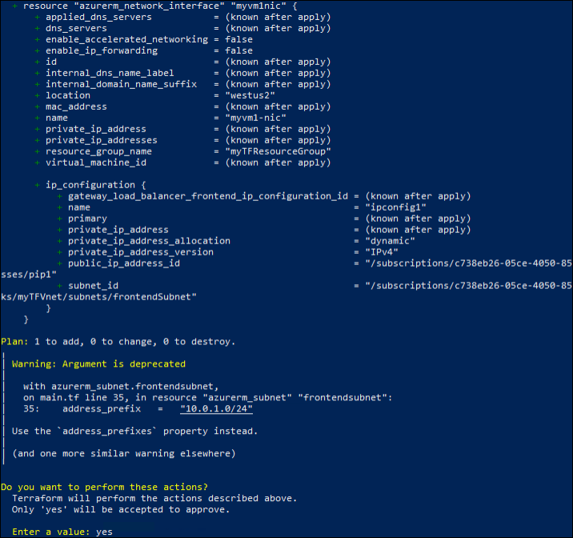
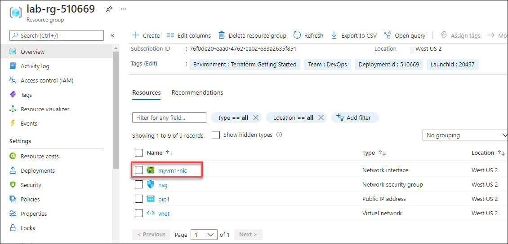
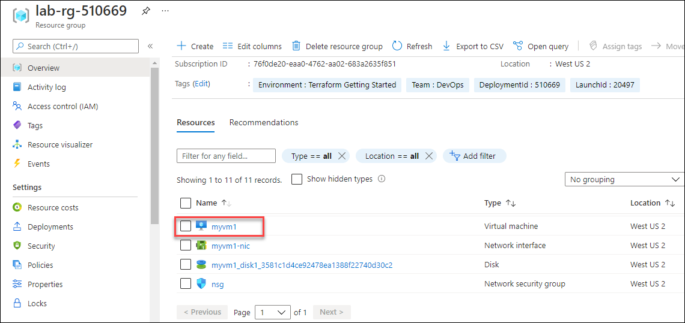

# Exercise 4: Create Network Interface and Virtual Machine using Terraform

In this exercise, you will create Network Interface and Virtual machine using Terraform configuration.


## Task 1: Create Network Interface using Terraform

In this task, you will create a Network interface using Terraform.

1. Minimize the windows browser and navigate to the path **C:\learn-terraform-azure** in the file explorer.

1. In your **main.tf** file, add the resource block below to create a Network Interface and save the file.

    ```
      # Create Network Interface
      resource   "azurerm_network_interface"   "myvm1nic"   { 
         name   =   "myvm1-nic" 
         location   =   "westus2" 
         resource_group_name   =   azurerm_resource_group.rg.name 

         ip_configuration   { 
             name   =   "ipconfig1" 
             subnet_id   =   azurerm_subnet.frontendsubnet.id 
             private_ip_address_allocation   =   "Dynamic" 
             public_ip_address_id   =   azurerm_public_ip.myvm1publicip.id 
          } 
      }
    ```
      >**Info :** To create a new Network Interface, you have to specify the name of the resource group, subnet, and public IP address. By referencing the resource group, subnet, and public IP address you establish a dependency between the resources. Terraform ensures that resources are created in proper order by constructing a dependency graph for your configuration.

1. After changing the configuration, run the below command to see how Terraform will apply this change to your infrastructure. Respond yes to the prompt to confirm the changes.

    ```
      terraform apply
    ```
    
     
     
1. Now, you have successfully created a **Network Interface** named as **myvm1-nic** using Terraform.

1. To validate the **Network Interface**, navigate back to the **Azure Portal** and click on **Resource groups** from Navigate panel.

     
     
1. On the **Resource groups** tab, click on **lab-rg-<inject key="DeploymentID" />**.

1. Now, under **Resources**, scroll down to see the network interface Address **myvm1-nic**.

    


## Task 2: Create Virtual Machine using Terraform

In this task, you will create a Virtual Machine using Terraform.

1. Return to the **Windows Powershell (Admin)** in the LabVm. If you have closed the tab, right-click on the **Windows icon (1)** from the bottom left corner and select **Windows Powershell (Admin) (2)**.

    
    
1. Navigate to the created directory by running the following command.

     ```
         cd C:\learn-terraform-azure
     ```
     
1. Now, minimize the Powershell window and navigate to the path **C:\learn-terraform-azure** in the file explorer.

1. In your **main.tf** file, add the resource block below to create a Virtual Machine and save the file.

    ```
      # Create Virtual Machine
      resource   "azurerm_windows_virtual_machine"   "example"   { 
          name                    =   "myvm1"   
          location                =   "westus2" 
          resource_group_name     =   azurerm_resource_group.rg.name 
          network_interface_ids   =   [ azurerm_network_interface.myvm1nic.id ] 
          size                    =   "Standard_B1s" 
          admin_username          =   "demouser" 
          admin_password          =   "Password.1!!" 

          source_image_reference   { 
              publisher   =   "MicrosoftWindowsServer" 
              offer       =   "WindowsServer" 
              sku         =   "2019-Datacenter" 
              version     =   "latest" 
          } 

         os_disk   { 
           caching             =   "ReadWrite" 
           storage_account_type   =   "Standard_LRS" 
        } 
     }
    ```

1. After changing the configuration, run the below command to see how Terraform will apply this change to your infrastructure. Respond yes to the prompt to confirm the changes.

    ```
       terraform apply
    ```
    
1. Now, you have successfully created a **Virtual Machine** named as **myvm1** using terraform.

1. To validate the **Virtual Machine**, navigate back to the **Azure Portal** and click on **Resource groups** from Navigate panel.

    

1. On the **Resource groups** tab, click on **lab-rg-<inject key="DeploymentID" />**.

1. Now, under **Resources**, scroll down to see the Virtual Machine **myvm1**.

    
    
    
## Summary

- Created Network Interface using Terraform and validated the resource from Azure portal.
- Created Virtual Machine using Terraform and validated the resource from Azure portal.
