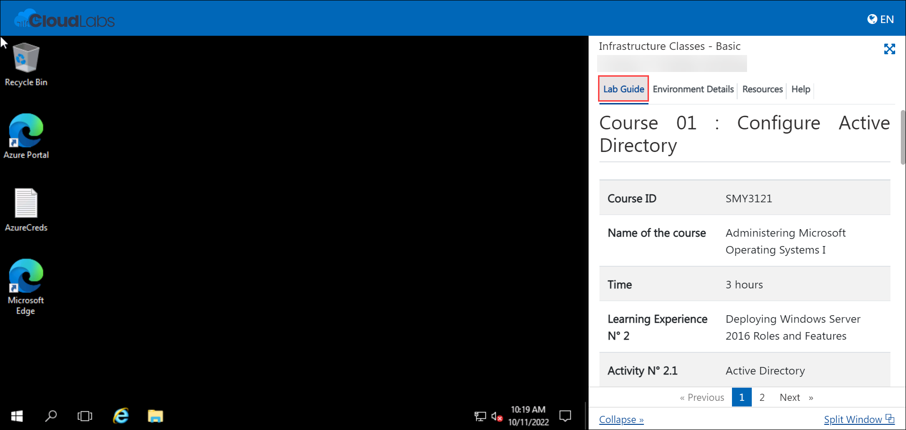
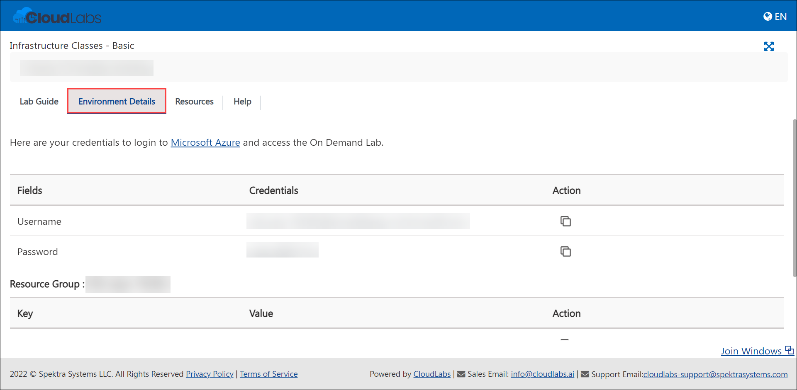
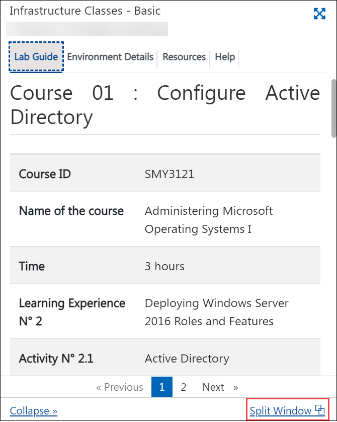

# Getting Started

1. Once the environment is provisioned, a virtual machine and lab guide will be loaded into your browser. Use this virtual machine to perform the lab.

    
    
2. To get the lab environment details, you can select the **Environment Details** tab.

    

3. Also, you can **start, stop and restart** the virtual machines from the **Resources** tab.
    
    
    
4. Click on **Next** from the bottom right corner and follow the instructions to perform the lab.

    
    
5. You can also open the Lab Guide in a separate full window by selecting the **Split Window** button in the bottom right corner.

    
    
