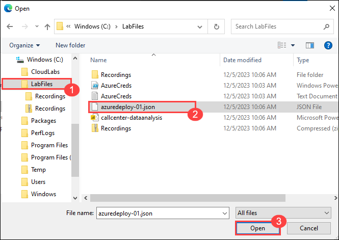

# Call Center data analysis using Azure AI services and Azure OpenAI 

## Overview
In this hands-on lab, you will learn how to effectively extract insights from customer conversations within a call center using Azure AI services and Azure OpenAI Service. You'll get the opportunity to apply real-time and post-call analytics to enhance call center efficiency and elevate customer satisfaction. This immersive experience will guide you through a diverse range of topics related to data processing, audio transcription, sentiment analysis, and data visualization, allowing you to master real-time and post-call analytics.

## Architecture diagram

 

## Task 1: Provision Azure resources

1. In the **Azure portal**, search for **deploy** and select **Deploy a custom template** from the services list.

   

1. On the **Custom deployment** blade, select **Build your own template in the editor** 

   

1. On the **Edit template** blade, click on **Load file** and navigate to the **C:\LabFiles** and upload the file **azuredeploy-01.json**.

   

   

1. Click on **Save**

1. On the **Custom deployment** blade, select the resource group name **callcenter-<inject key="Deployment-id" enableCopy="false"></inject>** from the dropdown.

    

1. Scroll down and replace the existing **EnterUniqueID** text value with **<inject key="Deployment-id" enableCopy="false"></inject>** for the Deployment Id Parameter, and leave all other default values and click on **Review + create**

    

1. Click on **Create**

   
   
1. Wait for deployment to be completed.It might take around 5-7 mins.

## End OF Task-1

## Proceed to Next Task
