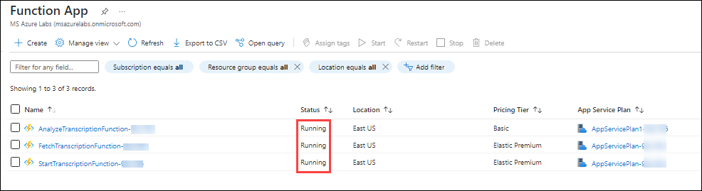
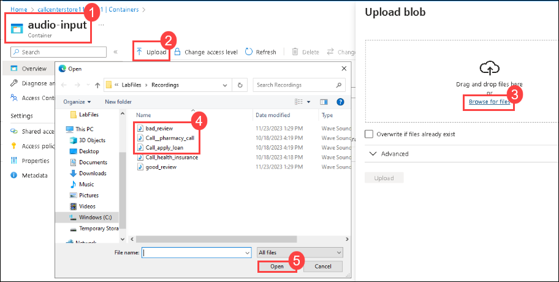

## Task 2: Upload audio file 

In this task , you will upload a audio file which will be converted to text transcription and then further it will be analysed using Azure Open AI and Function App

1. **Restart** all the three function apps and make sure all are **Running**

   

2. Navigate to the Storage account **callcenterstore<inject key="Deployment-id" enableCopy="false"></inject>**

3. Select **Containers** from the **Data Storage** section, select the **audio-input** container

   

4. Next, upload two or more audio file from the VM Path:**C:\LabFiles\Recordings** to the **audio-input** container

    

5. The audio file or the call recording uploaded to the **audio-input** will be processed and transcribed in JSON format to another container **json-result-output**

* When a file lands in the storage container **audio-input**, an Event Grid event signals the completion of the file upload. The file is then filtered and pushed to a Service Bus queue. The code within the Azure Functions **StartTranscriptionFunction** is triggered by a timer, picking up the event and initiating a transmission request using the Azure Speech Services batch pipeline. After the transmission request is complete, an event is placed in another queue within the same Service Bus resource. Subsequently, a separate Azure Function, **FetchTranscriptionFunction**, triggered by the completion event, begins monitoring the transcription completion status. Upon transcription completion, this Azure Function copies the transcript into the **json-result-output** container.

* Next, using the code of **AnalyzeTranscription** function the JSON file(transcript) from the **json-result-output** container is further analyzed using **Azure OpenAI** resource and the **Conversation summary** ,sentiment analysis whether it is **Positive or Negative** is further loaded to a **SQL Database** which will be used for Visualization in the next task

6. Wait for atleast 5-6 mins for the to see the json files in **json-result-output** container.

### End of Task-2

## Proceed with next task
