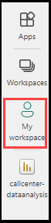

## Task 3 : Visualization using PowerBI Report and Dashboard

In this task, you will use the existing comprehensive Power BI report and make changes on the data source settings and create a dashboard to visualize key metrics and insights for a call center, enabling data-driven decision-making and performance analysis.

1. Open **PowerBI Desktop** from the Virtual machine

1. Navigate to the **File** menu and click on **Open** and select **Browse this device** and navigate to the **C:\LabFiles** and select the **callcenter-dataanalysis.pbix** and click on **Open**.

   

   
   
    **Note** : The callcenter-dataanalysis.pbix contains the prebuild models and report which can be utilised for our lab by changing the data source settings.
  
1. Click on **Cancel** each time when there is a pop up for **SQL Server database** connection.

   
   
1. Later click on **Transform data** and select **Data source settings**

   

1. Under Data source settings, click on **change source** and replace the existing Server value with **sqlserver<inject key="Deployment-id" enableCopy="false"></inject>.database.windows.net** and Database value with **Database-<inject key="Deployment-id" enableCopy="false"></inject>** and click on **OK**

    

    

1. Click on **Edit Permissions**, under **Credentials** click on **Edit** and select **Database** under SQL Server database popup and provide the below values:

     * **User name** : sqluser
     * **Password**  : password.1!!

    
   
    
   
1. Click on **Save** and click on **OK**.

1. Click on **Close** under Data source settings.

1. Click on **Apply Changes**

    
   
1. Click on **Refresh** and the report will be generated as shown below

   

1. Click on **Publish** to publish the report online and click on **Save** to save the changes.

1. On the **Enter your Email address** dialog box, enter the **<inject key="AzureAdUserEmail"></inject>** and click on **Continue**

   

1. On the signin page, select **Work or school account** and click on **Continue**

   

1. On the **Sign in to Microsoft Azure** blade, you will see a login screen, in which enter the following email/username and then click on **Next**.  

   * **Azure Username/Email**:  <inject key="AzureAdUserEmail"></inject> 
   * **Azure Password**:  <inject key="AzureAdUserPassword"></inject>

1. On the **Stay signed in to all your apps** page, select **No,signin to this app only**

   

1. Click on **OK** for Power BI free license assigned pop-up.

      

1. On the **Publish to PowerBI** page, select **my workspace** from the list and click on **Select**

       

1. On the **Publishing to Power BI** dialog box, click on **Open 'callcenter-dataanalysis.pbix' in Power BI** and it will redirect to the powerbi service in the browser. 

         

1. On the PowerBI app service in the browser, select **Settings** icon from the top right corner and select **Manage connections and gateways**

            

1. On the Data(Preview) page, select the existing sqlserver and click on settings icon and provide the authentication details as below and click on **Save** and **close**
   
   * **Under Authentication settings**
        * *Authentication Method* : Basic
        * *Username* : sqluser
        * *Password* : password.1!1
   * **Under General setting**
        * *Privacy level* : None

    

1. Select **my workspace** from the left side menu.

    

1. Select the callcenter-dataanalysis which is of report type, it will load the report.

   
   
   

1. Click on Ellipses beside Edit icon and select **Pin to dashboard**

   

1. On the **Pin to dashboard** pane, check the **New dashboard** and provide the **callcenter-dataanalysis** under Dashboard name and click on **Pin live**

   

1. Select **Go to Dashboard**

1. To get the specific results based on any sentiment or conversation files, you can further filter it by selecting the checkbox under required filter options.

   

1. You can just refresh whenever a new audio file is uploaded to the Storage account and see the result in the **PowerBI Dashboard**
   
### End of Task-3

## Congratulations! You have successfully completed the lab.
