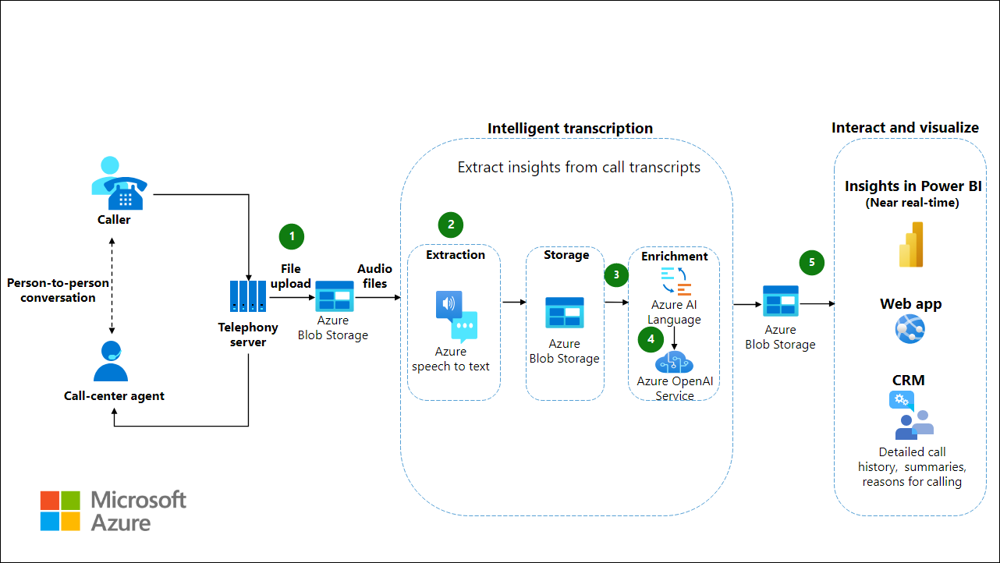
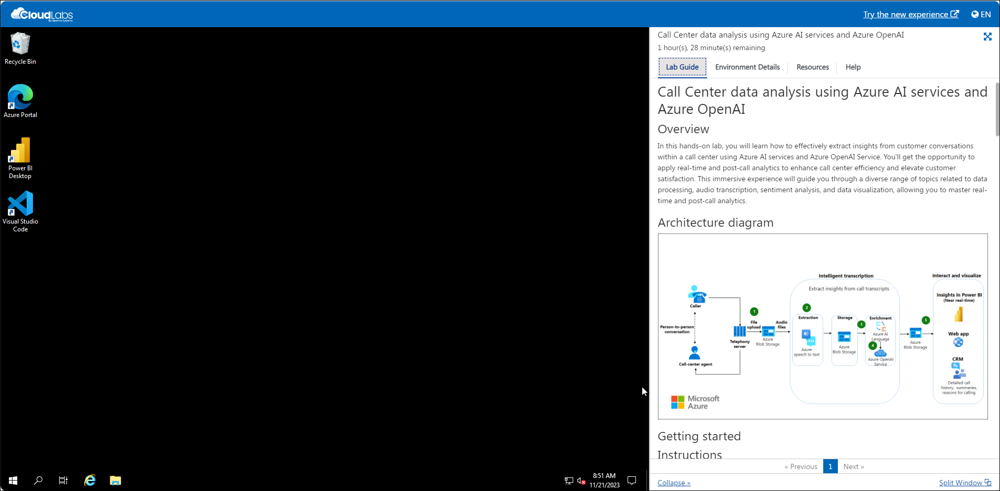
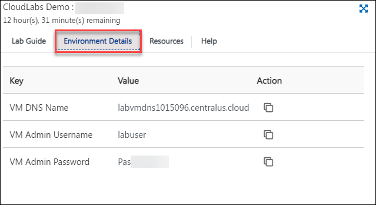
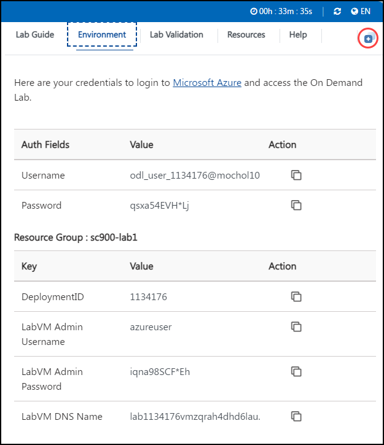
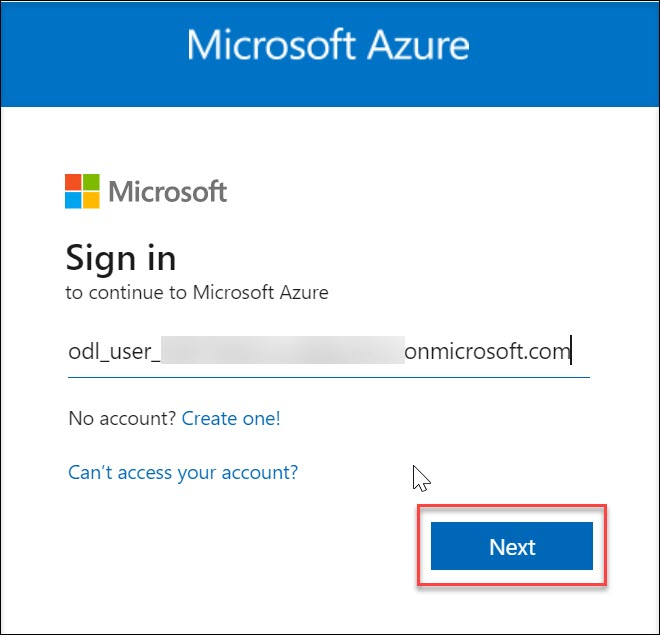

# Call Center data analysis using Azure AI services and Azure OpenAI 

## Overview
In this hands-on lab, you will learn how to effectively extract insights from customer conversations within a call center using Azure AI services and Azure OpenAI Service. You'll get the opportunity to apply real-time and post-call analytics to enhance call center efficiency and elevate customer satisfaction. This immersive experience will guide you through a diverse range of topics related to data processing, audio transcription, sentiment analysis, and data visualization, allowing you to master real-time and post-call analytics.

## Architecture diagram

 

## Getting started with your Call Center Data Analysis using Azure AI services and Azure Open AI Workshop

Welcome to your Call Center Data Analysis using Azure AI services and Azure Open AI workshop! We've prepared a seamless environment for you to explore and learn about extracting insights from customer conversations within a call center using Azure AI services and Azure OpenAI Service. Let's begin by making the most of this experience:

## Accessing Your Lab Environment
 
Once you're ready to dive in, your virtual machine and lab guide will be right at your fingertips within your web browser.

   

## Exploring Your Lab Resources
 
To get a better understanding of your lab resources and credentials, navigate to the **Environment Details** tab.
   
   

## Utilizing the Split Window Feature
 
For convenience, you can open the lab guide in a separate window by selecting the **Split Window** button from the Top right corner.
   
   
   
## Managing Your Virtual Machine
 
1. Feel free to start, stop, or restart your virtual machine as needed from the **Resources** tab. Your experience is in your hands!
 
   

## Let's Get Started with Azure Portal

1. On your virtual machine, click on the Azure Portal icon and sign in to the **Azure Portal** (<http://portal.azure.com>).

1. On the **Sign in to Microsoft Azure** blade, you will see a login screen, in which enter the following email/username and then click on **Next**.  

   * **Azure Username/Email**:  <inject key="AzureAdUserEmail"></inject> 
   * **Azure Password**:  <inject key="AzureAdUserPassword"></inject>

        **Note**: Refer to the **Environment Details** tab for any other lab credentials/details.
        
    
  
    
  
1. If you see the pop-up like below, click **Skip for now(14 days until this is required)**.

    

1. If you see the pop-up **Stay Signed in?** click **No**.

    

1. If you see the pop-up **You have free Azure Advisor recommendations!** close the window to continue the lab. 

1. If a **Welcome to Microsoft Azure** popup window appears, click **Maybe Later** to skip the tour.

    
   
1. Click **Next** from the bottom right corner to embark on your Lab journey!

   
    
Now you're all set to explore the powerful world of technology. Feel free to reach out if you have any questions along the way. Enjoy your workshop!
