# Call Center data analysis using Azure AI services and Azure OpenAI 

## Overview
In this hands-on lab, you will learn how to effectively extract insights from customer conversations within a call center using Azure AI services and Azure OpenAI Service. You'll get the opportunity to apply real-time and post-call analytics to enhance call center efficiency and elevate customer satisfaction. This immersive experience will guide you through a diverse range of topics related to data processing, audio transcription, sentiment analysis, and data visualization, allowing you to master real-time and post-call analytics.

## Architecture diagram

 

## Getting started

## Instructions

1. Once the environment is provisioned, a **virtual machine** (JumpVM) on the left and a lab guide on the right will get loaded in your browser. Use this virtual machine throughout to perform the lab tasks.

   

2. To get the lab environment details, you can select the **Environment details** tab, you can locate the **Environment details** tab in the upper right corner.
   
   

3. You can also open the Lab Guide on a separate full window by selecting the **Split Window** button on the bottom right corner.
   
4. You can **start(1)** or **stop(2)** the Virtual Machine from the **Resources** tab. You can also monitor the uptime remaining for your VM from here.

   

## Getting started with the Azure Portal

1. In the browser that you already opened, open a new tab, and sign in to the **Azure Portal** (<http://portal.azure.com>).

1. On the **Sign in to Microsoft Azure** blade, you will see a login screen, in which enter the following email/username and then click on **Next**.  

   * **Azure Username/Email**:  <inject key="AzureAdUserEmail"></inject> 
   * **Azure Password**:  <inject key="AzureAdUserPassword"></inject>

        **Note**: Refer to the **Environment Details** tab for any other lab credentials/details.
        
    
  
    
  
1. If you see the pop-up like below, click **Skip for now(14 days until this is required)**.

    

1. If you see the pop-up **Stay Signed in?** click **No**.

    

1. If you see the pop-up **You have free Azure Advisor recommendations!** close the window to continue the lab. 

1. If a **Welcome to Microsoft Azure** popup window appears, click **Maybe Later** to skip the tour.

    

## Task 1 : Create a Function App and Function using VS Code

1. Search and select the **Function App** from the search bar

   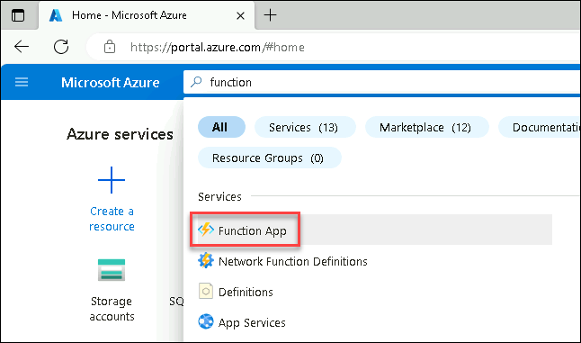

2. Select **+Create**

   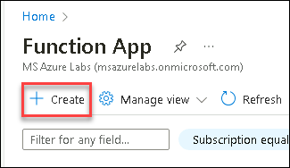

3. On the **Create Function App** blade select the subscription and the provided resource group

   - Function App Name: funcapp-<inject key="DeploymentID"></inject>
   - Runtime stack : Python
   - Version : 3.11
   - Region : East US
   - Hosting options and plans : App service Plan
   - Pricing Plan: Basic

    

4. Leave the other option set to Default and select **Review+Create**, **Create**

   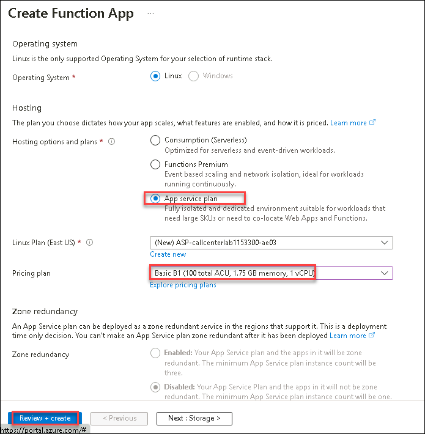

5. Once the deployment is successful, Open the created function app and select **Configuration** under **Settings**

   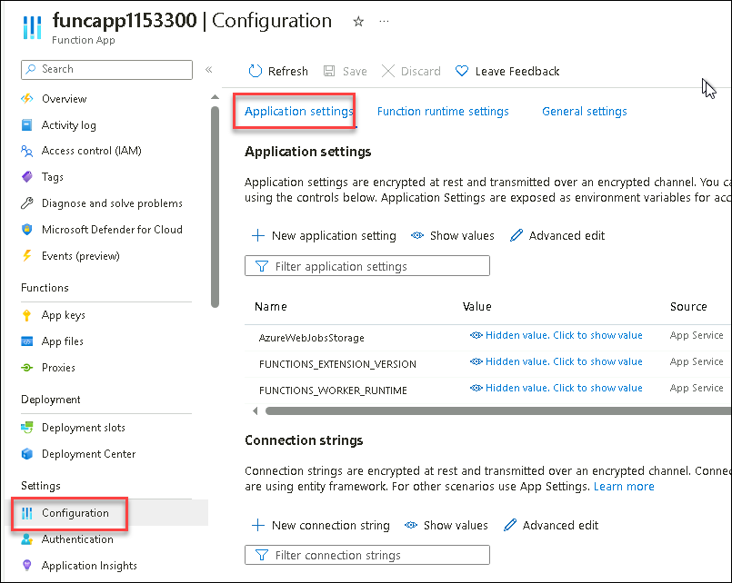

6. Select **+New application setting** from the **Application settings** tab

   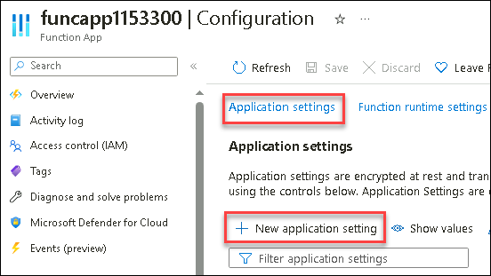

7. In **Add/Edit application setting**, Add **AzureWebJobsFeatureFlags** under **Name** field and provide its value as **EnableWorkerIndexing** in **Value** field and click **OK**

   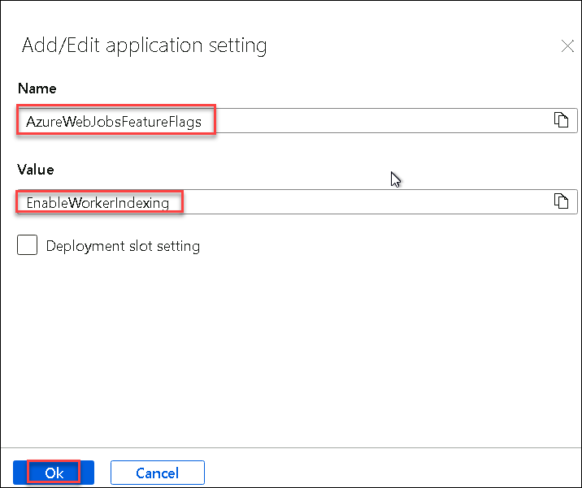

8. Next, Add **AZURE_OPENAI_ENDPOINT** under **Name** field and provide its value in **Value** field and click **OK**

   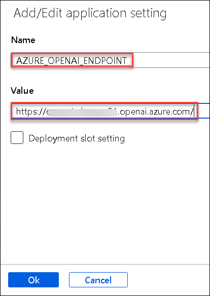
   
9. Similarly do it for AZURE_OPENAI_KEY , BlobStorageConnectionString , SqlConnectionString in **Name** fields.

   >Get the values from **Envrionment details** tab of the lab environment page.

11. Ensure all the application settings are added and click on **Save** to save the settings

    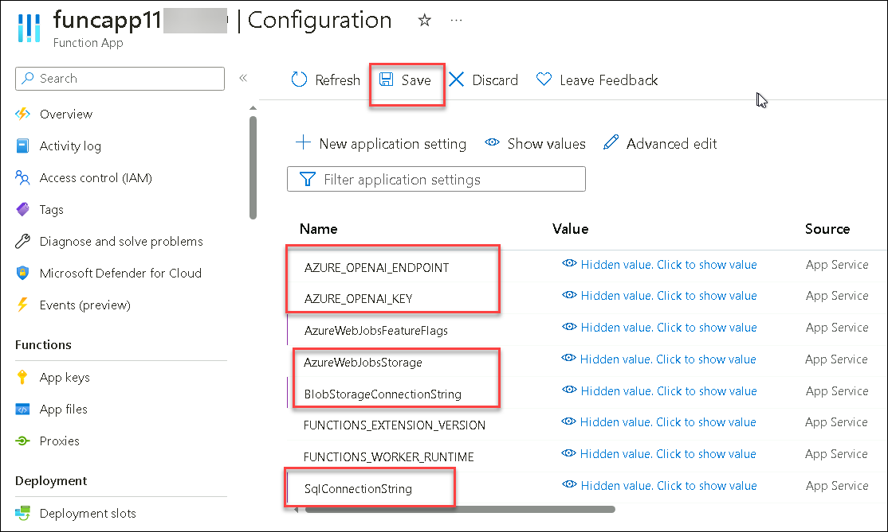

12. Now open **Visual studio code** from the Virtual machine's Desktop

13. Select **Azure** and **Sign in to Azure**, click on **Allow** if you get a pop up notification

    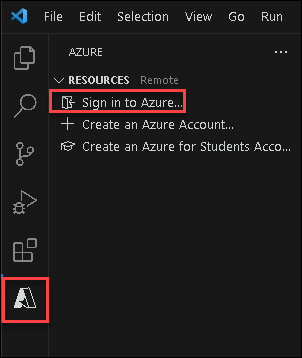

    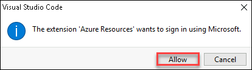

14. A sign in window will be opened in the browser , sign in using the below credentials

    * **Azure Username/Email**:  <inject key="AzureAdUserEmail"></inject> 
    * **Azure Password**:  <inject key="AzureAdUserPassword"></inject>

15. Once the sign to Azure is successful, you should to able to see the resources and function app you created in the previous steps.

    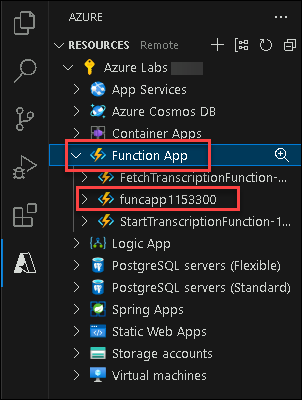

16. Now, from the **File** menu select **Open Folder** and browse to the path **C:\LabFiles\AnalyzeTranscriptOpenAI\AnalyzeTranscriptOpenAI-main**

    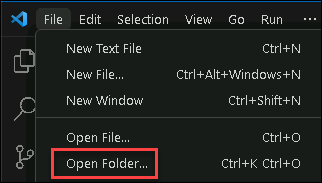

17. The project files should be as shown below:

    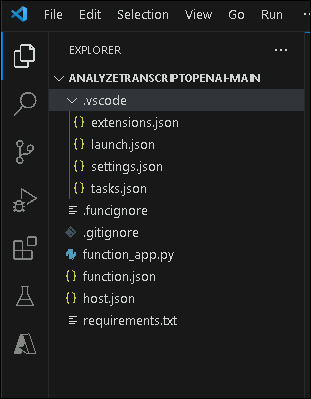

18. Check for any notifications and select **Create Virtual environment**.

     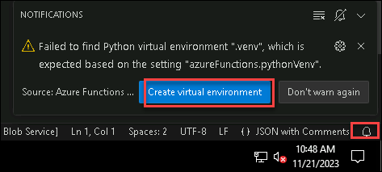

20. Select the Python Interpreter as 3.11.6 and wait till the virtual environment is created.

    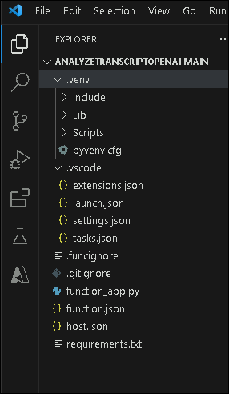

21. Next, Create a folder as **AnalyzeTranscription** for deploying a function to the function app on Azure

    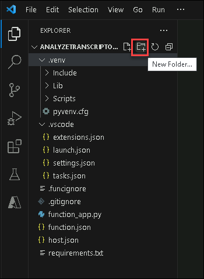

22. Move all the files to the created folder

    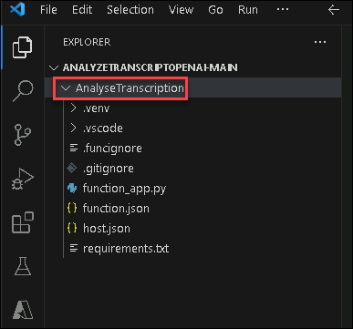

23. Ensure **AnalyzeTranscription** as *azureFunctions.deploySubpath* in **settings.json** file else you might get some warnings if this is not set correctly

    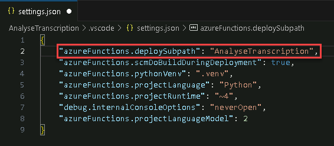

24. Review the file **function_app.py** and understand how the function is configured to use Open AI, Storage account and SQL Database for transcribing ,analyzing the data and to summarize.

25. Now select **AnalyzeTranscription** and right click to select the option **Deploy to Function App**

    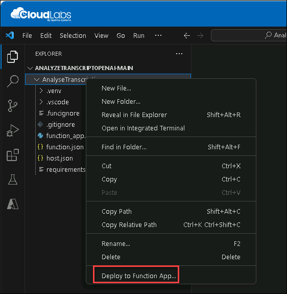

26. Select the function app you created in previous steps

27. If you get any pop up notification click on **Yes**

28. Select your project's language as **Python** if you are asked to select a language

29. If you get a notification as **Are you sure you want to deploy to function app?**, select **Deploy**

    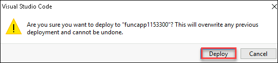

30. Wait until the function app is deployed successfully, check output section for logs.

    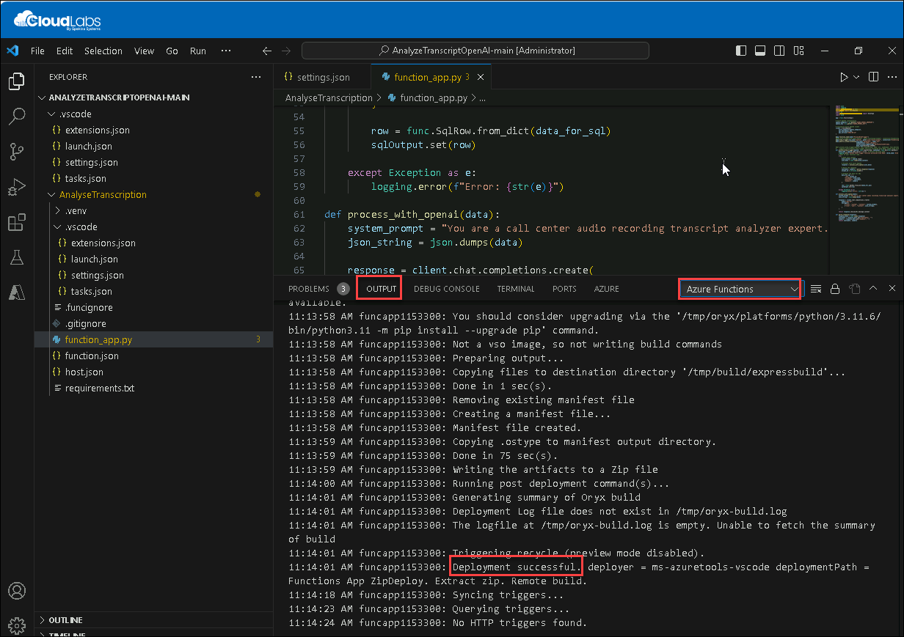

31. Navigate to **Azure Portal** and select the **funcapp-<inject key="DeploymentID"></inject>** you created in previous steps.

32. From the Overview, you should now see the function **ProcessBlobTrigger** that you deployed from **Visual studio code**

    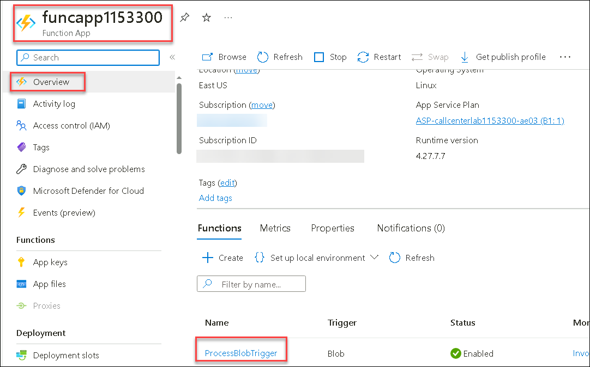

## Task 2: Upload audio file 

In this task , you will upload a audio file which will be converted to text transcription and then further analysed using Azure Open AI and Function App

1. Ensure all the three functions are **Running**

   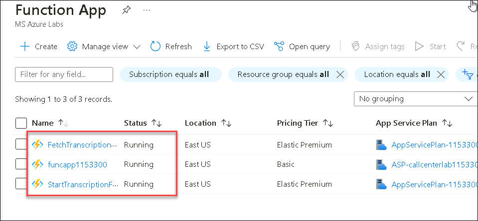

2. Navigate to the Storage account **callcenterstore<inject key="DeploymentID"></inject>**

3. Select **Containers** from the **Data Storage** section, select the **audio-input** container

   

4. Next, upload any audio file from the VM Path:**C:\LabFiles\Recordings** to the **audio-input** container

   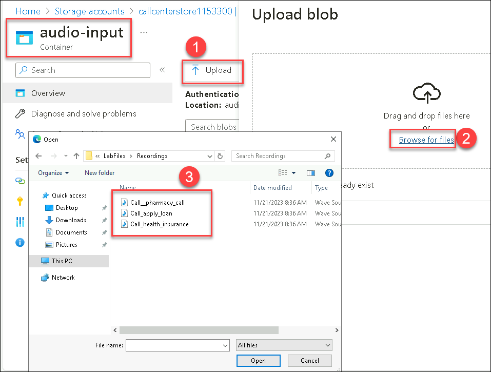

5. The audio file or the call recording uploaded to the **audio-input** will be proceeded and transcribed in JSON format to another container **json-result-output**

When a file lands in a storage container **audio-input**, the Grid event indicates the completed upload of a file. The file is filtered and pushed to a Service bus topic. Code in Azure Functions **StartTranscriptionFunction** is triggered by a timer picks up the event and creates a transmission request using the Azure Speech services batch pipeline. When the transmission request is complete, an event is placed in another queue in the same service bus resource. A different Azure Function **FetchTranscriptionFunction** triggered by the completion event starts monitoring transcription completion status. When transcription completes, the Azure Function copies the transcript into the **json-result-output** container.

Next, using the code of **ProcessBlobTrigger** function the JSON file(transcript) from the **json-result-output** container is further analyzed using **Azure OpenAI** resource and the **Conversation summary** ,sentiment analysis whether it is **Positive or Negative** is further loaded to a **SQL Database** which will be used for Visualization in the next task

## Task 3 : Visualization

In this task, you will learn how to create a comprehensive Power BI dashboard to visualize key metrics and insights for a call center, enabling data-driven decision-making and performance analysis.

1. Open **PowerBI Desktop** from the Virtual machine

2. In the Home group of the Power BI Desktop ribbon, select **Get data**, and select **SQL server Database** as the data source.Click on **Connect** to connect to the SQL server database where the data is present.

   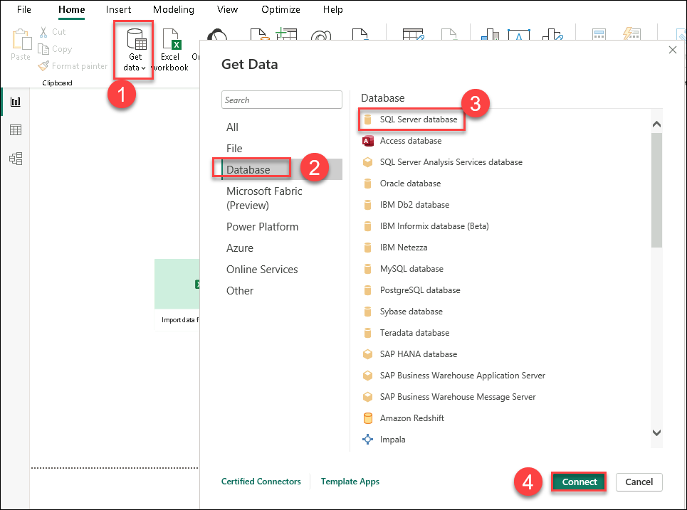

3. In the dialog box for the connection, under Data connectivity mode, select **DirectQuery**. Provide the **SQL server name** and **Database Name**

   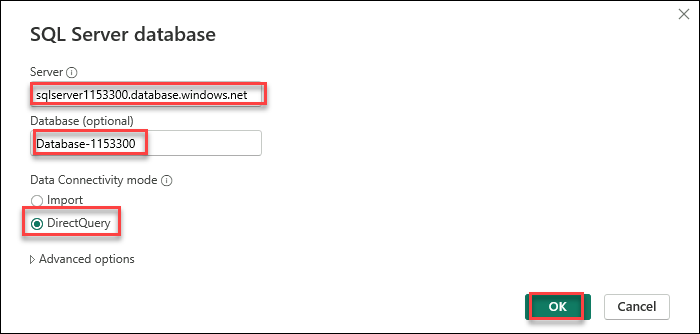

   DirectQuery reports always use current data. Seeing underlying data changes requires you to refresh the data, and reimporting large semantic models to refresh data could be unfeasible.

4. Select **Output** table where the data of the transcription and analysis is stored and Click on **Load**

   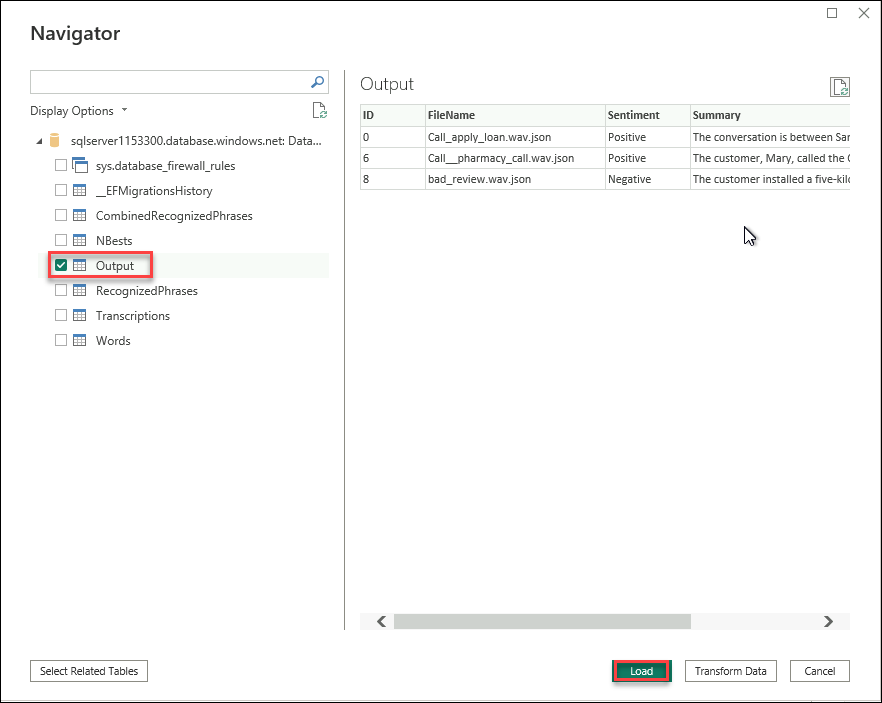

5. Once the data is loaded you should now see the empty report canvas and **Output** Table and it's columns **ID**, **Sentiment** and **Summary**

  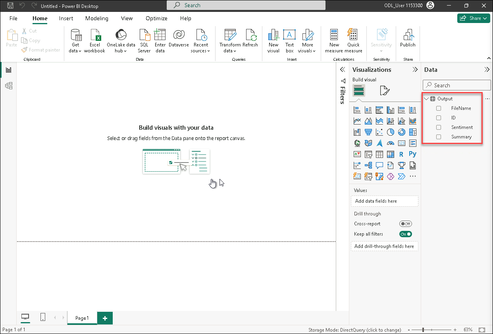

6. Select the **Guage** Visualization from **Visualizations** section and check **Sentiment** under **Data** section

7. Move **Sentiments** to **Value** and select **Count** for visualizing the number of sentiments

   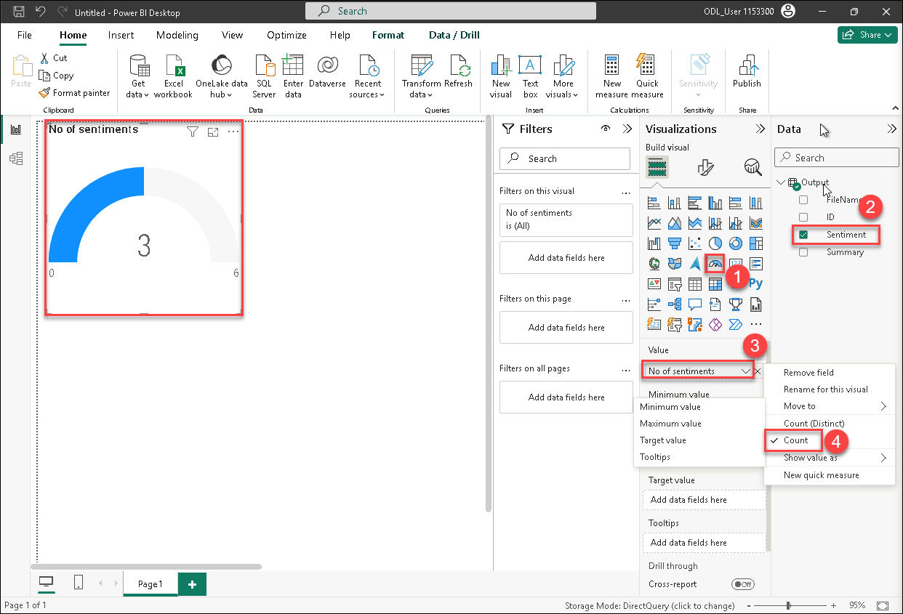

## Summary

In this lab you learned how to :
- Data Collection and Storage with Azure Storage
- Create a Function App and Function
- Audio Transcription with Azure AI Speech
- Personal Data Detection, Extracting Insights with Azure OpenAI
- Data Visualization with Power BI

   
