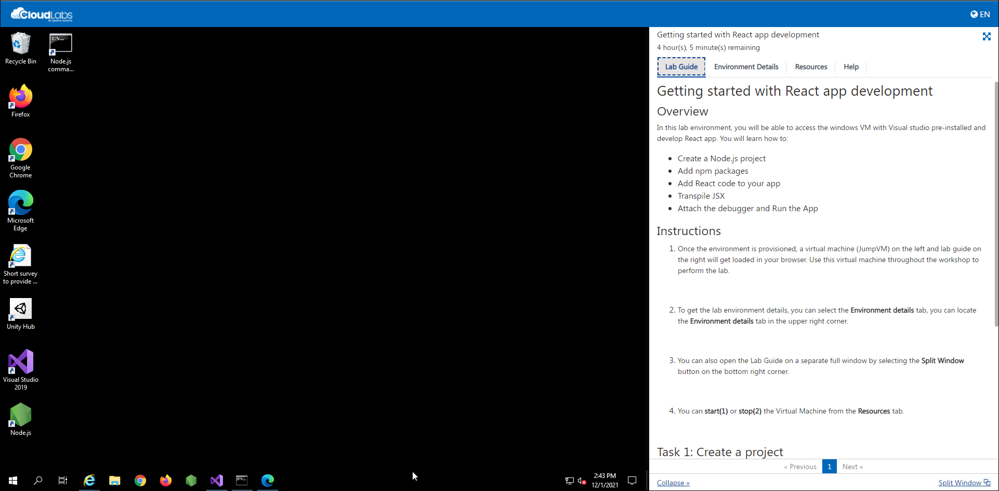
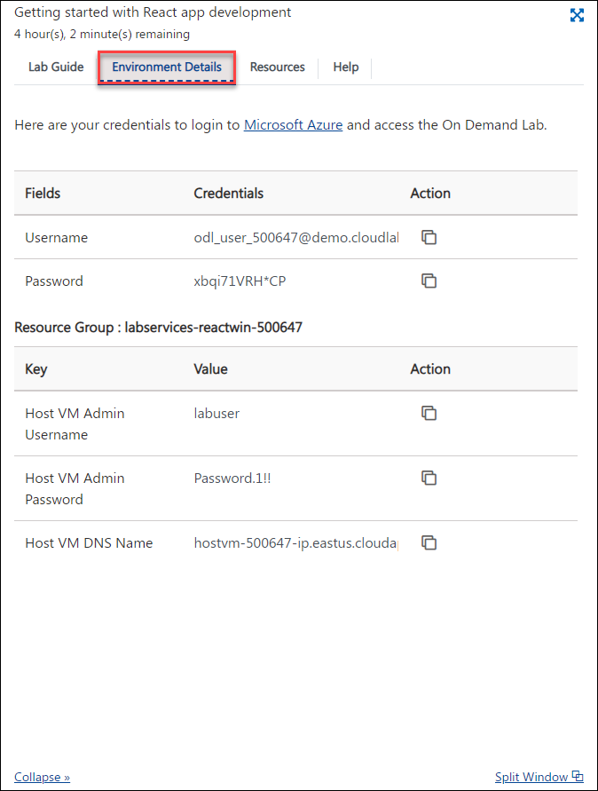
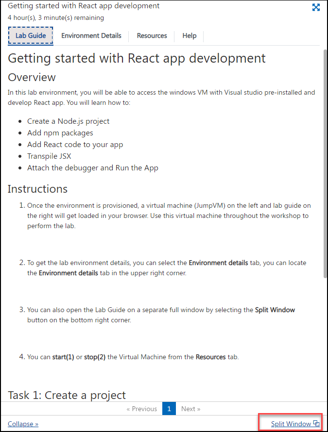

# Getting started with React app development

## Overview

In this lab environment, you will create a Node.js web app project from a Visual Studio template. Then, you will create a simple app using React.
You will learn how to:

- Create a Node.js project
- Add npm packages
- Add React code to your app
- Transpile JSX
- Attach the debugger and Run the App

## Instructions

1. Once the environment is provisioned, a virtual machine (JumpVM) on the left and lab guide on the right will get loaded in your browser. 
   
   > Note: Use this virtual machine throughout the workshop to perform the lab.

   

2. To get the lab environment details, you can select the **Environment details** tab, you can locate the **Environment details** tab in the upper right corner.
   
   

3. You can also open the Lab Guide on a separate full window by selecting the **Split Window** button on the bottom right corner.
   
   
 
4. You can **start(1)** or **stop(2)** the Virtual Machine from the **Resources** tab.

   

You can see the page number on lab guide at the bottom area to switch on different exercises of the lab guide.

Click on **Next** at the bottom of lab guide to move to the next task.
