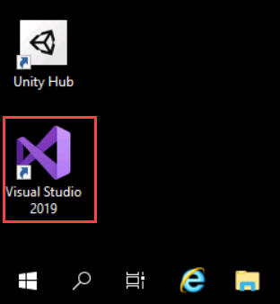
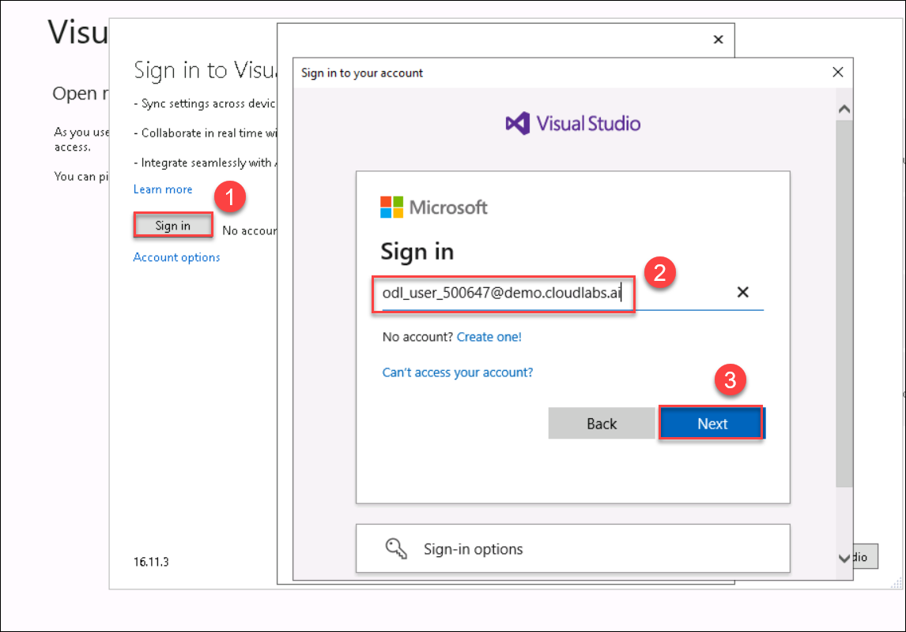
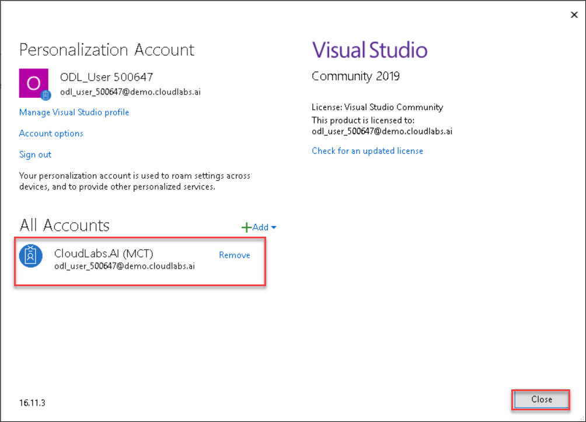
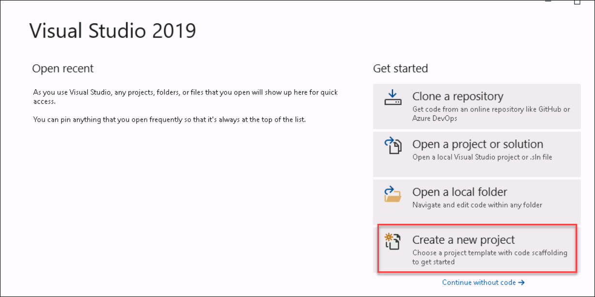
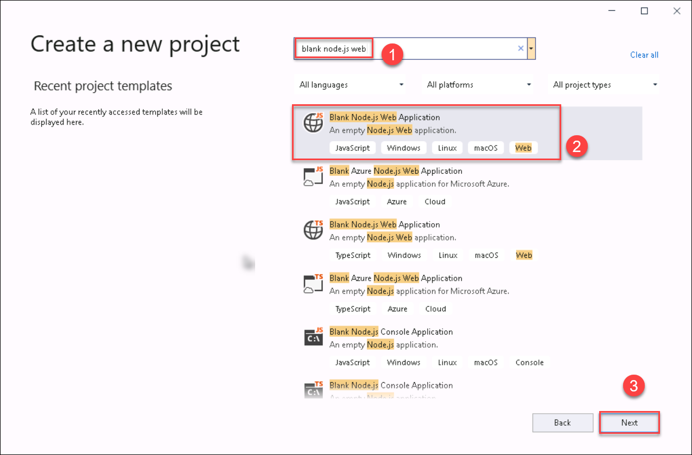
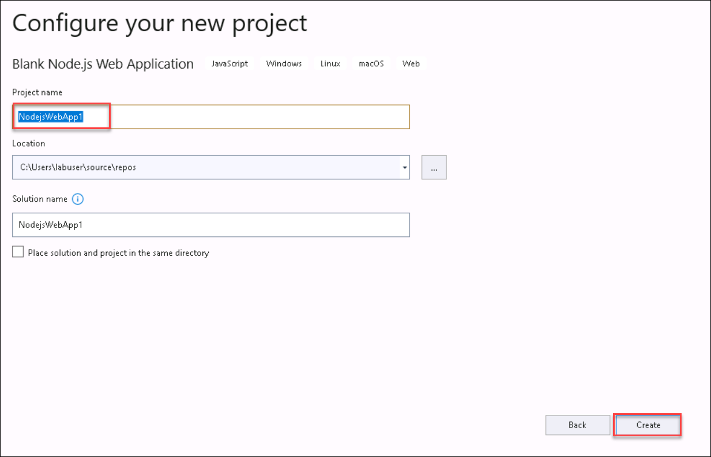
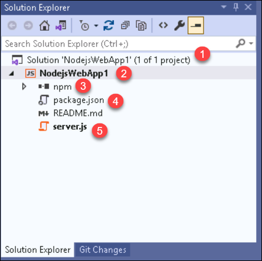

## Task 1: Create a Node.js project

In this task, you will sign in into the Visual Studio using the credentials provided to you from the lab Environment details and create a Blank Node.js Web Application - JavaScript project.

Visual Studio with the Node.js development workload is pre-installed for you.

1. In the virtual machine, double click on the **Visual Studio** shortcut on the desktop.
   
   
   
2. This will open up Visual Studio, click on **Signin** and login using the credentials provided to you from the Environment details tab.

   
   
3. Verify your account is appearing under **All accounts** and select **close**.

   

4. On the Visual Studio page select **Create a new project**
   
   
   
5. Type node.js in the search box and choose **Blank Node.js Web Application - JavaScript** from the list.
  
   
   
6. In the **Configure your new project** dialog box, leave the default value for project name and select **Create**.
   
   
   
7. Look at the project structure in **Solution Explorer** in the right pane 
 
   

Click on **Next** at the bottom of lab guide to move to the next exercise.
