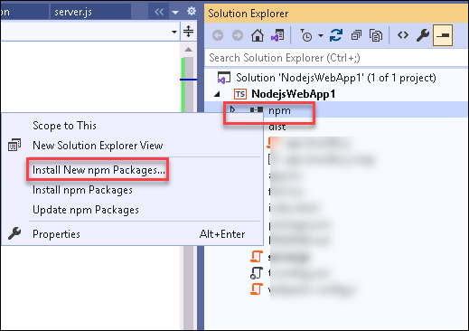
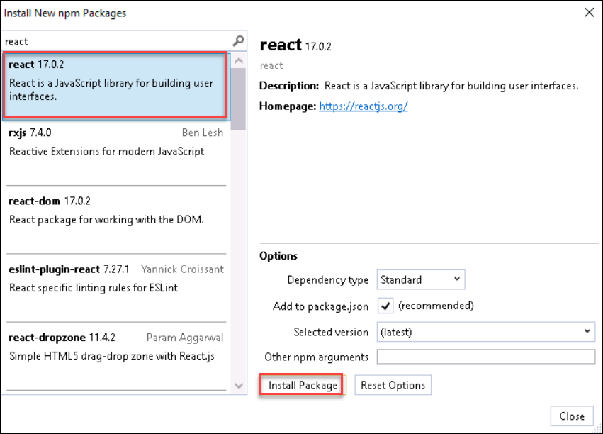
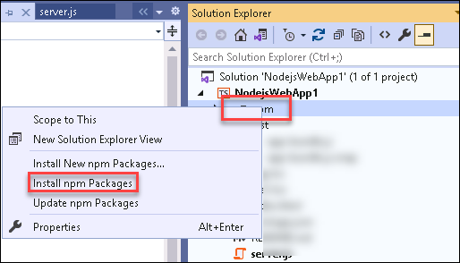
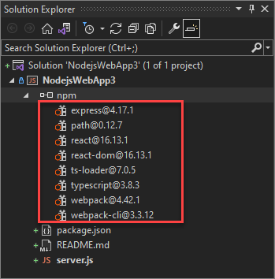

## Task 2 : Add npm Packages

In this task, you will install react package by installing New npm Packages in the **Solution Explorer** of your Node.js Web App.

This app requires the following npm modules to run correctly:

- react
- react-dom
- express
- path
- ts-loader
- typescript
- webpack
- webpack-cli
  
1. To install package in the **Solution Explorer**, right-click the **npm** node and select **Install New npm Packages**.
    
   

2. In the **Install New npm Packages** dialog box, search for the **react** package, and select **Install Package** to install it.
   
   
 
   In the Install New npm Packages dialog box, you can choose to install the most current package version or to specify a version. If you choose to install the current versions, but run into unexpected errors later, try installing the exact package versions listed in the next steps.

3. The **Output** window in the Visual Studio lower pane shows package installation progress. Open the **Output window** by selecting **View > Output** or pressing Ctrl+Alt+O.    In the Show output from field of the Output window, select **Npm**.

4. After the react package is installed verify that the react package appears under the **npm** node in **Solution Explorer**.

5. Instead of using the UI to search for and add the rest of the packages one at a time, you can paste the required package code into **package.json** file to install the required packages with the specified version, you will perform it in the next step.

6. From Solution Explorer, open **package.json** in the Visual Studio editor. Add the following **dependencies** section before the end of the file.If the file already has a dependencies section, replace it with the preceding JSON code
   
   ```
   "dependencies": {
   "express": "^4.17.1",
   "path": "^0.12.7",
   "react": "^17.0.2",
   "react-dom": "^17.0.2",
   "ts-loader": "^9.2.6",
   "typescript": "^4.5.2",
   "webpack": "^5.64.4",
   "webpack-cli": "^4.9.1"
   }
   ```
7. Press Ctrl+S or select **File->Save** to save the changes made to package.json file.

8. In **Solution Explorer**, right-click the **npm** node in your project and select **Install npm Packages**. This option runs the npm install command directly to install all the packages listed in **packages.json**.
   
   
 
9. Select the **Output** window in the lower pane to see installation progress. Installation might take a few minutes, and you might not see results immediately. Make sure that you select **Npm** in the Show output from field in the Output window.

10. After installation, the npm modules appear in the npm node in Solution Explorer.

    


Click on **Next** at the bottom of lab guide to move to the next task.
