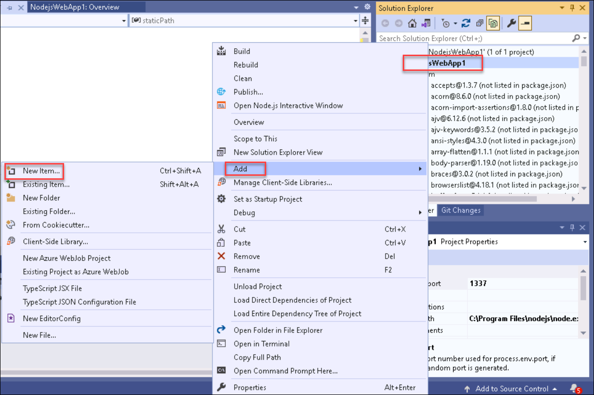
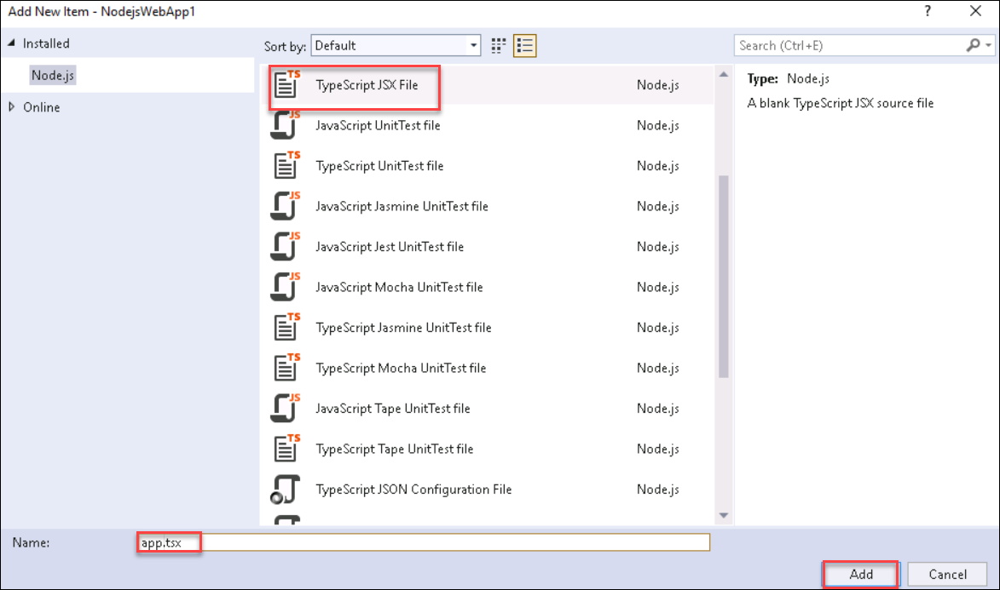

## Task 3: Add project files and React code to your app

In this task, you will be adding new project files and configuring the required app code for your application.
 
 For this app, you will be adding the following new project files in the project root.
 - app.tsx
 - webpack-config.js
 - index.html
 - tsconfig.json
 
 1. In the **Solution Explorer**, right-click on the project name and select **Add > New Item** option.
    
    
 
 2. In the **Add New Item** dialog box choose **TypeScript JSX File**, type the name **app.tsx**, and select **Add or OK**.
     
    
     
 3. Repeat these steps to add a **JavaScript file** named **webpack-config.js**.

 4. Repeat these steps to add an **HTML file** named **index.html**.

 5. Repeat these steps to add a **TypeScript JSON Configuration File** named **tsconfig.json**.
 
 6. In the next few steps, you will add the required app code for your application.
 
 7. In Solution Explorer, open **server.js** file and replace the existing code with the following code:
 
    ```
    'use strict';
     var path = require('path');
     var express = require('express');
     var app = express();
     var staticPath = path.join(__dirname, '/');
     app.use(express.static(staticPath));

     // Allows you to set port in the project properties.
     app.set('port', process.env.PORT || 3000);
     var server = app.listen(app.get('port'), function() {
     console.log('listening');
     });
    ```
    Note: The preceding code uses Express to start Node.js as your web application server. The code sets the port to the port number configured in the project properties, which by default is 1337. If you need to open the project properties, right-click the project name in Solution Explorer and select Properties.

8. Open **app.tsx** file and add the following code which uses JSX syntax and React to display a message
   
   ```
   var React = require('react');
   var ReactDOM = require('react-dom');
   ReactDOM.render(
    <h1>Welcome to React!</h1>,
    document.getElementById('root')
   );
   ```
 
 9. Open **index.html** and replace the **body** section with the following code:
    ```
    <body>
    <div id="root"></div>
    <!-- scripts -->
    <script src="./dist/app-bundle.js"></script>
    </body>
    ```
 This HTML page loads app-bundle.js, which contains the JSX and React code transpiled to plain JavaScript. Currently, app-bundle.js is an empty file. In the next section, you configure options to transpile the code.


Click on **Next** at the bottom of lab guide to move to the next task.
