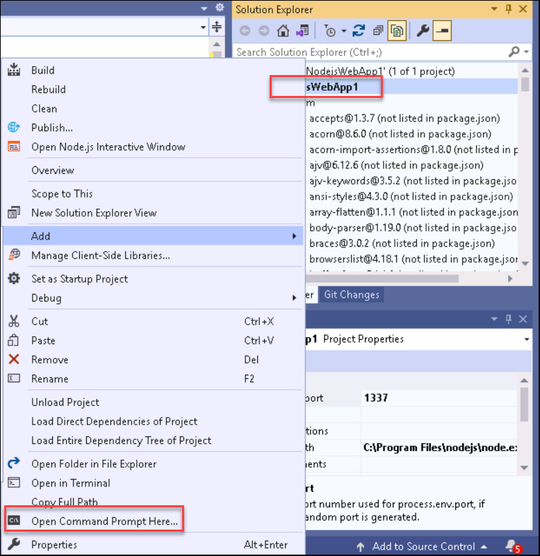
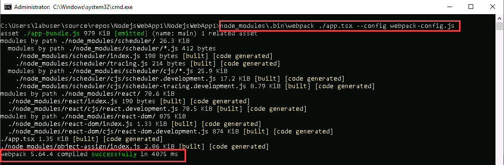

## Task 5: Transpire the JSX

In this task, you will be transpiling the app files through command prompt and required scripts to start buildibng from Visual Studio.

1. In Solution Explorer, right-click the project name and select **Open Command Prompt Here**.
 
   
   
2. In the command prompt, enter the following webpack command:
   ```
   node_modules\.bin\webpack ./app.tsx --config webpack-config.js
   ```
3. The command prompt window shows the result as shown in the screenshot.
   
   
   
   Note: If you see any errors instead of the preceding output, you must resolve them before your app will work. If your npm package versions are different than the versions  specified in this lab, that can cause errors. One way to fix errors is to use the exact versions shown in the earlier step.

4. In Solution Explorer, right-click the project node and select **Add->Existing Folder**

5. Select the **dist** folder, and then select **Select Folder**. Visual Studio adds the dist folder, which contains app-bundle.js and app-bundle.js.map, to the project.

6. Open **app-bundle.js** file to see the transpiled JavaScript code.

7. If prompted whether to reload externally modified files, select **Yes to All**.

8. Anytime you make changes to **app.tsx** file, you must **rerun** the webpack command. To automate this step, you will **add a build script** to transpile the JSX in the next steps.

9. Open **package.json** file and add the following **scripts** section after the **dependencies** section:
   ```
   "scripts": {
   "build": "webpack-cli ./app.tsx --config webpack-config.js"
   }
   ```
  Visual Studio versions starting with **Visual Studio 2019** require a build script. Instead of transpiling JSX at the command line, as shown above you can transpile JSX when building from Visual Studio.

10. Select **File** menu and click on **Save** to save the changes made to package.json file.


Click on **Next** at the bottom of lab guide to move to the next exercise.
