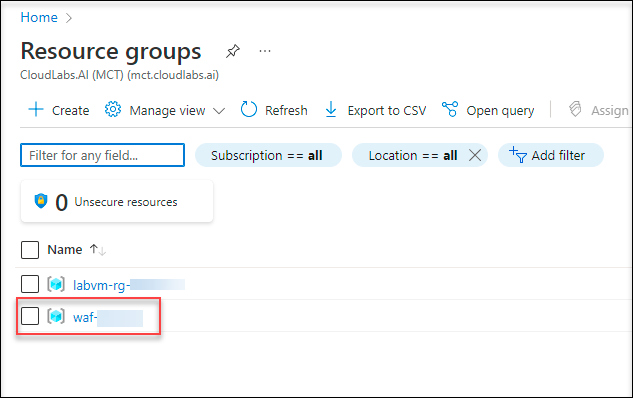
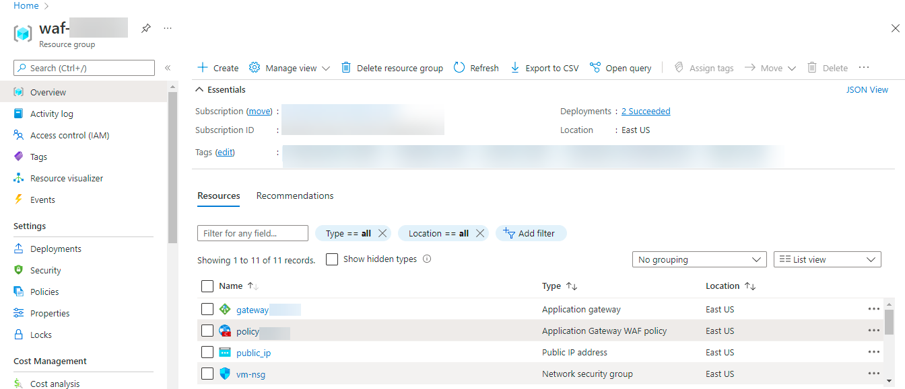

# Getting started with the Environment  

## Overview

 In this task, you will view the pre-created resources of this lab.
 
## Getting started 

1. Click on the **Resource tab**, and you can able to view the virtual Machines running. You can start and stop the virtual machines.

1. Click on the start(1) to start the virtual machine and stop(2) to stop the virtual machine.

     

1. On the environment provided to you, on the left side of the environment launch the browser and Navigate to [Azure Portal](https://portal.azure.com) and login with the credentials provided under **Environment Details** tab.

     

1. To toggle **show/hide** the Portal menu options with icon, Click on the **Show Menu** button.

     

1. Click on the **Resource groups** button in the Menu navigation bar, to view the Resource groups blade.

1. Under the resource group tab, select **waf-DID**.

     
     
1. You can able to view the deployed resources in that resource group **waf-DID**.

     

# Proceed to Task 1 : View the Application Gateway
 
