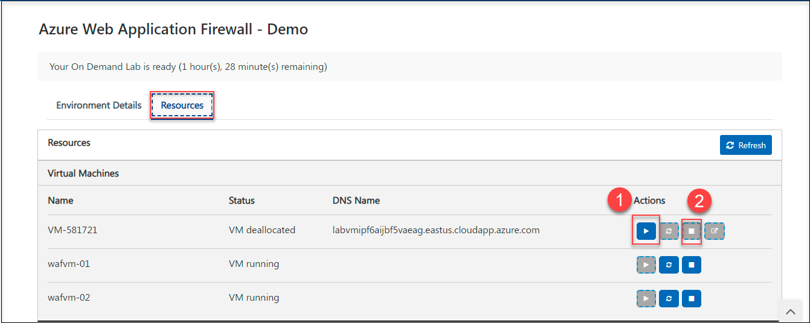
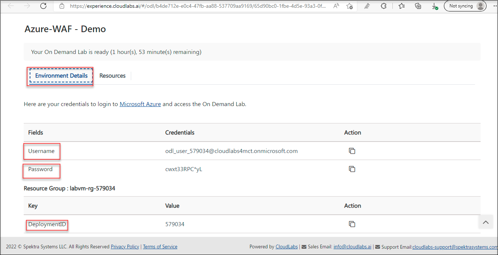
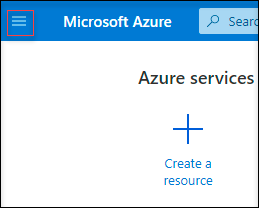
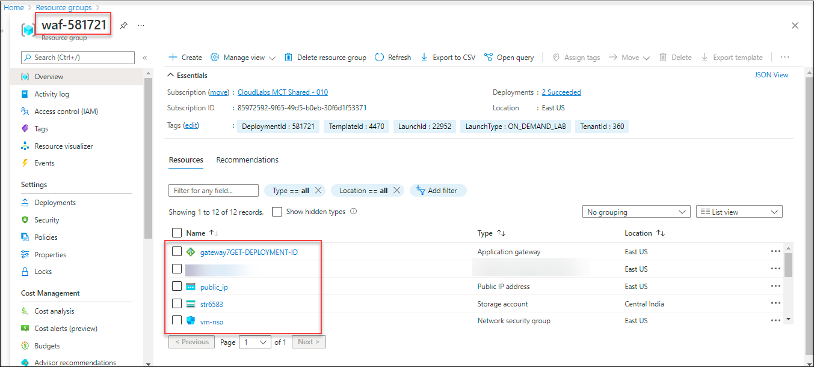

# Getting started with the an application gateway with a Web Application Firewall 

## Overview

 In this task, you will view the pre-created resources of this lab
 
## Getting started with the environment

1. You can start(1) or stop(2) the Virtual Machine from the Resources tab.

     

1. Launch the Edge browser and Navigate to [Azure Portal](https://portal.azure.com) and login with the credentials provided under **Environment Details** tab.

     

1. To toggle **show/hide** the Portal menu options with icon, Click on the **Show Menu** button.

     

1. Click on the **Resource groups** button in the Menu navigation bar, to view the Resource groups blade.

1. Under the resource group tab, select **waf-DID**.

     
     
1. You can able to view the deployed resources in that resource group **waf-DID**.

     

# Proceed to Task 1 : View the Apl=plication Gateway
 
