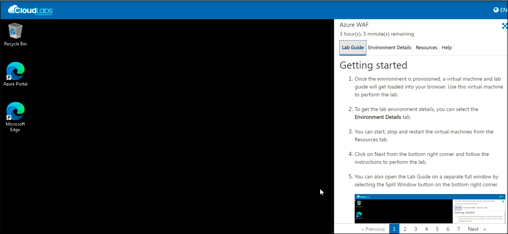
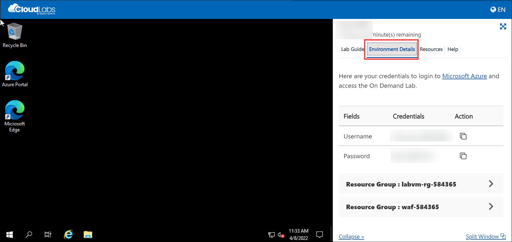
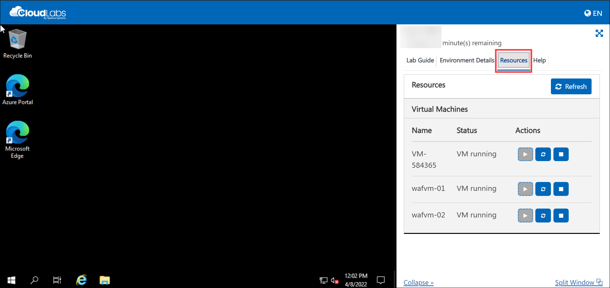
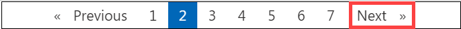
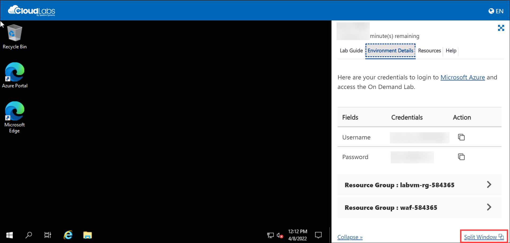

# Getting started

1. Once the environment is provisioned, a virtual machine and lab guide will get loaded into your browser. Use this virtual machine to perform the lab.

    

1. To get the lab environment details, you can select the **Environment Details** tab.

    
    
1. Also, you can **start, stop and restart** the virtual machines from the **Resources** tab.

    
    
1. Click on **Next** from the bottom right corner and follow the instructions to perform the lab.

    
    
1. You can also open the Lab Guide on a separate full window by selecting the **Split Window** button on the bottom right corner.

    

