# Task 1 : Create an Application Gateway through Azure Portal

## Overview

Azure Application Gateway is a web traffic load balancer that enables you to manage traffic to your web applications. Application Gateway can make routing decisions based on additional attributes of an HTTP request, for example URI path or host headers.

In this task, you will learn how to create application gateway through azure portal.

1. Launch the Edge browser and Navigate to [Azure Portal](https://portal.azure.com) and login with the credentials provided under **Environment Details** tab.

     

1. To toggle **show/hide** the Portal menu options with icon, Click on the **Show Menu** button.

     

1. In the search bar, select **Application Gateway** in the Featured list.

     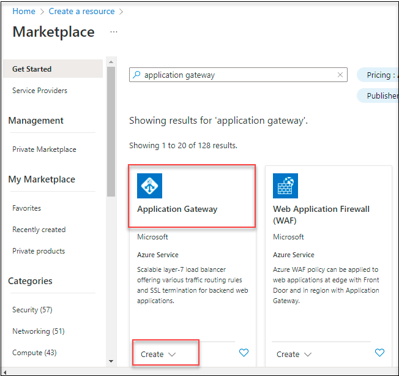

1. On the Basis tab, provide the following details and leave others as default.

    | Settings | Values |
    |  -- | -- |
    | Subscription | **Choose your subscription**|
    | Resource group | **waf-[deploymentID]** (use existing) |
    | Application gateway name | **gateway[deploymentID]** |
    | Tier | **WAF V2** |
    
1. Under Configure virtual network, select **Create new**.

    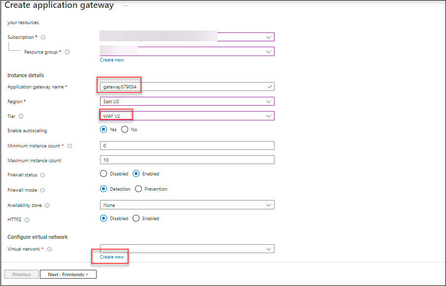

1. On the create virtual network page, under name provide the name as **vnetDID**.
   
1. Under subnets, the Subnets grid will show a subnet named Default. Change the name to **myAGSubnet**.

1. Create a second Subnet namely **myBackendSubnet**.

1. For example, if the **myAGSubnet** ip address is **10.1.0.0/24** and for **myBackendSubnet** the address will be **10.1.1.0/24**. Verify all the details.

1. Click on **ok**.

    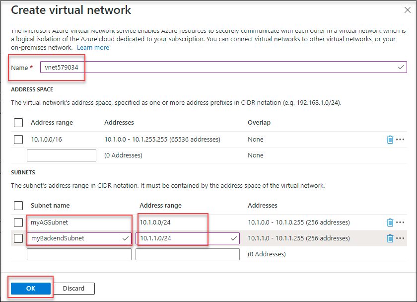

1. On the Basics tab, accept the default values for the other settings and then select **Next: Frontends**.

    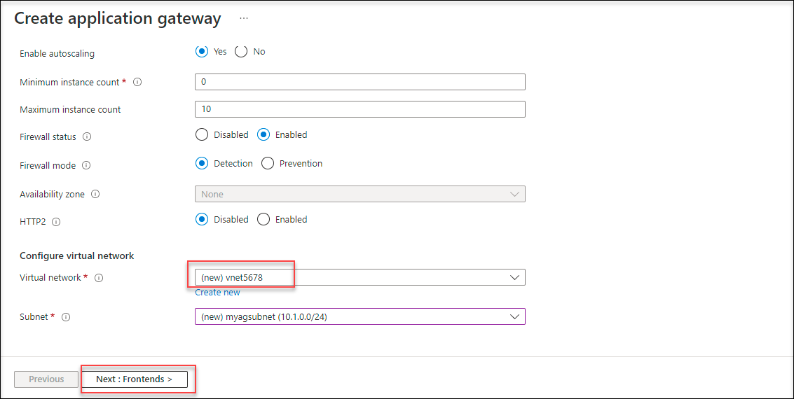

1. On the **Frontend tab**, for the Frontend IP address type, select as **Public**.

1. Choose **Add new** for the Public IP address and enter **myAGPublicIPaddress** for the public IP address name, and then select OK.

     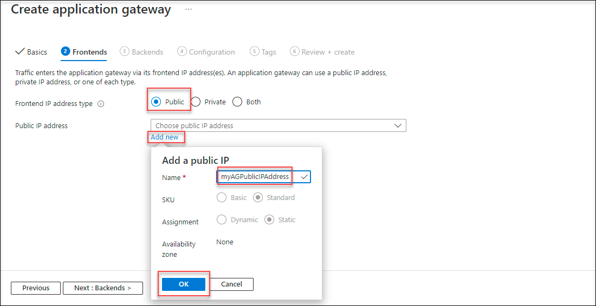

1. Now select **Next : Backends**.

    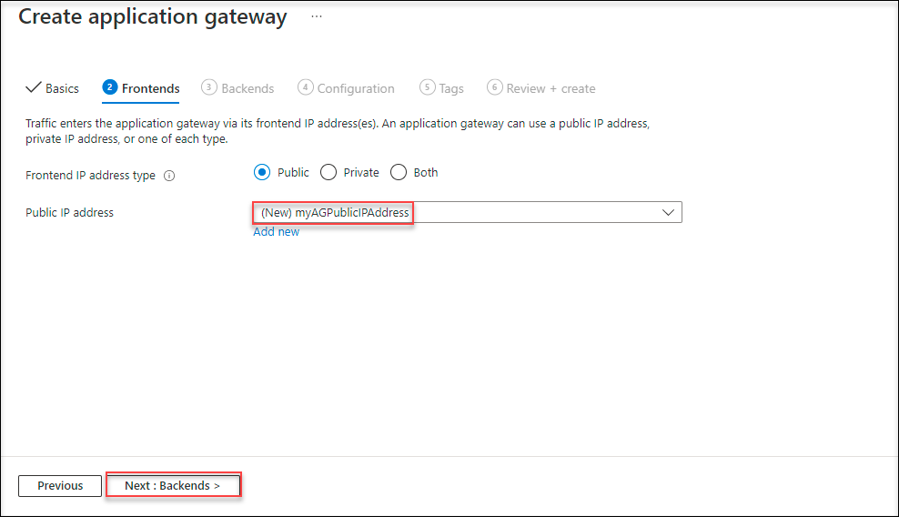

1. On the Backends tab, select **Add a backend pool**.

    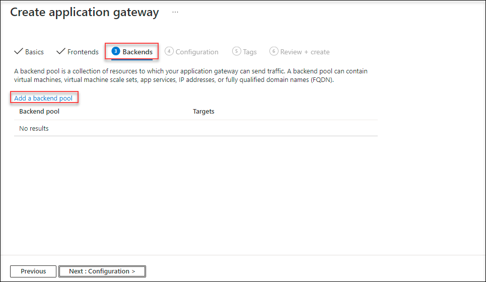

1. In the add a backend pool window that opens, enter the following values to create an empty backend pool : 

    | Settings | Values |
    |  -- | -- |
    | Name | **myBackendPool**|
    | Add backend pool without targets: | select the toggle to **yes** |
    
1. Click on **Add**.

    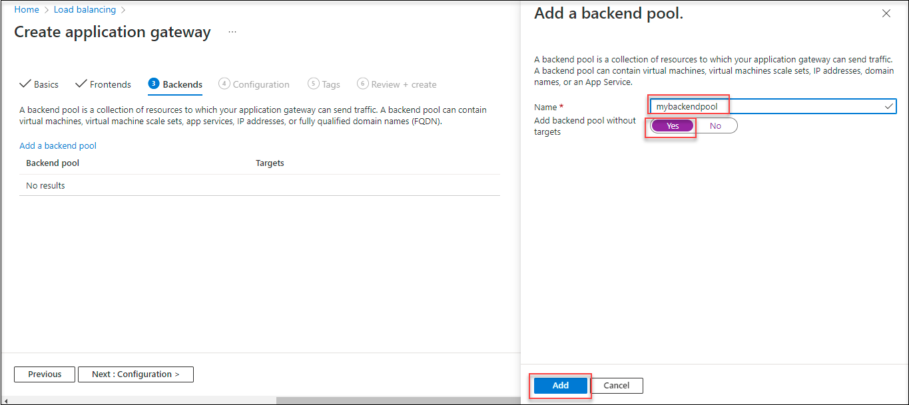

1. On the Backends tab, select **Next: Configuration**.

    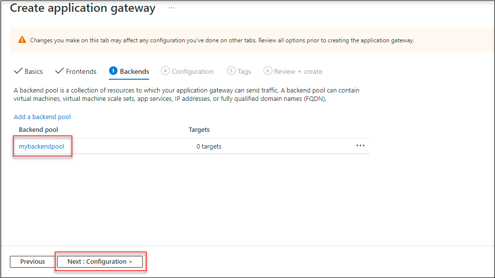

1. On the **Configuration tab**, under **Routing rules** select **add a routing rule**.

    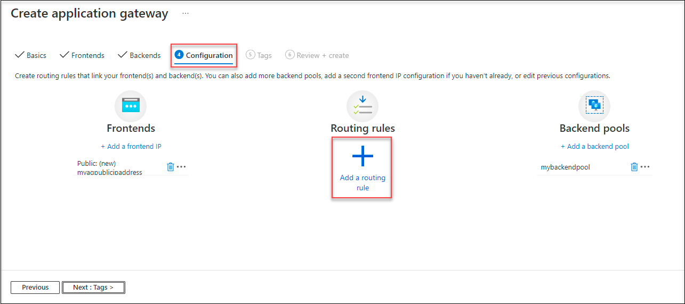

1. On the add a routing rule that appears, provide **myRoutingRule** for the Rule name.

1. Within the Add a routing rule window, on the Listener tab, enter the following values for the listener:

      * Listner Name :  **mylistenerDID**

      * Frontend IP : select **Public** from the dropdown.

1. Accept the default values for the other settings on the Listener tab.

     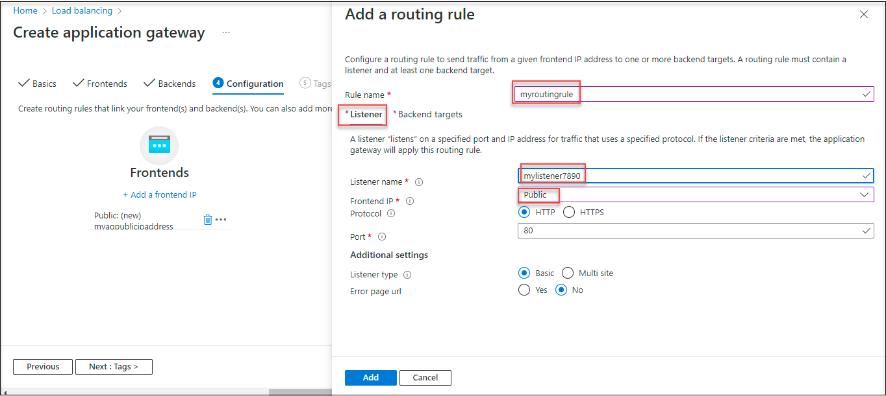

1. Select the **Backend Targets** from the add a routing rule page.

1. On the **Backend Targets**, select the **mybackendpool** for the **Backend Target**.

1. For the **HTTP setting**, select **Add new**.

    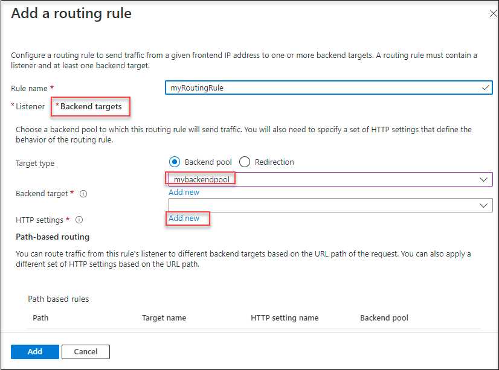

1. On the **Add a HTTP setting** page, under HTTP settings name provide the name as **myhttpsetting**.

1. Accept the default for the other settings and click on **Add**.

    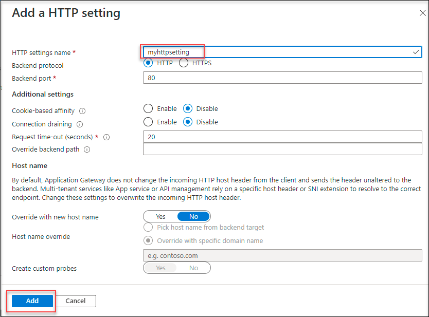

1. On the Add a routing rule window, select **Add** to save the routing rule.  

    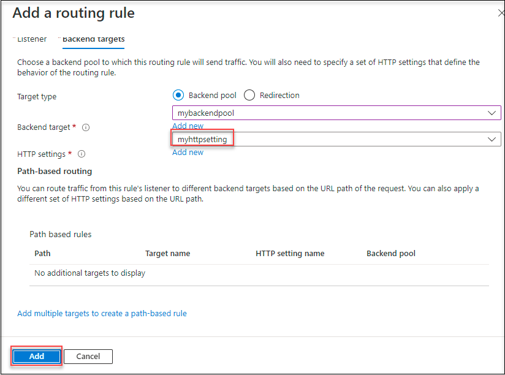

1.  Verify that the rule is added and select **Next : Tags**.

    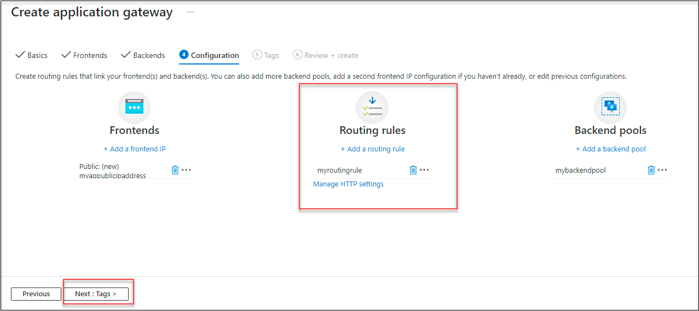

1. Now click on **Review+create** and then click on **Create**.

    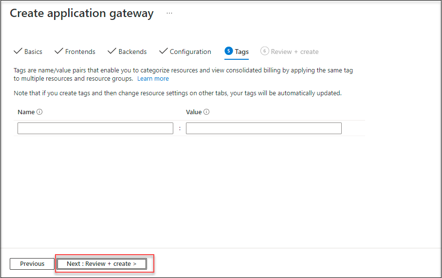
 
   >Note :  It may take several minutes for Azure to create the application gateway. Wait until the deployment finishes successfully before moving on to the next section.

  
