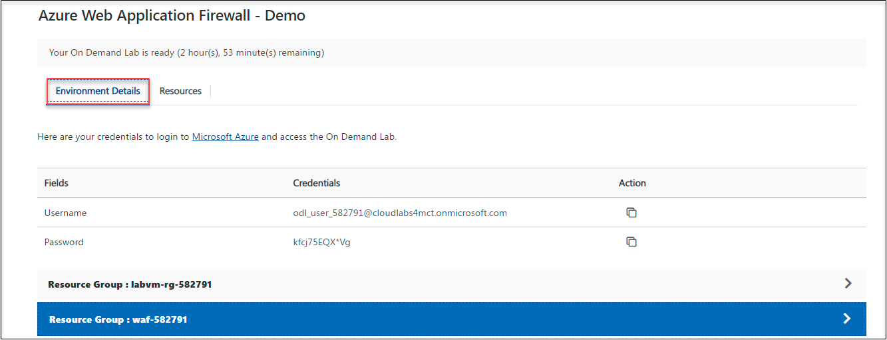

# Task 3 : Test the application gateway

## Overview

In this task, we will use  IIS to test the application gateway.

1. To get the lab environment details, you can select the Environment Details tab.

     

1. Copy the **publicIPAddress** under the resource group **waf-DID** and paste in the browser.

      
     
1. Check the response. A valid response verifies that the application gateway was successfully created and it is successfully connected with the backend.

1. Refresh the browser and verify the output of it. For the reference, you can verify the screenshot that is attached below.
   
   
   
   

# Congraluations! you have successfully completed the lab
