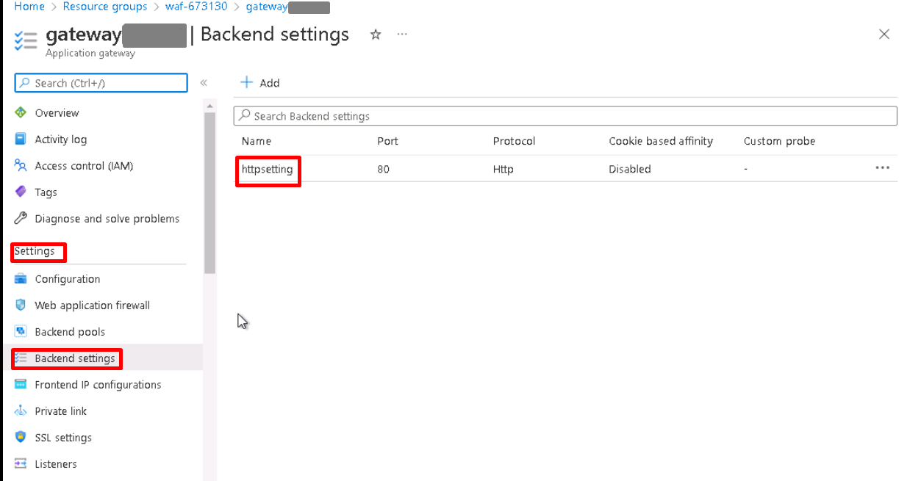

# 03: Verify the Application gateway with WAF Enabled

## Overview

Azure Application Gateway is a web traffic load balancer that enables you to manage traffic to your web applications. Application Gateway can make routing decisions based on additional attributes of an HTTP request, for example URI path or host headers. With Azure Application Gateway, you direct your application web traffic to specific resources by assigning listeners to ports, creating rules, and adding resources to a backend pool.

### Task 1 : Verify the Virtual Network within the Resource Group waf-<inject key="DeploymentID"></inject>

In this task, you will view the backend pool with application gateway attached and then backend targets attached to the backend pool.

1. To communicate with the azure resources that is already created, virtual network is needed.

1. Navigate to [Azure Portal](https://portal.azure.com) and login with the credentails provided.

1. On the home page, select **resource group**.

     

1. Under the resource group tab, select the resource group **waf-<inject key="DeploymentID"></inject>**.

     
     
1. On the resource group page of **Waf-<inject key="DeploymentID"></inject>**, select the virtual network **vnet<inject key="DeploymentID"></inject>**.

     

1. On the virtual network page, under **settings**, select **subnet** and verify the subnets **agsubnet** and **backendsubnet** which is already attached.

    
    
### Task 2 : Application gateway and its Components

In this task, you can view the Application gateway and its Components

1. On the resource group page of **waf-<inject key="DeploymentID"></inject>**, select the application gateway with the name **gateway-<inject key="DeploymentID"></inject>**.

     
     
   * **Frontend Tab** - In this task, the application gateway uses its frontend public IP to reach the server.

1. On the application gateway overview page, verify the **Frontend IP Address** is set to **Public**.

    >Note : For the Application Gateway v2 SKU, private frontend IP configuration is currently not enabled.

1. On the application gateway page, under **settings**, select the **Backend pools** and select the **backendpool**.

     * **Backends Tab** - The backend pool is used to route requests to the backend servers that serve the request. Backend pools can be composed of NICs, virtual machine scale sets, public IPs, internal IPs, fully qualified domain names (FQDN), and multi-tenant back-ends like Azure App Service. 

      

1. On that page, review the **Backend targets** aand click on **Cancel**.

      
      
1. In this, it uses different Components such as routing rules, listeners and backend target.

      * **Listener** : A listener is a logical object that monitors connection requests for new ones. A listener accepts a request if the request's protocol, port, hostname, and IP address match the listener's configuration components.

      *  **Routing Rule** : The key component of the application gateway is **Routing Rule**, because it determines how to route traffic on the listener. The rule binds the listener, the back-end server pool, and the backend HTTP settings.
      
1. Under **Settings**, select **Rules**.

1. On the **Rules** page, select **routingrule**.

     

1. On the application gatway overview page, under **settings**, select the **Backend settings** and select **httpsetting**.

      * **Backend settings** : The port and protocol used in the HTTP settings determine whether the traffic between the application gateway and backend servers is encrypted or unencrypted.

     

1. On the **Add HTTP setting**, review the settings and click on **Cancel**.

     

1. On the application gateway overview, under **settings**, select the **Listeners** and select **MyListener**.

     

1. On the **MyListener** page review the settings and click on **Cancel**.

     

1. On the **routingrule** page, review the settings for the **Listener**.

      
      
1. On the routingrule page, verify the settings and click on **Backend Target**.

1. Review the details of the backend target and click on **Cancel**.

      

# Summary
In this task you have viewed and verified the resources of the resource group **waf-<inject key="DeploymentID"></inject>** and learnt about application gateway and its components

Click on Next to continue to the next section of the lab.
