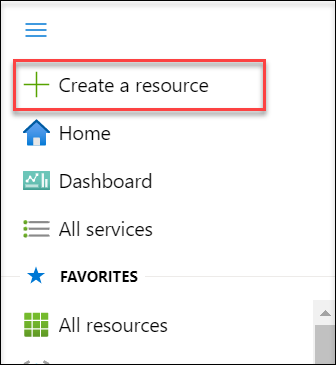
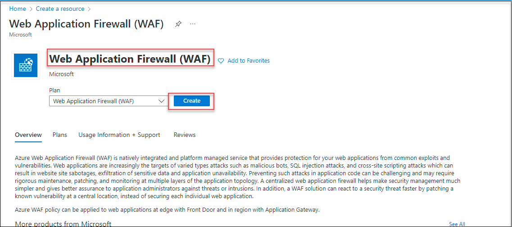
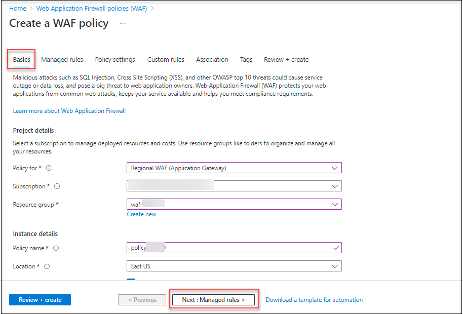
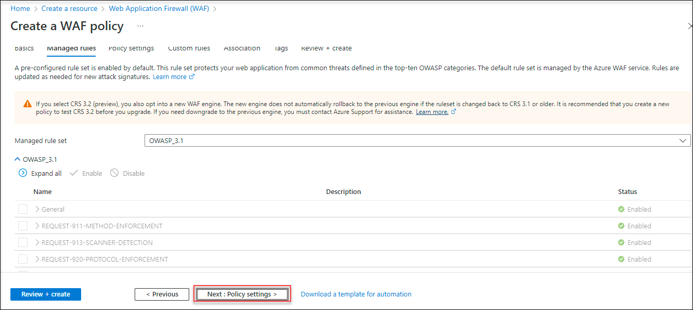
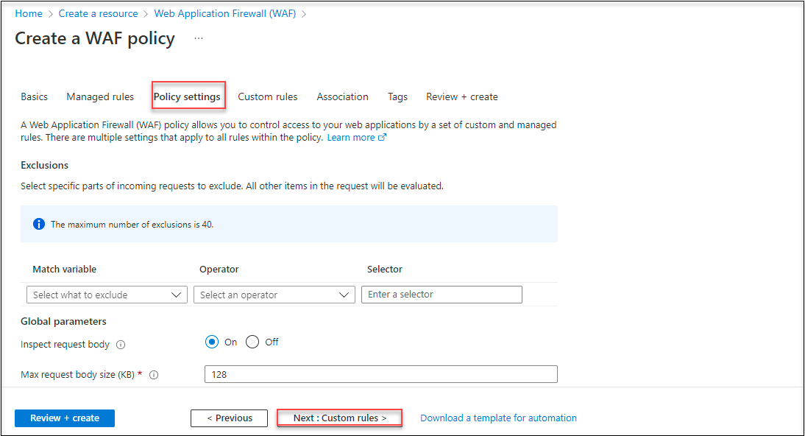
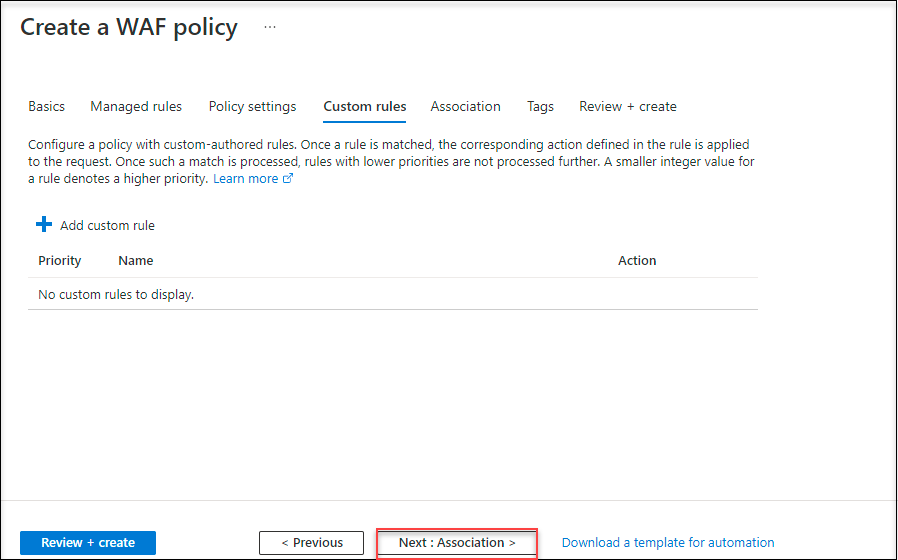
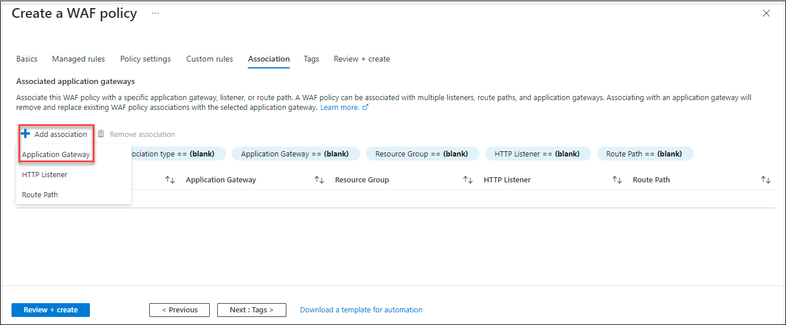
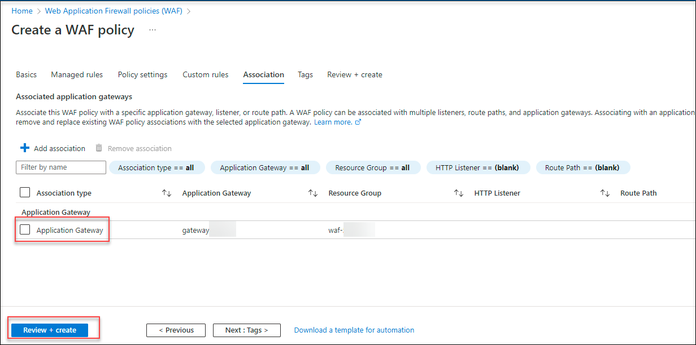

# 04: Create and link a Web Application Firewall policy

## Overview

In this task, you will be creating a Web Application Firewall policy with the associated Application Gateway. All of the WAF customizations and settings are in a separate object, called a WAF Policy.

1. On Azure Portal click on **Show menu** from the top left corner and select **Create a resource**.

     

1. Search for WAF, select **Web Application Firewall**, then select Create.

1. On the upper left side of the portal, select Create a resource. Search for WAF, select **Web Application Firewall**, then select Create.

     

1. On Create a WAF policy page, Basics tab, provide the following information :

    * Policy for : **Regional WAF**
    
    * Subscription : Select the default subscription

    * Resource Group : **Waf-<inject key="DeploymentID"></inject>**

    * Policy Name : **Policy<inject key="DeploymentID"></inject>**

1. Select **Next : Managed rules**.

     

1. Accept the defaults and then select **Next : Policy settings**.
    
     

1. Accept the defaults, and then select **Next : Custom rules**.

     

1. Now select **Next : Association**.

      

1. Under **Association**, click on **+Add Association** and select **application gateway**.

      

1. On the **Associate an application gateway** page, select the gateway with the **gatewayDID** and click on **Add**.

     

1. On the **Association** page, review the settings and select Review + create and then select Create.

     

# Summary

In this task you created and linked a Web Application Firewall policy

Click on **Next** to continue to the next section of the lab.
