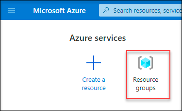
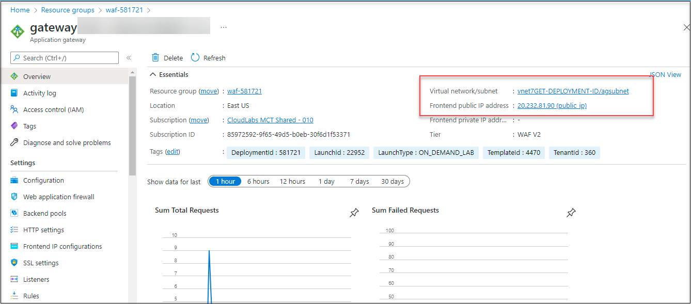
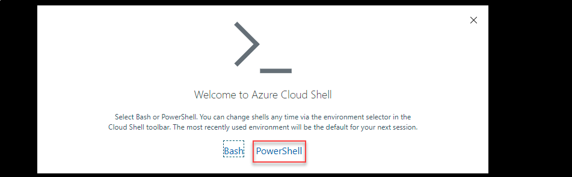
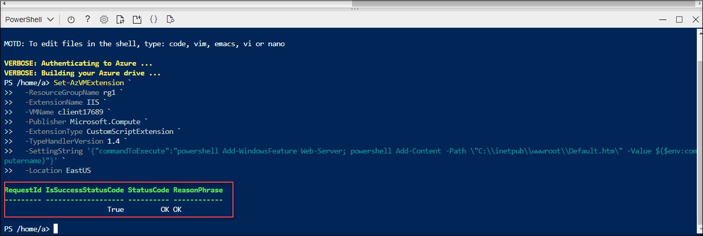

#  Task 2 : Install IIS for Testing

## Overview

In this task, you will install Install IIS for the virtual machines. The virtual machines are pre-created

1. On the home page, select **resource group**.

     

1. Under the resource group tab, select **waf-DID**.

     
     
1. On the resource group of **waf-DID**, select the virtual machine **Wafvm-01**.

1. From the Azure portal, open the Azure Cloud Shell by clicking on the icon in the top right of the Azure Portal.

       

1. When prompted to select either Bash or PowerShell, select **PowerShell**.

         

1. When prompted, select Show advanced settings and then select Use existing and choose existing resource group that is **waf-DID** . Then select Create new against Storage account as well as File Share and provide a unique value in both of the fields and then click on Create storage, and wait for the Azure Cloud Shell to initialize.

1. Set the location parameter according to the resource group location, change the **Virtual Machine** name and resource group name , and then run the following command to install IIS on the virtual machine:

          `````
          Set-AzVMExtension `
          -ResourceGroupName waf-DID `
          -ExtensionName IIS `
          -VMName wafvm-01 `
          -Publisher Microsoft.Compute `
          -ExtensionType CustomScriptExtension `
          -TypeHandlerVersion 1.4 `
          -SettingString '{"commandToExecute":"powershell Add-WindowsFeature Web-Server; powershell Add-Content -Path \"C:\\inetpub\\wwwroot\\Default.htm\" -Value $($env:computername)"}' `
          -Location EastUS

          `````
          
 1. Verify the status as **OK**.

        
     
 1. Repeat the above step and install the IIS server to other virtual machine.

# Proceed to Task 3 : Create and link a Web Application Firewall policy


     
