# Getting Started with Application Gateway Firewall using the Azure portal

## Tasks Included

In this hands-on lab you will perform the following tasks:
 
- **01: Login to Azure Portal**
- **02: View the Azure Portal Deployments**
- **03: Verify the Application gateway with WAF Enabled**
- **04: Create and link a Web Application Firewall policy**
- **05: Test the application gateway**

## Overview

Azure Application Gateway is a web traffic load balancer that enables you to manage traffic to your web applications. Traditional load balancers operate at the transport layer (OSI layer 4 - TCP and UDP) and route traffic based on source IP address and port, to a destination IP address and port. Incoming application traffic is distributed across different backend pools, including Azure VMs, virtual machine scale sets, Azure App Service, and on-premises/external servers.

## Architecture Diagram 

   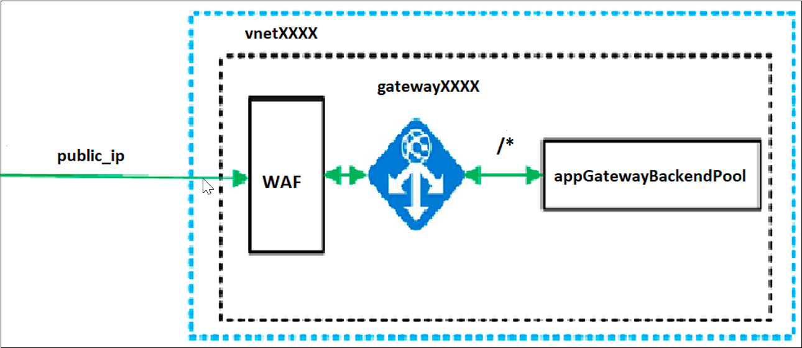
   
Click on **Next** to continue to the next section of the lab.

# 01: Login to Azure Portal

## Overview

In this task you will login to Microsoft Azure using your credentials and access the Azure Portal dashboard.

1. From the virtual machine which is loaded in your browser, select the **Azure Portal** icon to access the Azure Portal.

1. On **Sign in to Microsoft Azure** blade, you will see a login screen, in that enter the following email/username and then click on **Next**.

   * **Azure Username/Email**:  <inject key="AzureAdUserEmail"></inject> 
   * **Azure Password**:  <inject key="AzureAdUserPassword"></inject>
    
    >Note: Refer to the **Environment Details** tab for any other lab credentials/details.
        
   
    
   
   
1. If you see the pop-up like below, click **Skip for now(14 days until this is required)**.

   

1. If you see the pop-up **Stay signed in?** Click **Yes**.

   
    
1. If a **Welcome to Microsoft Azure** popup window appears, click **Maybe Later** to skip the tour.

   
    
1. Now will now see the Azure Portal Dashboard.

# Summary

In this task, you logged into Microsoft Azure using your credentials and accessed the Azure Portal dashboard.

Click on **Next** to continue to the next section of the lab.

# 02: View the Azure Portal deployments

## Overview

In this task, you will navigate to your resource group and view the pre-deployed resources.

1. On the Azure Portal, click on the **Show Menu** button.

     

1. Click on the **Resource groups** button in the Menu navigation bar, to view the Resource groups blade.

     

1. On the Resource group blade, select the resource group with **waf-<inject key="DeploymentID"></inject>**.

     

1. You can view the deployed resources in that resource group **waf-<inject key="DeploymentID"></inject>**.

     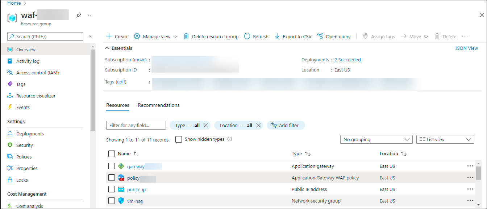
     
# Summary
In this task you navigated to your resource group, and viewed the pre-deployed resources.

Click on **Next** to continue to the next section of the lab.

# 03: Verify the Application gateway with WAF Enabled

## Overview

Azure Application Gateway is a web traffic load balancer that enables you to manage traffic to your web applications. Application Gateway can make routing decisions based on additional attributes of an HTTP request, for example URI path or host headers. With Azure Application Gateway, you direct your application web traffic to specific resources by assigning listeners to ports, creating rules, and adding resources to a backend pool.

### Task 1 : Verify the Virtual Network within the Resource Group waf-<inject key="DeploymentID"></inject>

In this task, you will view the backend pool with application gateway attached and then backend targets attached to the backend pool.

1. To communicate with the azure resources that is already created, virtual network is needed.

1. Navigate to [Azure Portal](https://portal.azure.com) and login with the credentails provided.

1. On the home page, select **resource group**.

     

1. Under the resource group tab, select the resource group **waf-<inject key="DeploymentID"></inject>**.

     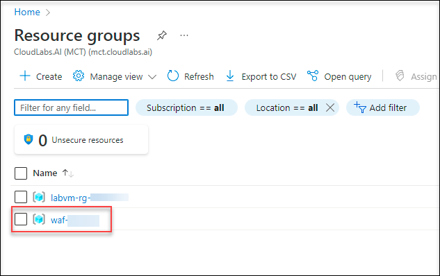
     
1. On the resource group page of **Waf-<inject key="DeploymentID"></inject>**, select the virtual network **vnet<inject key="DeploymentID"></inject>**.

     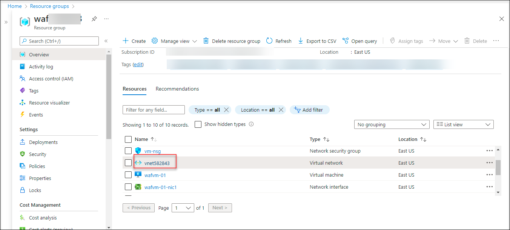

1. On the virtual network page, under **settings**, select **subnet** and verify the subnets **agsubnet** and **backendsubnet** which is already attached.

    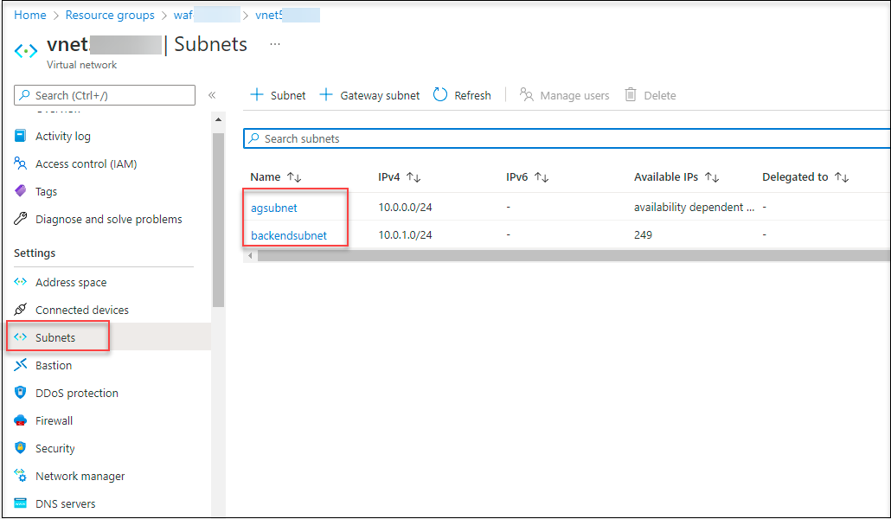
    
### Task 2 : Application gateway and its Components

In this task, you can view the Application gateway and its Components

1. On the resource group page of **waf-<inject key="DeploymentID"></inject>**, select the application gateway with the name **gateway-<inject key="DeploymentID"></inject>**.

     
     
   * **Frontend Tab** - In this task, the application gateway uses its frontend public IP to reach the server.

1. On the application gateway overview page, verify the **Frontend IP Address** is set to **Public**.

    >Note : For the Application Gateway v2 SKU, private frontend IP configuration is currently not enabled.

1. On the application gateway page, under **settings**, select the **Backend pools** and select the **backendpool**.

     * **Backends Tab** - The backend pool is used to route requests to the backend servers that serve the request. Backend pools can be composed of NICs, virtual machine scale sets, public IPs, internal IPs, fully qualified domain names (FQDN), and multi-tenant back-ends like Azure App Service. 

      

1. On that page, review the **Backend targets** aand click on **Cancel**.

      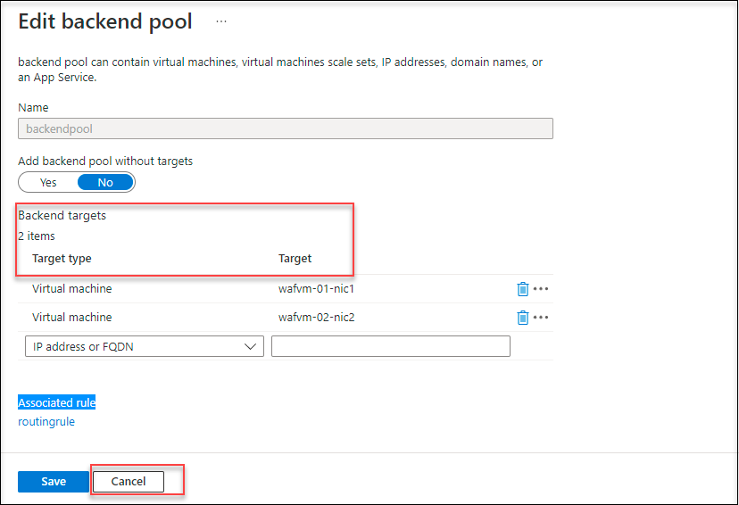
      
1. In this, it uses different Components such as routing rules, listeners and backend target.

      * **Listener** : A listener is a logical object that monitors connection requests for new ones. A listener accepts a request if the request's protocol, port, hostname, and IP address match the listener's configuration components.

      *  **Routing Rule** : The key component of the application gateway is **Routing Rule**, because it determines how to route traffic on the listener. The rule binds the listener, the back-end server pool, and the backend HTTP settings.
      
1. Under **Settings**, select **Rules**.

1. On the **Rules** page, select **routingrule**.

     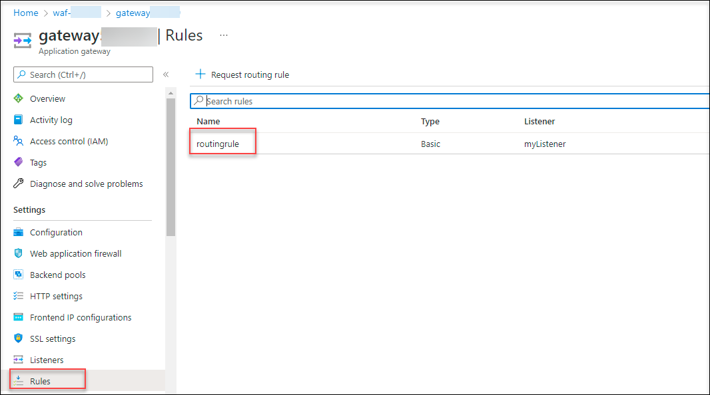

1. On the application gatway overview page, under **settings**, select the **HTTP Settings** and select **httpsetting**.

      * **HTTP Setting** : The port and protocol used in the HTTP settings determine whether the traffic between the application gateway and backend servers is encrypted or unencrypted.

     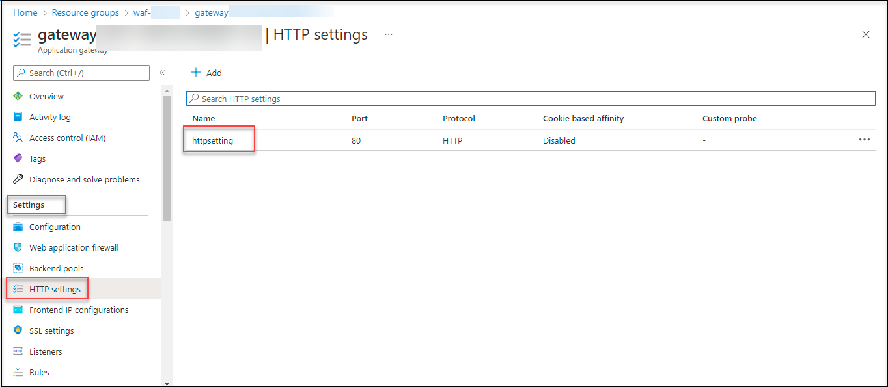

1. On the **Add HTTP setting**, review the settings and click on **Cancel**.

     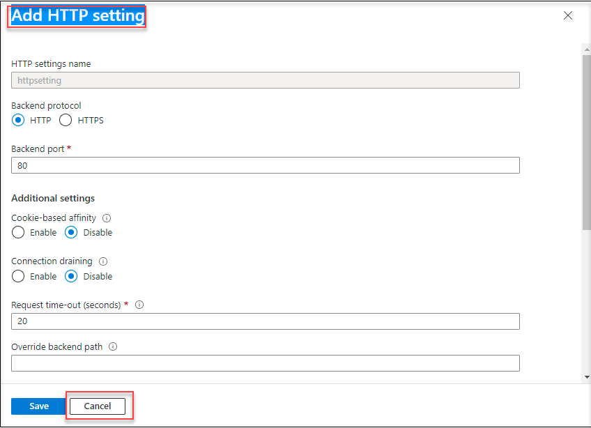

1. On the application gateway overview, under **settings**, select the **Listeners** and select **MyListener**.

     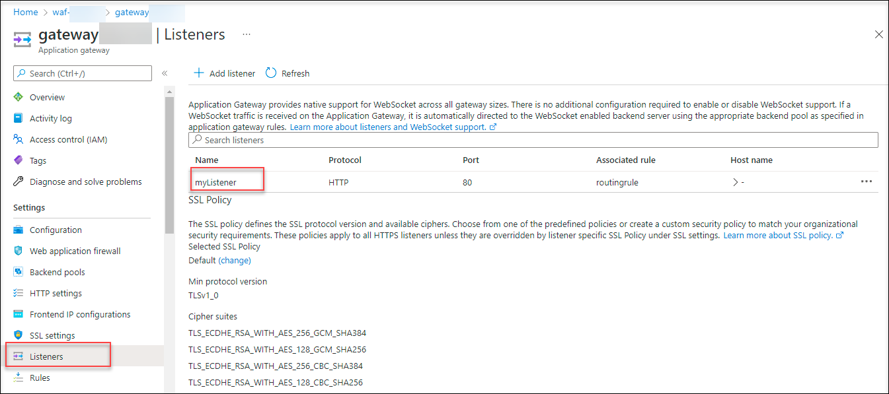

1. On the **MyListener** page review the settings and click on **Cancel**.

     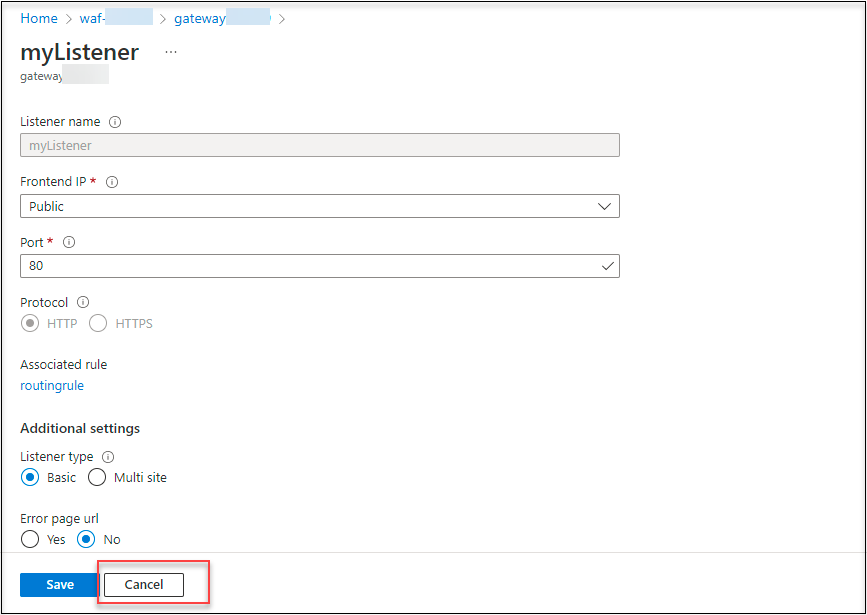

1. On the **routingrule** page, review the settings for the **Listener**.

      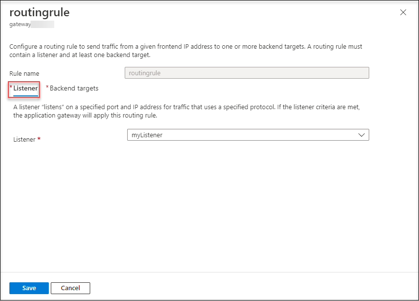
      
1. On the routingrule page, verify the settings and click on **Backend Target**.

1. Review the details of the backend target and click on **Cancel**.

      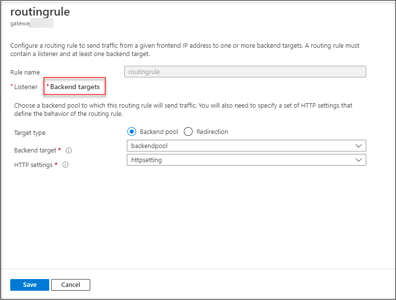

# Summary
In this task you have viewed and verified the resources of the resource group **waf-<inject key="DeploymentID"></inject>** and learnt about application gateway and its components

Click on Next to continue to the next section of the lab.

# 04: Create and link a Web Application Firewall policy

## Overview

In this task, you will be creating a Web Application Firewall policy with the associated Application Gateway. All of the WAF customizations and settings are in a separate object, called a WAF Policy.

1. On Azure Portal click on **Show menu** from the top left corner and select **Create a resource**.

     

1. Search for WAF, select **Web Application Firewall**, then select Create.

     

1. On Create a WAF policy page, Basics tab, provide the following information :

    * Policy for : **Regional WAF**
    
    * Subscription : Select the default subscription

    * Resource Group : **waf-<inject key="DeploymentID"></inject>**

    * Policy Name : **Policy<inject key="DeploymentID"></inject>**

1. Select **Next : Managed rules**.

     

1. Accept the defaults and then select **Next : Policy settings**.
    
     

1. Accept the defaults, and then select **Next : Custom rules**.

     

1. Now select **Next : Association**.

      

1. Under **Association**, click on **+Add Association** and select **application gateway**.

      

1. On the **Associate an application gateway** page, select the gateway with the **gatewayDID** and click on **Add**.

     

1. On the **Association** page, review the settings and select Review + create and then select Create.

     

# Summary
In this task you created and linked a Web Application Firewall policy

Click on **Next** to continue to the next section of the lab.

# 05: Test the Application Gateway

## Overview

In this task, you will have pre-installed IIS server on the virtual machines to verify that application gateway was successfully created.

1. To verify the linkage of the application gateway, take the **publicIPAddress**: <inject key="PublicIPAddress"></inject> and paste in the browser.

      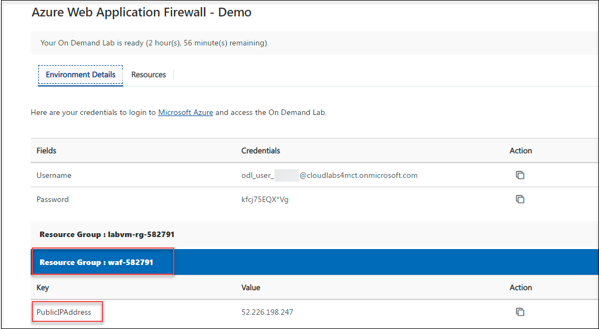
     
1. Check the response. A valid response verifies that the application gateway was successfully created and it is successfully connected with the backend.

1. Refresh the browser and verify the output of it. For the reference, you can verify the screenshot that is attached below.
   
   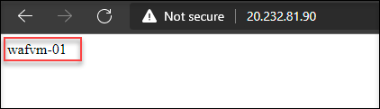
   
   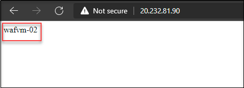
   

# Summary

 In this task, you verified that the application gateway was successfully created and connected to the backend.

# Congratulations! You have successfully completed the lab

