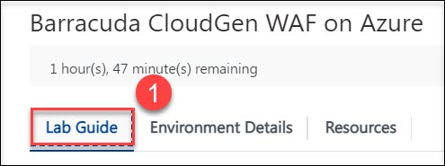

# Getting Started

1. Once the environment is provisioned, a lab guide will get loaded into your browser **(1)**, Click on **Next** from the bottom middle and follow the instructions to perform the labs **(2)**.

    
    
    
    
1. To get the lab environment details, you can select the **Environment Details** tab.

    

1. Also, you can **start, stop and restart** the virtual machines from the **Resources** tab.

    

### Log-in to the Azure portal

1. In the Local Machine, Open a New InPrivate window and sign in to the **Azure Portal** (<http://portal.azure.com>).

1. On **Sign in to Microsoft Azure** blade, you will see a login screen, in that enter the following email/username and then click on **Next**.  

   * **Azure Username/Email**:  <inject key="AzureAdUserEmail"></inject> 
   * **Azure Password**:  <inject key="AzureAdUserPassword"></inject>

        **Note**: Refer to the **Environment Details** tab for any other lab credentials/details.
        
    
  
    
  
1. If you see the pop-up like below, click **Skip for now(14 days until this is required)**.

    

1. If you see the pop-up **Stay Signed in?** click **No**.

    

1. If you see the pop-up **You have free Azure Advisor recommendations!** close the window to continue the lab. 

1. If a **Welcome to Microsoft Azure** popup window appears, click **Maybe Later** to skip the tour.

    

1. Now will now see the Azure Portal Dashboard.

1. Click on **Next** from the bottom middle and follow the instructions to perform the lab.

