# Getting started with Barracuda on Azure

## Overview 

This document will help you in configuring the Barracuda Web Application firewall hosted on Azure for publishing IIS Based websites.

<!---
## Prerequisites

- Microsoft Azure Subscription with admin credentials.

- Azure Quick-start template **Barracuda-waf-solution** needs to be deployed successfully in the subscription
 -->

## Task 1: Getting started with the environment

1.	**Launch** the Edge browser and **Navigate** to https://portal.azure.com.

2.	**Login** with your Microsoft Azure credentials.

3.	To toggle **show/hide** the Portal menu options with icon, **Click** on the **Show Menu** button.

   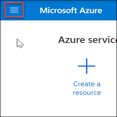

4.	**Click** on the **Resource groups** button in the **Menu navigation bar**, to view the Resource groups blade.
 
   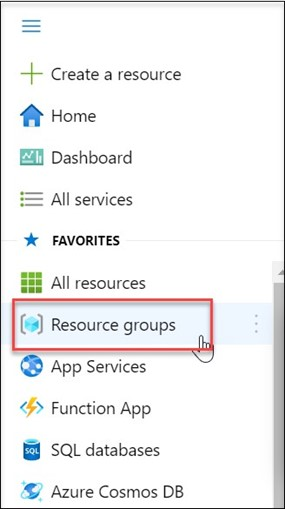

5.	Select the Resource Group in which you deployed the quick start template.

   
 
6.	From **Settings**, select **Deployments**.

   

7.	Select the latest **deployment** available on this resource group.

   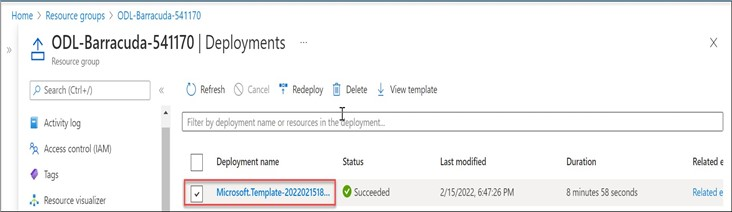
 
8.	In the Deployment blade, Click on the **Outputs** section (1). You will see the **Public IP address** of **Barracuda WAF VM** (3) and **Load Balancer(2)**.

   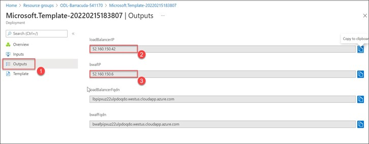

9.	Click the **Copy icon** to copy the **Public IP address**. Create a new text document in **Notepad** or **Notepad++** and paste both IP addresses to it as **Load Balancer Public Ip** and **Barracuda WAF Public IP**.
 
   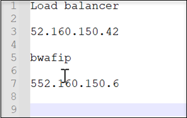

10.	Navigate back to the Resource groups and select your **Resource Group**.

   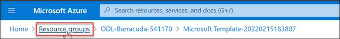
 
11.	On the Resource group blade, click on **Overview**.

   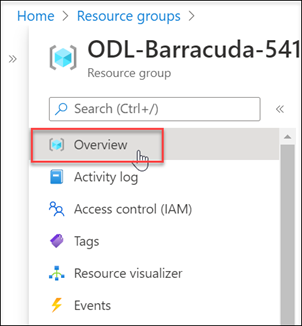

12.	Select the **web-vm1** virtual machine from the resource list.

   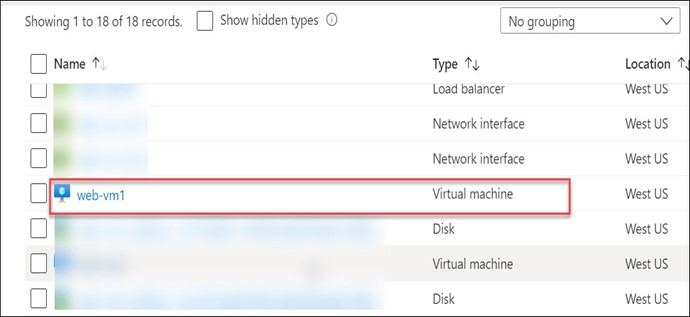
 
13.	On the virtual machine blade, scroll down to the **Settings** section, click on **Networking**

   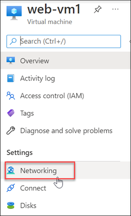

14.	Select the **web-vm-nic1** Network Interfaces.

   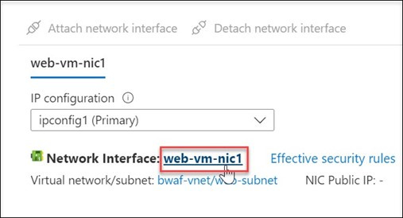
 
15.	In the Network Interfaces blade, you can see the **Private IP address** of **web-vm1**. Save this IP address to the notepad as **web-vm1 private IP**.

   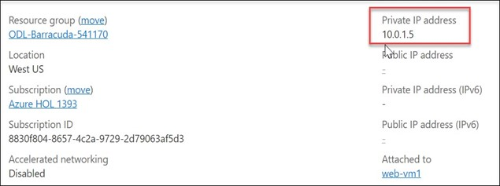

16.	Repeat steps **11 to 13** to obtain the **Private IP address** of **web-vm2** as well by selecting
**web-vm2** in step **11**. Now, you will have all the following IP addresses in your notepad.

   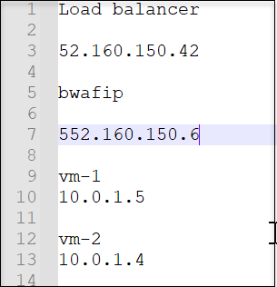
   
## Task 2: Accessing the Barracuda Dashboard   

1.	Open a new tab in the browser and paste the **Barracuda WAF Public IP** from the notepad. Append a **colon** and the port number **8000** to the ip address as shown below. This port is used by the **BWAF** management web interface. Press **Enter** key.

   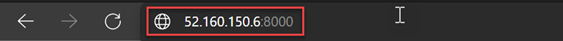

2.	A page as shown below will appear.

   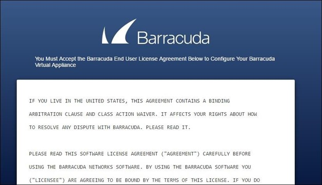

  This is the **Barracuda End User License Agreement.**

3.	Scroll down to the bottom of the page. Fill the text boxes with appropriate values and Click **Accept**.

   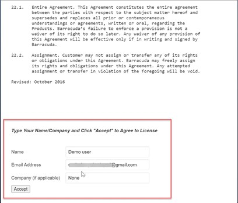
   
## Task 3: Configuiring Barracuda Firewall   
 
1.	In the **Sign-In page** of Barracuda, use the following credentials:

   - Username : **admin**
   - Password : The password you provided when deploying the quickstart template.

   Click on **Sign in**.

   

2.	Now, you will be able to see the management portal of **Barracuda**.

   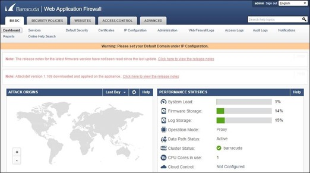

3.	Click on **Services** in the Basic menu.

   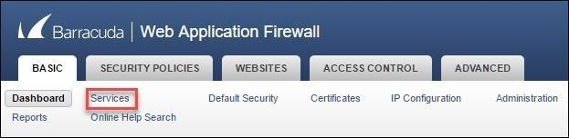

4.	In the **ADD NEW SERVICE** section, configure as below:

   - Service Name: **Demo-Websites** (Or your custom service name)
   - Type : **HTTP**
   - Virtual IP Address : Leave the default. (This is the private IP address of **bwaf-vm1**     VM.)
   - Port : Leave the default
   - Real Servers : Copy and paste web-vm1 Private IP from the notepad.
   - Create Group : Leave the default
   - Service Groups : Leave the default
    
   After configuration, click **Add**.
 
   

5.	If the Sign-In page of **Barracuda** occurs, use the following credentials:

   - Username : **admin**
   - Password : The password you provided when deploying the quickstart template.

Click on **Sign in**.
 
   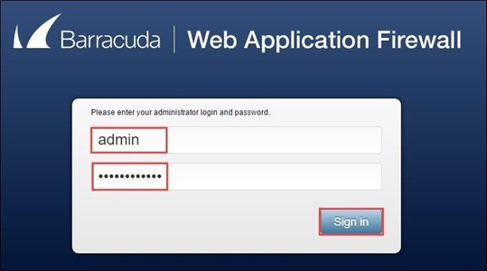

6.	Now, you can see that the **Services** section is updated with the configuration you provided. Click on **Edit** against **Server_10.0.1.5_80**.

   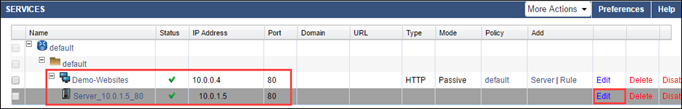

7.	In the **Server Configuration** page, provide the **Server Name** as **web-vm1**. Click on **Save**.

   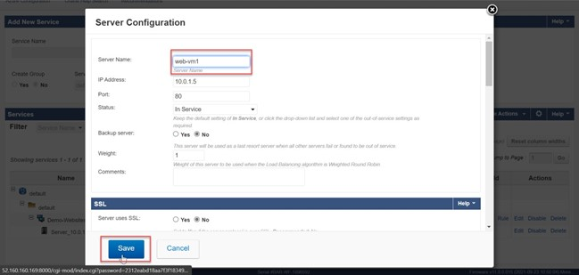
 
8.	The page will be refreshed, and the web server **Server_10.0.1.5_80** will be renamed as **web-vm1**. Now, click on Server against the **Demo-Websites** service.

   

9.	In the window that appears, configure as follows:
    
   - Server Name : **web-vm2**
   - IP Address : **10.0.1.4**

   Keep the default for others and click **Add**

   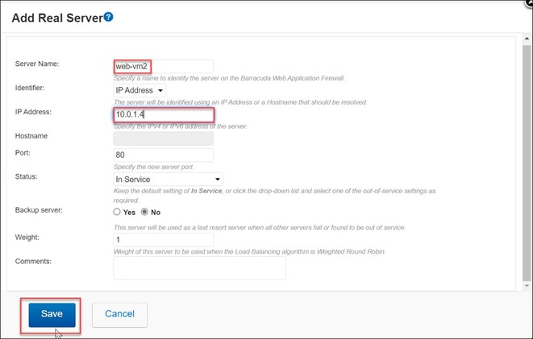

10.	Again, the page will be refreshed and **web-vm2** will be added to the service **Demo-Websites**.

   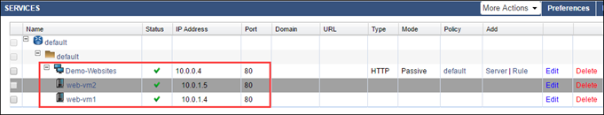

11.	Now, to configure load balancing of **web-vm1** and **web-vm2**, click on **Edit** against **Demo-Websites**.

   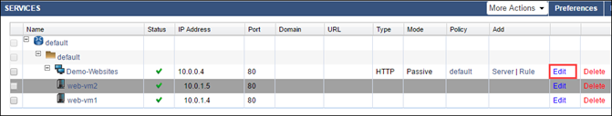

12.	In the window that comes up, scroll down to see the **Load Balance** section. You can choose the **Load Balancing Algorithm**, **Persistence Method** and **Failover Method**.

    For more details, go to the link https://campus.barracuda.com/product/webapplicationfirewall/article/WAF/ConfigLoadBalanci ng/

   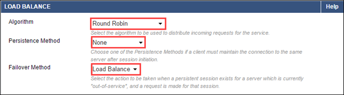

13.	Click on **Save** after any configuration change.

   

14.	Open a new tab in the browser. Copy **Barracuda WAF Public IP** from the notepad and paste it in the URL box. Press **Enter** key. By default, this use port **80**.

   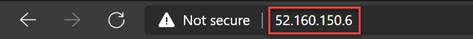

15.	As you can see, the request will be forwarded to the backend web servers as configured.

   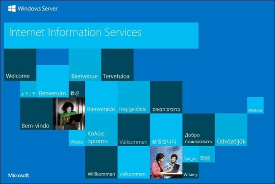

16.	Now, navigate back to the **Management portal of Barracuda Web Application Firewall**. Click on **Access Logs**.

   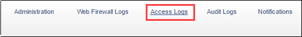

17.	You should see that the request you made to the firewall is logged. Click on **Details** to see more about the request.
 
   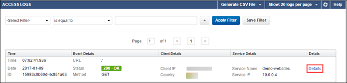

18.	Now you can update the website at the backend servers as per your requirements and configure similar services via Barracuda. Follow Barracuda documentation to learn more about configuring Barracuda web application firewall (https://campus.barracuda.com/product/webapplicationfirewall)

## Task 4: Accessing Web VMs via RDP

### Instructions

1.	Launch a **browser** and Navigate to https://portal.azure.com.

2.	Login with your MicrosoftAzure credentials.

3.	To toggle **show/hide** the Portal menu options with icon, **Click** on the **Show Menu** button.

   
 
4.	Click on the **Resource groups** button in the **Menu navigation** bar, to view the Resource groups blade.

   

5.	Select the Resource Group in which you deployed **Barracuda-waf-Solution** quickstart template.

   
 
6.	From the list of resources, select **webrdp-lb**.

   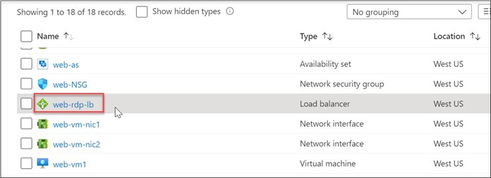

7.	In the **Overview** blade, you can see the **Public IP address** of the load balancer. This is the same public IP noted earlier from **Outputs** of the deployment.

   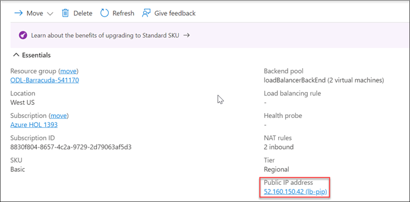

8.	Click on **Inbound NAT rules** in **Settings**.

   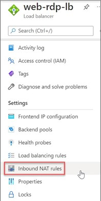

9.	Make a note of the NAT port number for the VM you’d want to access via RDP.

   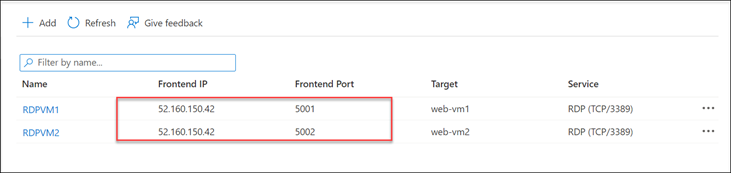

10.	In your PC, go to **Start Menu>Run**. Type **mstsc** and click **OK**. The **Remote Desktop** Connection window will appear. Copy **webrdp-lb** public IP from the notepad and paste it in the text box against **Computer** followed by a **colon** and the port number noted from previous step.
 
    Now, your **Remote Desktop Connection** window should looks like this:

   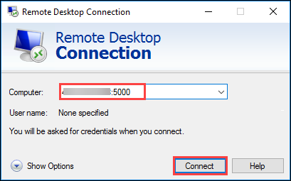

   Click **Connect**.

11.	In the following window, provide the username and password used while deploying the solution.. Click **OK**.

   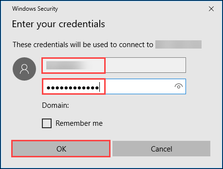

12.	Click **Yes** in the security page.
 
   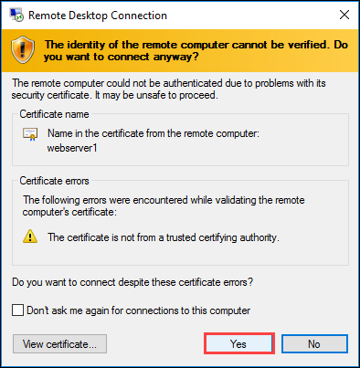

13.	This should open the remote desktop to the virtual machine.

   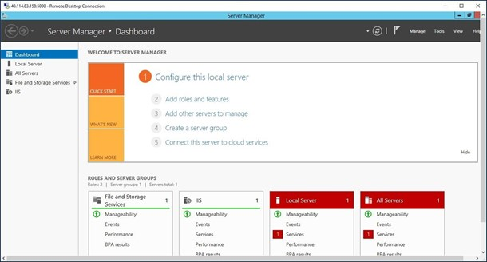
