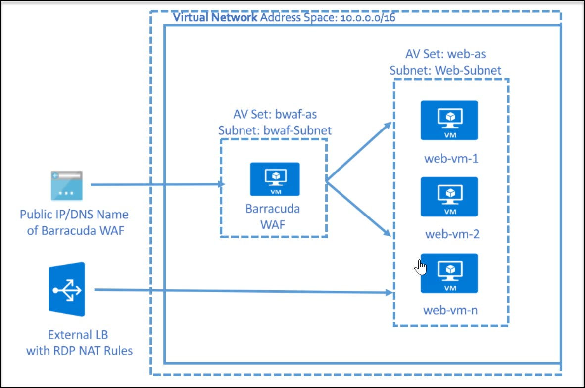

# Getting started with Barracuda CloudGen WAF on Azure

## Tasks Included

In this hands-on lab you will perform the following tasks:

- **Task 1: Getting started with Barracuda CloudGen WAF on Azure**
- **Task 2: Accessing Barracuda Dashboard**
- **Task 3: Configuring Barracuda Firewall**
- **Task 4: Access Web VMs via RDP**

# Overview 

## Barracuda Web Application Firewall

The Barracuda Web Application Firewall inspects inbound web traffic and blocks SQL injections, Cross-Site Scripting, malware uploads & application DDoS, and other attacks targeted at your web applications. It also inspects the responses from the back-end web servers for Data Loss Prevention (DLP). The integrated access control engine enables administrators to create granular access control policies for Authentication, Authorization & Accounting (AAA), which gives organizations strong authentication and user control. The onboard L4/L7 Load Balancing capabilities enable organizations to quickly add back-end servers to scale deployments. Application acceleration capabilities, including SSL Offloading, caching, compression, and connection pooling, ensure faster web application content application delivery.

## Architecture Diagram

   

## Task 1: Getting started with the environment

In this task, you will view the pre-deployed Barracuda Cloudgen WAF VM and multiple backend web servers. 

1. **Launch** the Edge browser and **Navigate** to https://portal.azure.com.

1. **Login** with your username and password as provided in the **Environment Details** tab.

1. To toggle **show/hide** the Portal menu options with icon, **Click** on the **Show Menu** button.

      

1. **Click** on the **Resource groups** button in the **Menu navigation bar** to view the Resource groups blade.
 
      

1. Select the **ODL-Barracuda-XXXX** resource group in the resource groups blade.

      
 
1. On the Resource group blade, click on **Overview**.

      

1. Select the **web-vm1** virtual machine from the resource list.

      
 
1. On the virtual machine blade, scroll down to the **Settings** section, click on **Networking**

      

1. Select the **web-vm-nic1** Network Interfaces.

      
 
1. In the Network Interfaces blade, you can see the **Private IP address** of **web-vm1**. Copy the value of the Private IP address. You will need it in the next task.

      

1. Repeat steps **7 to 10** to obtain the **Private IP address** of **web-vm2** as well by selecting **web-vm2** in step **7**.

      

1. Navigate back to the Resource groups and select your Resource Group

      
    
1. On the Resource group blade, click on Overview.

      

1. Explore through pre-deployed resources from the resource list
   
