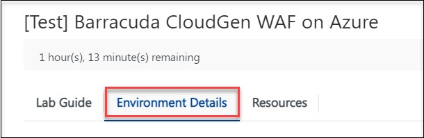
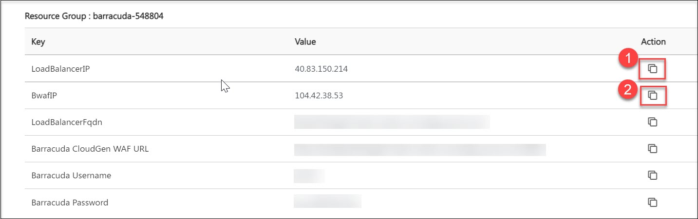

# Getting started with Barracuda CloudGen WAF on Azure

The Barracuda Web Application Firewall inspects inbound web traffic and blocks SQL injections, Cross-Site Scripting, malware uploads & application DDoS and other attacks targeted at your web applications. It also inspects the responses from the back-end web servers for Data Loss Prevention (DLP). The integrated access control engine enables administrators to create granular access control policies for Authentication, Authorization & Accounting (AAA), which gives organizations strong authentication and user control. The onboard L4/L7 Load Balancing capabilities enable organizations to quickly add back-end servers to scale deployments. Application acceleration capabilities including SSL Offloading, caching, compression, and connection pooling, ensure faster application delivery of web application content.

## Task 1: Getting started with the environment

In the following task you will able to view the pre-deployed Barracuda WAF VM and multiple backend web servers. 

1. **Launch** the Edge browser and **Navigate** to https://portal.azure.com.

1. **Login** with your username and Password as provided in the **Environment Details** tab.

1. To toggle **show/hide** the Portal menu options with icon, **Click** on the **Show Menu** button.

      

1. **Click** on the **Resource groups** button in the **Menu navigation bar**, to view the Resource groups blade.
 
      

1. Select the **Resource Group**.

      
 
1. Note down the **Public IP address**: <inject key="AzureAdUserEmail"></inject> of **Barracuda WAF VM** and **public IP address**: <inject key="AzureAdUserEmail"></inject> of **Load Balancer**. Additionaly, Navigate back to the Environment, select the **Environment Details tab**. 

      

1.  You will see the Value of **BwafIP(1)** and **LoadBalancerIP(2)**, Click the **Copy icon** to copy the **Public IP address**. Create a new text document in **Notepad** or **Notepad++** and paste both IP addresses to it as **Load Balancer Public Ip** and **Barracuda WAF Public IP**, Please Ignore this step If you performed step 6.
 
      
      
      

1. Navigate back to the Resource groups and select your **Resource Group**.

      
 
1. On the Resource group blade, click on **Overview**.

      

1. Select the **web-vm1** virtual machine from the resource list.

      
 
1. On the virtual machine blade, scroll down to the **Settings** section, click on **Networking**

      

1. Select the **web-vm-nic1** Network Interfaces.

      
 
1. In the Network Interfaces blade, you can see the **Private IP address** of **web-vm1**. Save this IP address to the notepad as **web-vm1 private IP**.

      

1. Repeat steps **11 to 13** to obtain the **Private IP address** of **web-vm2** as well by selecting **web-vm2** in step **11**. Now, you will have all the following IP addresses in your notepad.

      
   
1. Click on **Next** from the bottom right corner and follow the instructions to perform the lab.
