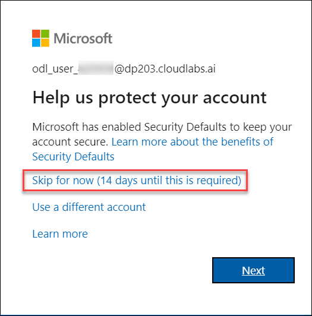
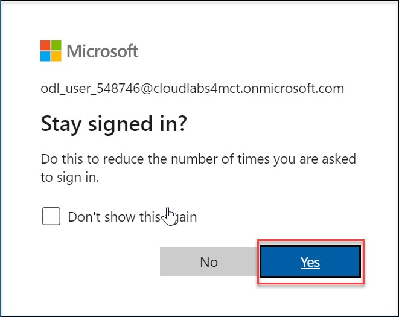
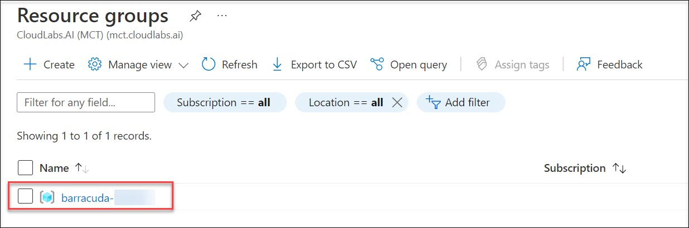
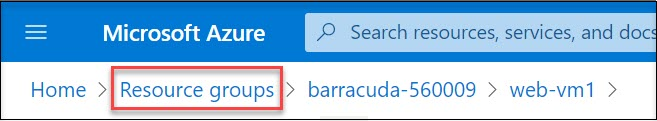

# 02: Getting started with the Azure Portal

## Overview

In this task, you will view the pre-deployed Barracuda Cloudgen WAF VM and multiple backend web servers. 

## Task 1: Getting started with the Azure Portal

1. In the browser that you already opened, open a new tab, and sign in to the **Azure Portal** (<http://portal.azure.com>).

1. On **Sign in to Microsoft Azure** blade, you will see a login screen, in that enter the following email/username and then click on **Next**.  

   * **Azure Username/Email**:  <inject key="AzureAdUserEmail"></inject> 
   * **Azure Password**:  <inject key="AzureAdUserPassword"></inject>

        **Note**: Refer to the **Environment Details** tab for any other lab credentials/details.
        
    
  
    
  
1. If you see the pop-up like below, click **Skip for now(14 days until this is required)**.

    

1. If you see the pop-up **Stay Signed in?** click **No**.

    

1. If you see the pop-up **You have free Azure Advisor recommendations!** close the window to continue the lab. 

1. If a **Welcome to Microsoft Azure** popup window appears, click **Maybe Later** to skip the tour.

    

1. Now you will be able to view the Azure Portal Dashboard.

1. To toggle **show/hide** the Portal menu options with icon, **Click** on the **Show Menu** button.

      

1. **Click** on the **Resource groups** button in the **Menu navigation bar** to view the Resource groups blade.
 
      

1. Select the **barracuda-DeploymentID** resource group in the resource groups blade.

      
 
1. On the Resource group blade, click on **Overview**.

      

1. Select the **web-vm1** virtual machine from the resource list.

      
 
1. On the virtual machine blade, scroll down to the **Settings** section, click on **Networking**

      

1. Select the **web-vm-nic1** Network Interfaces.

      
 
1. In the Network Interfaces blade, you can see the **Private IP address** of **web-vm1**. Copy the value of the Private IP address. You will need it in the next task.

      

1. Repeat steps **7 to 10** to obtain the **Private IP address** of **web-vm2** as well by selecting **web-vm2** in step **7**.

1. Navigate back to the Resource groups and select your Resource Group

      
    
1. On the Resource group blade, click on Overview.

      

1. Explore the pre-deployed resources
   
# Proceed to Task 3 - Configuring Barracuda Firewall 
