# Getting started with F5 Advanced WAF on Azure

## Tasks Included

In this hands-on lab you will perform the following tasks:

- **Task 1: Accessing the F5 Dashboard**
- **Task 2: Getting started with the Azure Portal**
- **Task 3: Configuring F5 Advanced Web Application firewall**

## F5 Web Application Firewall
F5 Advanced WAF is an application-layer security platform protecting against application attacks. The industry-leading F5 Advanced WAF provides robust web application firewall protection by securing applications against threats including layer 7 DDoS attacks, malicious bot traffic, all OWASP top 10 threats and API protocol vulnerabilities.The F5 Advanced WAF leverages behavioral analytics, automated learning capabilities, and risk-based policies to secure your website, mobile apps, and APIs—whether in a native or hybrid Azure environment

## Architecture Diagram
   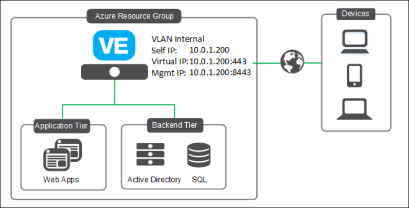
    
## Overview 

In this task, you will access the F5 Advanced WAF dashboard by using the Public Ip address.

## Task 1: Accessing the F5 Dashboard

1. In the LabVM desktop, select the **Microsoft Edge** icon.
  
1. Open a new tab in the browser and log in to the BIG-IP Configuration utility by using **https** with the **F5 Advanced WAF Public IP**: <inject key="F5IP"></inject>. Append a **colon** and the port number **8443** to the IP address as shown below. This port 8443 allows management traffic to reach BIG-IP VE. Press **Enter** key.

    
    
1. A page shown below will apear. Click on **Advanced** on the web page.

    
     
1. Click on the link **Continue to XXXXXX(unsafe)** on the page as shown below. 

    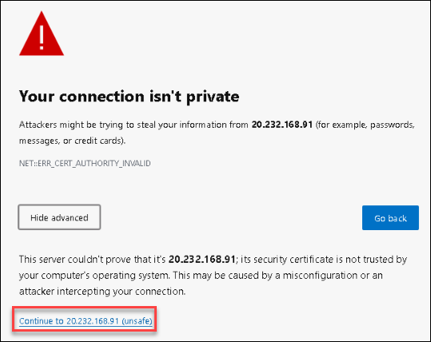
    
1. You will be redirected to the **F5 Advanced WAF** Login page.

    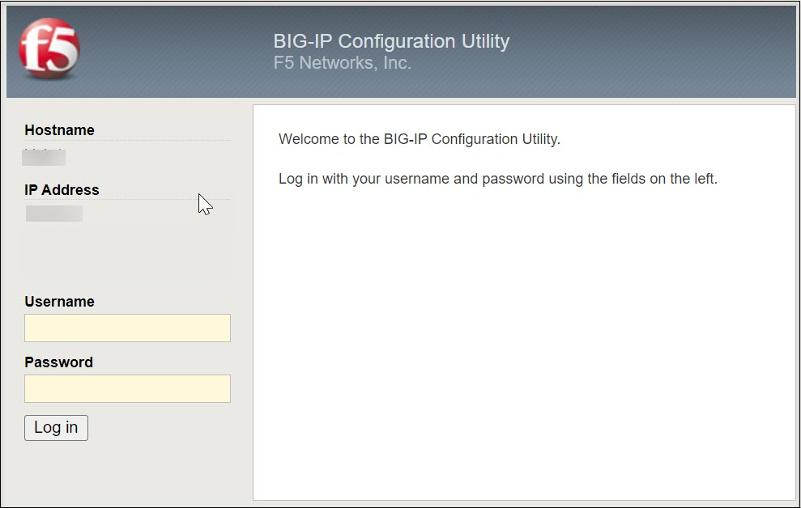
    
1. Enter the following F5 Portal username and password and then click on **Log in**.  

   * **F5 Portal Username**:  <inject key="F5 Portal Username"></inject> 
   * **F5 Portal Password**:  <inject key="F5 Portal Password"></inject>

        **Note**: Refer to the **Environment Details** tab for any other lab credentials/details.
        
    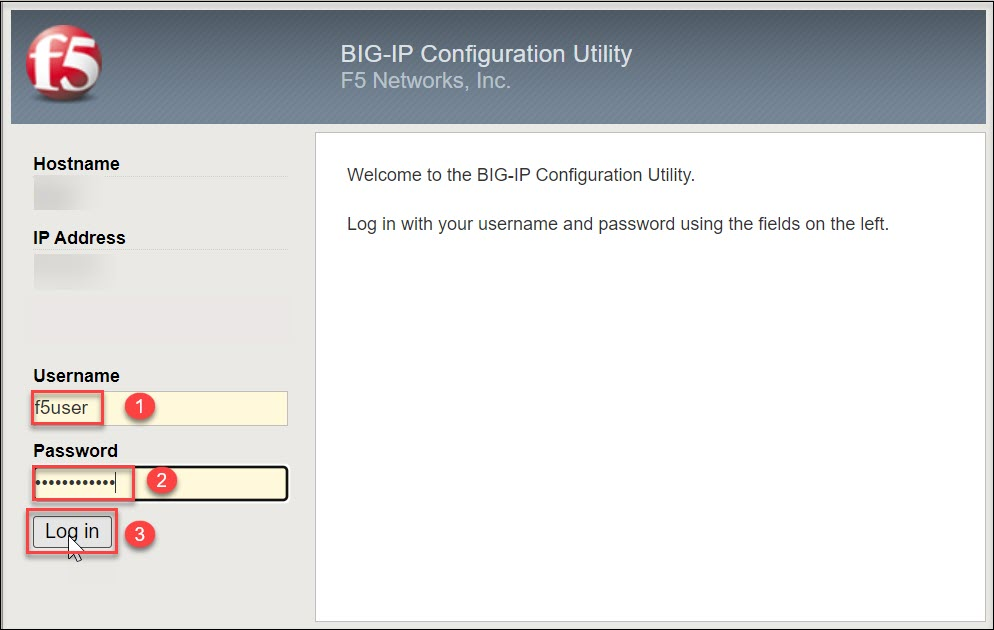
 
1. Now, you will be able to see the F5 dashboard. 
 
    
   
# 02: Getting started with the Azure Portal

## Overview

In this task, you will view the pre-deployed F5 Advanced WAF VM and web servers. 

## Task 1: Getting started with the Azure Portal

1. In the browser that you already opened, open a new tab, and sign in to the **Azure Portal** (<http://portal.azure.com>).

1. On the **Sign in to Microsoft Azure** blade, you will see a login screen, in which enter the following email/username and then click on **Next**.  

   * **Azure Username/Email**:  <inject key="AzureAdUserEmail"></inject> 
   * **Azure Password**:  <inject key="AzureAdUserPassword"></inject>

        **Note**: Refer to the **Environment Details** tab for any other lab credentials/details.
        
    
  
    
  
1. If you see the pop-up like below, click **Skip for now(14 days until this is required)**.

    

1. If you see the pop-up **Stay Signed in?** click **No**.

    

1. If you see the pop-up **You have free Azure Advisor recommendations!** close the window to continue the lab. 

1. If a **Welcome to Microsoft Azure** popup window appears, click **Maybe Later** to skip the tour.

    

1. Now you will be able to view the Azure Portal Dashboard.

1. To toggle **show/hide** the Portal menu options with icon, **Click** on the **Show Menu** button.

      

1. **Click** on the **Resource groups** button in the **Menu navigation bar** to view the Resource groups blade.
 
      
      
1. Select the **F5-DeploymentID** resource group in the resource groups blade.

      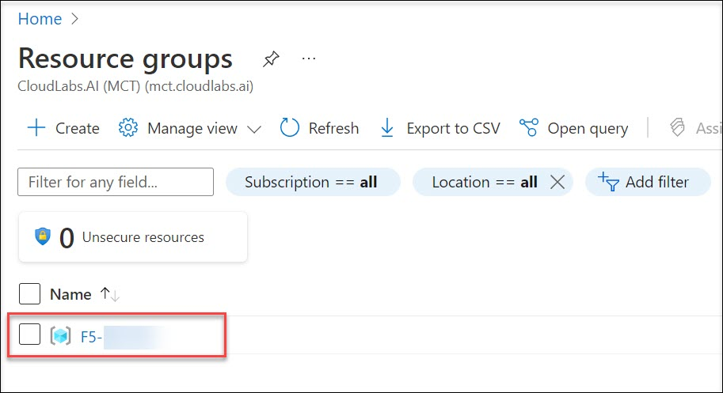
 
1. On the Resource group blade, click on **Overview**.

      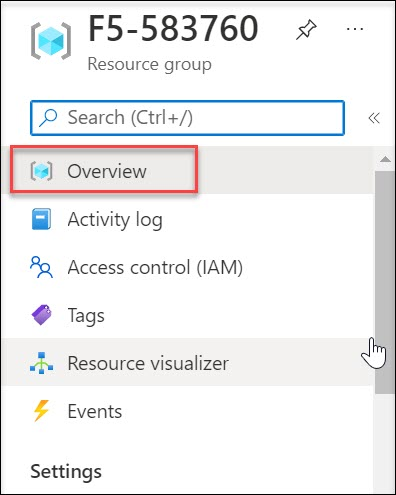
      
1. Select the **web-vm1** virtual machine from the resource list.

      
      
1. On the virtual machine blade, scroll down to the **Settings** section, click on **Networking**

      
      
1. Select the **web-vm-nic1** Network Interfaces.

      
 
1. In the Network Interfaces blade, you can see the **Private IP address** of **web-vm1**. Copy the value of the Private IP address. You will need it for the next task.

      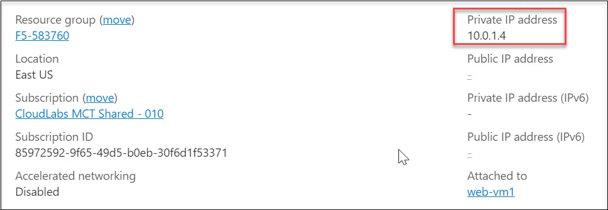

1. Navigate back to the Resource groups and select your Resource Group

      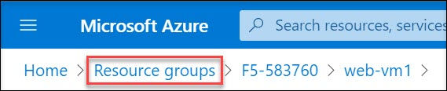
    
1. On the Resource group blade, click on Overview.

      

1. Explore the pre-deployed resources
   

# 03: Configuring F5 Advanced Web Application firewall

## Overview

In this task, you will configure the F5 Advanced Web Application firewall hosted on Azure for publishing IIS Based websites.

## Task 1: Access the Webserver

1. Open a new tab in the browser and attempt to access the webserver via http to the same IP address as the F5.
   * <inject key="f5_httpURL"></inject>

    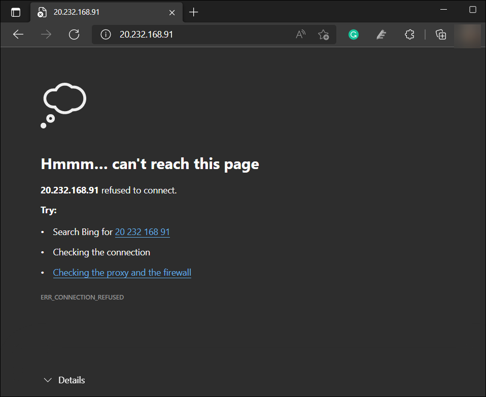
    
2. You won't be able to access the webserver because the F5 is not yet configured to respond to port 80.

## Task 2: Configuring F5 Advanced Web Application firewall  

### Exercise 1: Creating a pool and adding members to it

In this exercise, BIG-IP VE routes traffic to a pool. This pool should contain your application servers.

1. Switch back to F5 dashboard tab, On the **Main** tab, click **Local Traffic -> Pools -> Pool List**.

    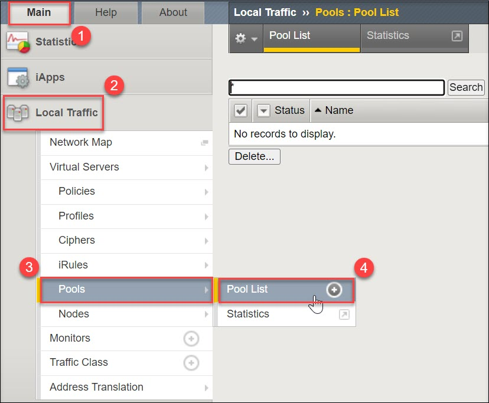
    
1. Click **Create** to create the Pool.    
        
    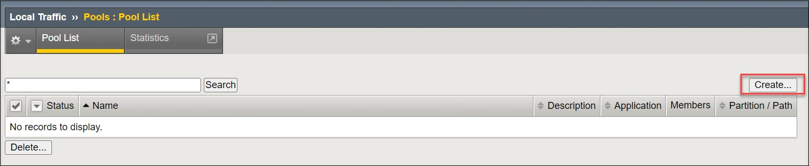

1. In the **Name** field, type **web_pool**. Names must begin with a letter, be fewer than 63 characters, and can contain only letters, numbers, and the underscore (_) character. For **Health Monitors**, move **http_head_f5** from the **Available** to the **Active** list by clicking on <<.

      

1. In the **New Members** section, in the **Address** field, type the Private IP address which you copied in the previous task **(1)**. In the **Service Port** field, type **80** as service port **(2)** and Click **Add** **(3)**.

      **Note**: The list now contains the member **(4)**
        
    Click **Finished** **(5)**.
   
    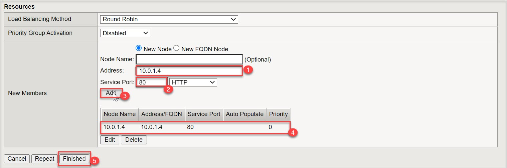
    
1. Refresh the page and verify if the created pool's status is shown as **Available** (indicated in green) 
   
   
    
### Exercise 2: Creating a virtual server

In this exercise, A virtual server listens for packets destined for the external IP address. You must create a virtual server that points to the pool you created.

1. On the **Main** tab, click **Local Traffic -> Virtual Servers-> Virtual Server List**

    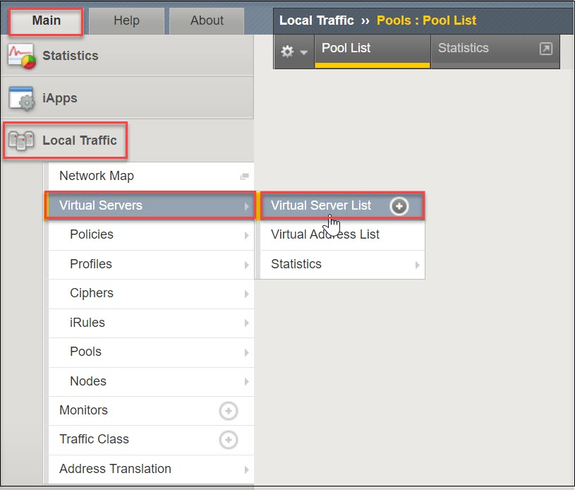
    
1. Click **Create** to create the Virtual Server.  

    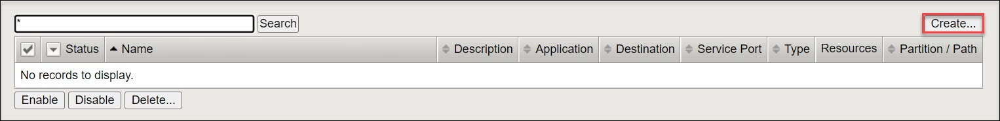
    
1. In the **General Properties** section, configure as below:

   - Name: **Demo-Websites** (Or your custom service name)
   - Destination Address/Mask: **0.0.0.0/0**
   - Service port: **80**
   - State: Leave the default

    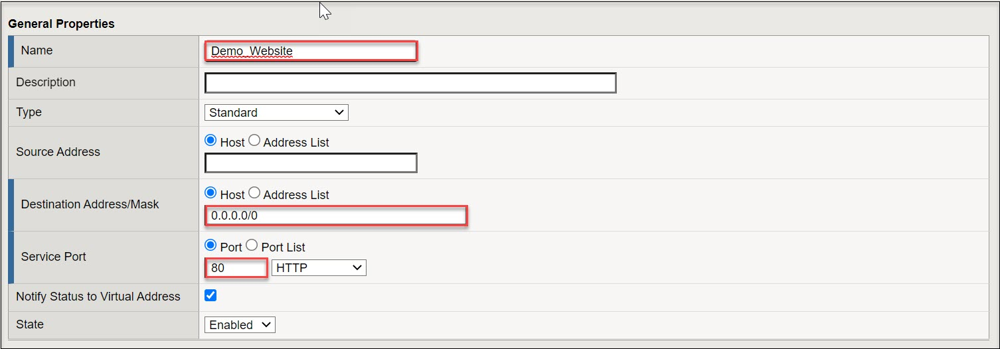
 
1. Scroll down to the **Configuration** section, configure as below:

   - Source Address Translation: Select **Auto Map**

    

1. Again, scroll down to the **Resource** section, configure it as below and click on **Finished**.

   - Default Pool: Select the Pool which you created in the previous exercise
    
    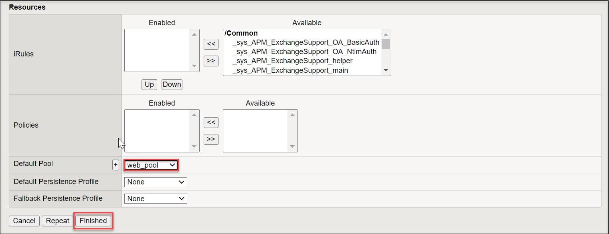
  
1. Verify if the created Virtual server's status is shown as **Available** (indicated in green) 
    
   
    
1.  Open a new tab in the browser and copy-paste the following to access the webserver.
    * <inject key="f5_httpURL"></inject>
    
1. The request will be forwarded to the backend web server as configured and You should be able to see the webserver in the browser.
    
    

# Conclusion

Congratulations, You have successfully completed this lab. In this lab, you were able to publish a Web Application hosted behind F5 advanced Web application firewall   

    
  

