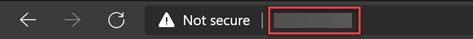

# 03: Configuring F5 Advanced Web Application firewall

## Overview

In this task, you will configure the F5 Advanced Web Application firewall hosted on Azure for publishing IIS Based websites.

## Task 1: Configuring F5 Advanced Web Application firewall  

### Exercise 1: Creating a pool and adding members to it

In this exercise, BIG-IP VE routes traffic to a pool. This pool should contain your application servers.

1. Switch back to F5 WAF Tab, On the **Main** tab, click **Local Traffic -> Pools -> Pool List**.

    
    
1. Click **Create** to create the Pool.    
        
    

1. In the **Name** field, type **web_pool**. Names must begin with a letter, be fewer than 63 characters, and can contain only letters, numbers, and the underscore (_) character. For **Health Monitors**, move **http_head_f5** from the **Available** to the **Active list**.

      

1. In the **New Members** section, in the **Address field**, type the Private IP address which you copied in the previous task **(1)**. In the **Service Port** field, type **80** as service port **(2)** and Click **Add** **(3)**.

      **Note**: The list now contains the member **(4)**
        
    Click **Finished** **(5)**.
   
    
    
### Exercise 2: Creating a virtual server

In this exercise, A virtual server listens for packets destined for the external IP address. You must create a virtual server that points to the pool you created.

1. On the **Main** tab, click **Local Traffic -> Virtual Servers**

    
    
1. Click **Create** to create the Virtual Server.  

    
    
1. In the **General Properties** section, configure as below:

   - Name: **Demo-Websites** (Or your custom service name)
   - Destination Address/Mask: **0.0.0.0/0**
   - Service port: **80**
   - State: Leave the default

    
 
1. In the **Configuration** section, configure as below:

   - Source Address Translation: Select **Auto Map**

    

1. In the **Resource** section, configure as below:

   - Default Pool: Select the Pool which you created in the previous exercise

   After configuration, click **Finished**.
    
    
 
 1. Again Open a new tab in the same browser. Copy **F5 Advanced WAF Public IP** : <inject key="F5IP"></inject> and paste it. Press **Enter** key. By default, this use port **80**.

    

1. As you can see, the request will be forwarded to the backend web server as configured.
    
    

# Conclusion

Congratulation, You have completed this lab.
 
