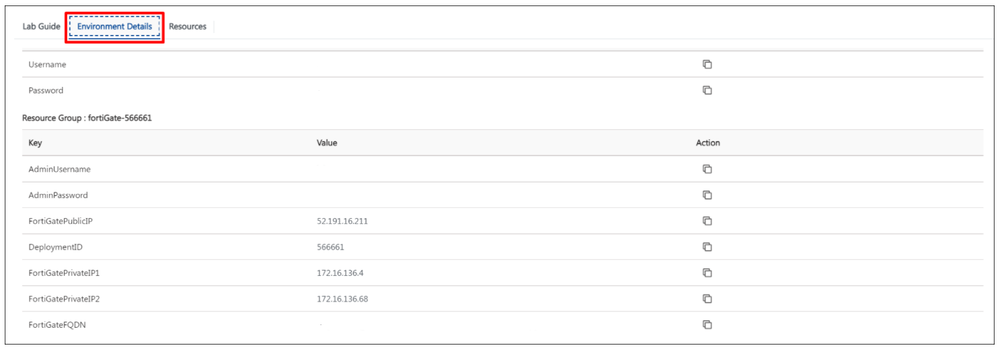

# Getting Started

1. Once the environment is provisioned, a lab guide will get loaded into your browser **(1)**, Click on **Next** from the bottom middle and follow the instructions to perform the labs **(2)**.
    
2. To get the lab environment details, you can select the **Environment Details** tab.

    

3. Also, you can **start, stop and restart** the virtual machines from the **Resources** tab.
    
    
    
