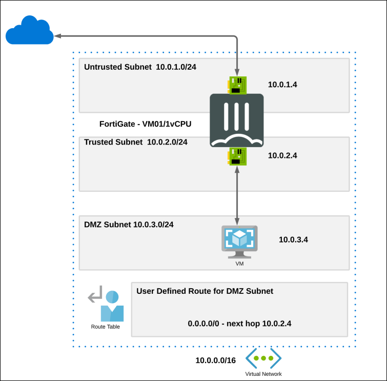

# Getting started with FortiGate Next-Generation Firewall - A Single VM

## Tasks Included

* **01 - Accessing the FortiGate Dashboard**      
* **02 - Login to Azure Portal**
* **03 - Getting Started with Azure Portal**
* **04 - Configure FortiGate for Web Traffic**
* **05 - Access the Webserver through Internet**

## Overview

The FortiGate firewall enables enterprises to control their resources and applications in Microsoft Azure. FortiGate-VM offers a consistent security posture and protects connectivity across public and private clouds, while high-speed VPN connections protect data. This single FortiGate-VM setup is a basic setup to start exploring the capabilities of the next generation firewall. The central system will receive, using user-defined routing (UDR), all or specific traffic that needs inspection going to/coming from on-prem networks or the public internet.

## Architecture Diagram

  
  
Click on **Next** to continue to the next section of the lab.
