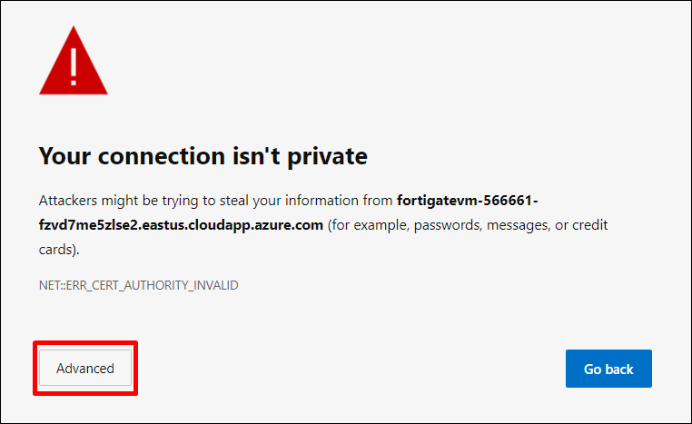
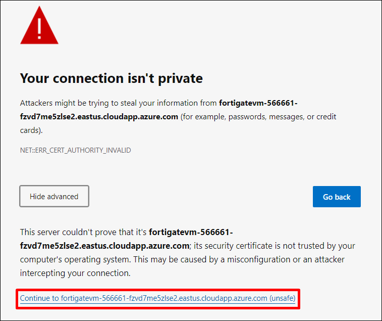
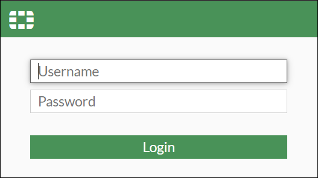
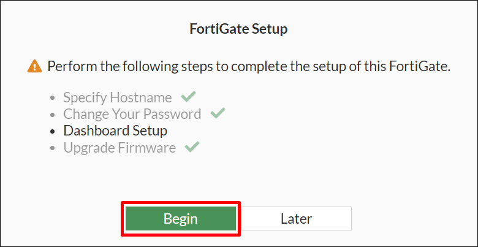
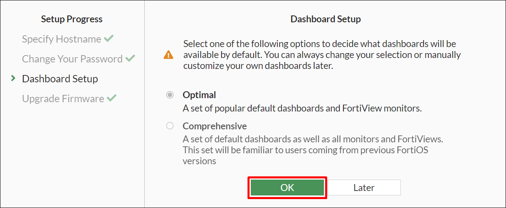
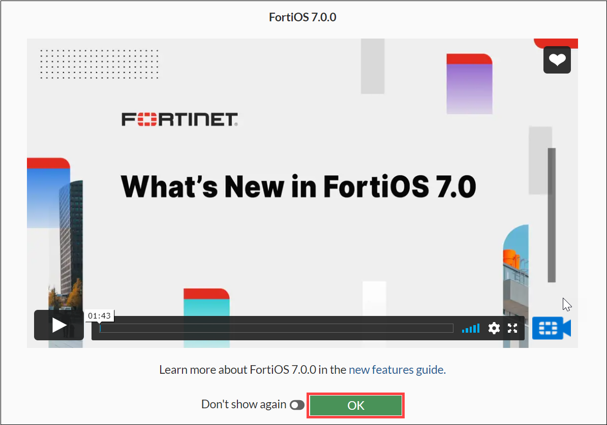
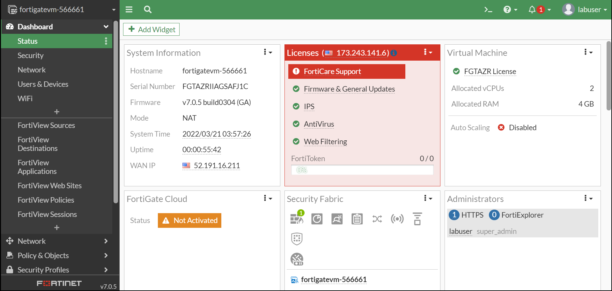
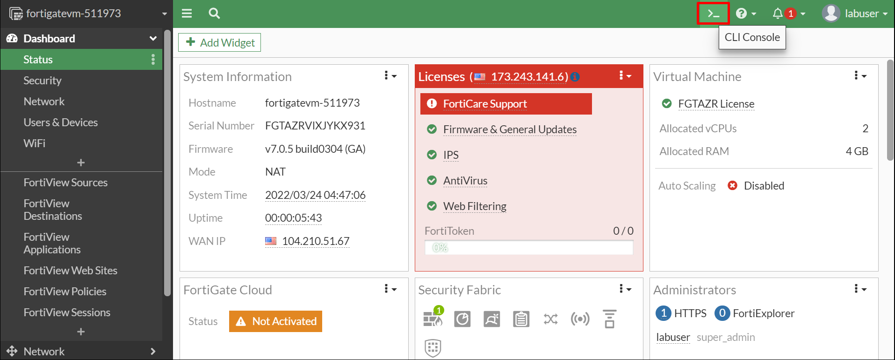
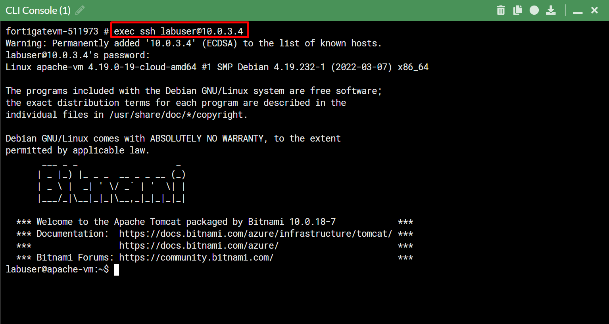
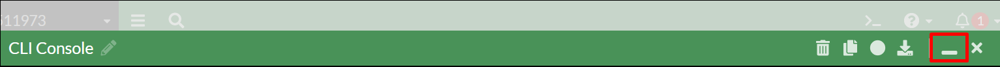

# 01 - Accessing the FortiGate Dashboard 

## Overview 

In this task, you will access the FortiGate dashboard through the internet by using the FortiGate FQDN and connect to the Apache webserver via the CLI Console.

## Task 1: Accessing the FortiGate Dashboard 

1. In the LabVM desktop, select the **Microsoft Edge** icon and in a new tab copy-paste the FortiGateFQDN <inject key="FortiGateFQDN"></inject>
     
2. A page shown below will apear. Click on **Advanced** on the web page.

    
     
3. Click on the link **Continue to fortigatevm-XXXXX** on the page as shown below. 

    
     
4. You will be redirected to the page shown below with empty **Username** and **Password** text boxes. Enter the following username/password and then click on **Login**.
     
    * **Username**:  <inject key="AdminUsername"></inject>
    * **Password**:  <inject key="AdminPassword"></inject>

    
     
5. A **FortiGate Setup** page appears as shown below. Click on **Begin**

    
     
6. A **Dashboard Setup** page appears as shown below. Keep the **Optimal** option as default and click on **OK**

    
    
7. Click on **OK** to bypass “What’s New in FortiOS 7.0".

     

8. The **FortiGate** dashboard will appear as shown below.

    
     
## Task 2: Connect to the Apache webserver
     
1. To connect to the Apache webserver, click on the **CLI Console** on the FortiGate dashboard as shown below.
     
    
     
2. Connect to the webserver host via the CLI Console by copying the following command & password in the console. Click ENTER on your keyboard for executing the commands.
     
    * **exec ssh fortigateuser@10.0.3.4**<copy>
    * **labuser@10.0.3.4's password**:  <inject key="AdminPassword"></inject>
     
    
     
3. Minimize the CLI Console.
 
    
    
## Summary

In this task you accessed the FortiGate dashboard using the FortiGate FQDN and connected to the Aapche Webserver via the CLI Console present on the dashboard.
     
Click on **Next** to continue to the next section of the lab.
     

