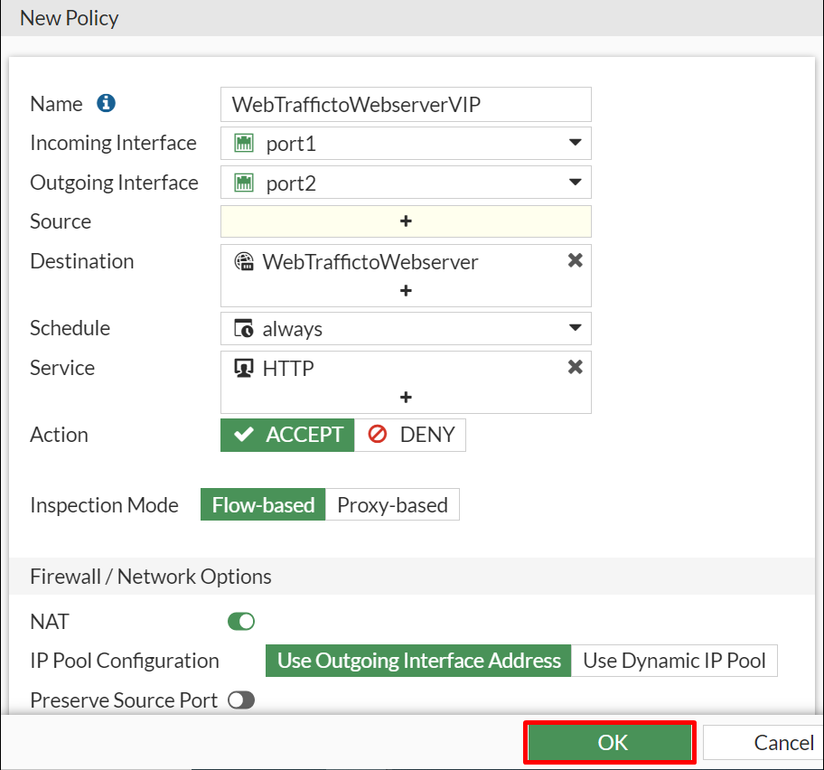

# 04 - Configuring FortiGate for Web Traffic

## Overview

In this task you will configure the web traffic of an Apache server through the FortiGate dashboard.

## Task: Configuring an Apache webserver through FortiGate dashboard

1. On the FortiGate dashboard click on **Policy & Objects** dropdown and the **Virtual IPs**.
    
    
    
2. Click on the  **Create New** button and the select **Virtual IP**.

    
    
3. Create a new virtual IP to forward traffic for interface **port1** by entering the following values, enable **Port Forwarding** to specify the ports and then click **OK**.
    
    * Name:  **WebTraffictoWebserver**
    * Interface:  **port1**
    * External IP Address/Range:  **10.0.1.4**
    * Map to IPv4 Address/Range:  **10.0.3.4**
    * External service port:  **80**
    * Map to IPv4 port:  **80**

    
    
4. Under **Policy & Objects** on the dashboard, click on **Firewall Policy** and then **Create New**.

    

5. Create a new Firewall policy to access the webserver by entering the following values and the click **OK**. 
    
    **NOTE**: This new policy will allow all traffic in port1 and out port2.

    * Name:  **WebTraffictoWebserverVIP**
    * Incoming Interface:  **port1**
    * Outgoing Interface:  **port2**
    * Source:  **all**
    * Destination: **WebTrafficToWebserver**
    * Service: **HTTP**
    
    
    
6. Click on **Next** to continue to the next section of the lab.
