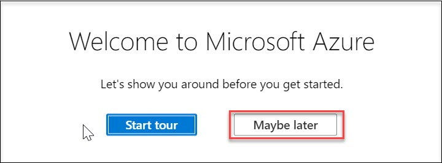
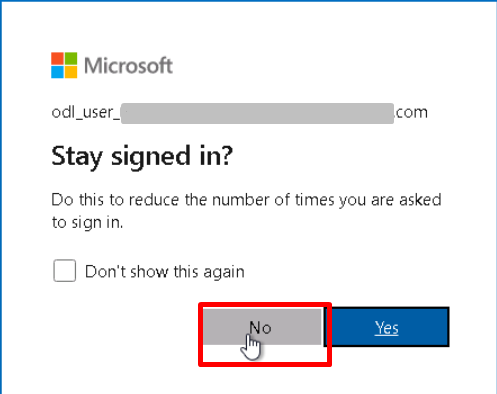

# 02 - Log-in to the Azure portal

## Overview

In this task, you will log in to Microsoft Azure using your credentials and access the Azure Portal dashboard.

1. In the LabVM desktop, select the **Azure Portal** icon to access the Azure Portal.

2. On the **Sign in to Microsoft Azure** blade, you will see a login screen, in which enter the following email/username and then click on **Next**.

    * **Azure Username/Email**:  <inject key="AzureAdUserEmail"></inject> 
    * **Azure Password**:  <inject key="AzureAdUserPassword"></inject>
    
    * **Note**: Refer to the **Environment Details** tab for any other lab credentials/details.
        
    
    
    
    
3. If you see the pop-up like below, click **Skip for now(14 days until this is required)**.

    
    
4. If you see the pop-up **Stay signed in?** Click **No**.

    
    
5. If you see the pop-up **You have free Azure Advisor recommendations!** close the window to continue the lab.

6. If a **Welcome to Microsoft Azure** popup window appears, click **Maybe Later** to skip the tour.

    
    
7. Now will now see the Azure Portal Dashboard.

## Summary

In this task, you logged into Microsoft Azure using your credentials and accessed the Azure Portal dashboard.

Click on **Next** to continue to the next section of the lab.
