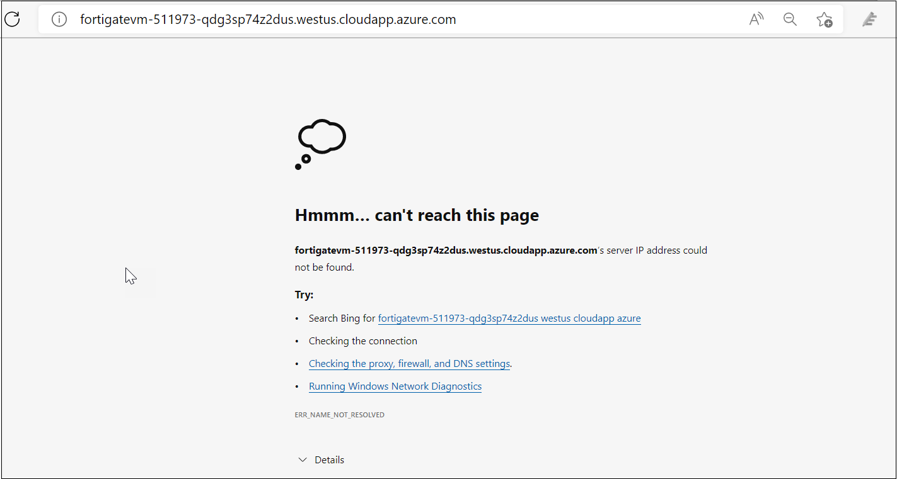
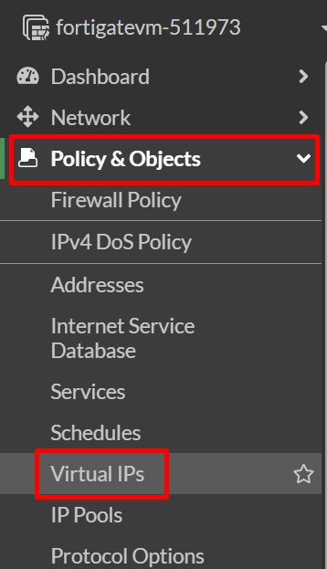
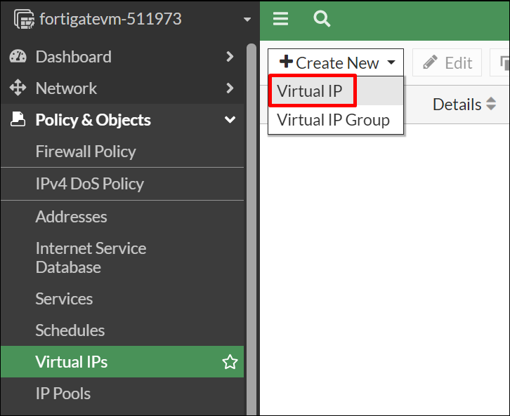
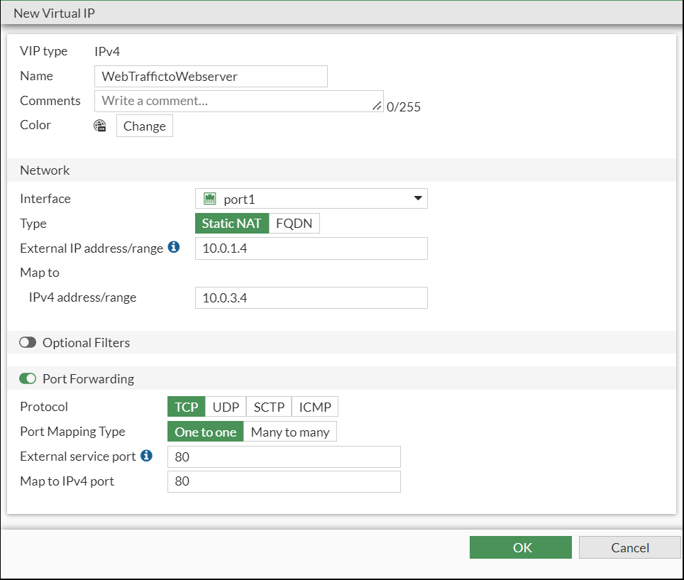
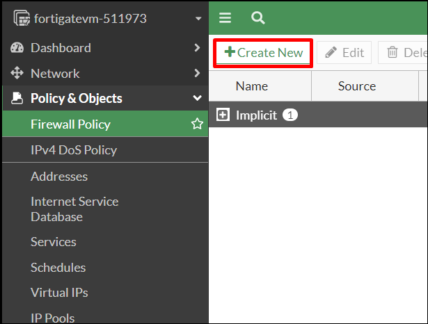
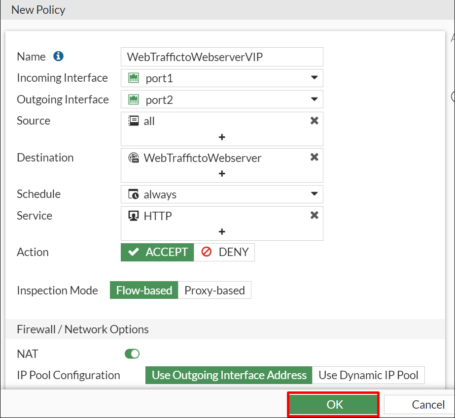

# 04 - Configuring FortiGate for Web Traffic

## Overview

In this task you will try to access the webserver via FortiGate's FQDN, configure Firewall policies on the FortiGate-VM firewall via the FortiGate dashboard and then add Virtual IPs to provide secured access from your device to the webserver hosted in Azure and protected by the FortiGate.

## Task 1: Access the Webserver

1. Open a new tab in the browser and attempt to access the webserver via http to the same FQDN as the FortiGate. You won't be able to access the webserver because the FortiGate is not yet configured to respond to port 80.

    

## Task 2: Configuring an Apache webserver through FortiGate dashboard

1. On the FortiGate dashboard click on **Policy & Objects** dropdown and the **Virtual IPs**.
    
    
    
2. Click on the  **Create New** button and the select **Virtual IP**.

    
    
3. Create a new virtual IP to forward traffic for interface **port1** by entering the following values, enable **Port Forwarding** to specify the ports and then click **OK**.
    
    * Name:  **WebTraffictoWebserver**
    * Interface:  **port1**
    * External IP Address/Range:  **10.0.1.4**
    * Map to IPv4 Address/Range:  **10.0.3.4**
    * External service port:  **80**
    * Map to IPv4 port:  **80**

    
    
4. Under **Policy & Objects** on the dashboard, click on **Firewall Policy** and then **Create New**.

    

5. Create a new Firewall policy to access the webserver by entering the following values and the click **OK**. 
    
    >**NOTE**: This new policy will allow all traffic in port1 and out port2.

    * Name:  **WebTraffictoWebserverVIP**
    * Incoming Interface:  **port1**
    * Outgoing Interface:  **port2**
    * Source:  **all**
    * Destination: **WebTrafficToWebserver**
    * Service: **HTTP**
    
    
    
## Summary

In this task you tried to access the webserver using FortiGate's FQDN, configured the Firewall policies on the FortiGate-VM firewall through the FortiGate dashboard and then added Virtual IPs to provide secured access from your device to the webserver hosted in Azure.

Click on **Next** to continue to the next section of the lab.
